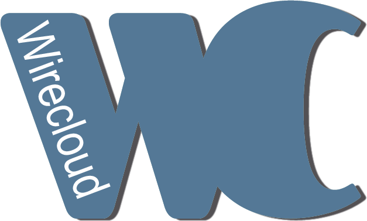

<p align="center">
    <a href="http://conwet.fi.upm.es/wirecloud">
        
    </a>
</p>

# WireCloud

[](https://www.fiware.org/developers/catalogue/)
[](./LICENSE)
[](https://hub.docker.com/r/fiware/wirecloud/)
[](https://stackoverflow.com/questions/tagged/fiware-wirecloud)
[](https://pypi.python.org/pypi/wirecloud)
<br/>
[](http://wirecloud.readthedocs.org/en/latest/)
[](https://github.com/Wirecloud/wirecloud/actions?query=workflow%3A%22Tests%22)
[](https://coveralls.io/github/Wirecloud/wirecloud?branch=develop)

[](https://bestpractices.coreinfrastructure.org/projects/4479)

WireCloud builds on cutting-edge end-user development, RIA and semantic
technologies to offer a next-generation end-user centred web application mashup
platform aimed at leveraging the long tail of the Internet of Services.

WireCloud builds on cutting-edge end-user (software) development, RIA and
semantic technologies to offer a next-generation end-user centred web
application mashup platform aimed at allowing end users without programming
skills to easily create web applications and dashboards/cockpits (e.g. to
visualize their data of interest or to control their domotized home or
environment). Web application mashups integrate heterogeneous data, application
logic, and UI components (widgets) sourced from the Web to create new coherent
and value-adding composite applications. They are targeted at leveraging the
"long tail" of the Web of Services (a.k.a. the Programmable Web) by exploiting
rapid development, DIY, and shareability. They typically serve a specific
situational (i.e. immediate, short-lived, customized) need, frequently with high
potential for reuse. Is this "situational" character which precludes them to be
offered as 'off-the-shelf' functionality by solution providers, and therefore
creates the need for a tool like WireCloud.

This project is part of [FIWARE](https://www.fiware.org/). For more information
check the FIWARE Catalogue entry for
[Context Processing, Analysis and Visualization](https://github.com/Fiware/catalogue/tree/master/processing).

| :books: [Documentation](https://wirecloud.rtfd.io/) | :page_facing_up: [Site](https://conwet.fi.upm.es/wirecloud) | :mortar_board: [Academy](https://fiware-academy.readthedocs.io/en/latest/processing/wirecloud) | :whale: [Docker Hub](https://hub.docker.com/r/fiware/wirecloud/) | :dart: [Roadmap](roadmap.md) |
|---|---|---|---|---|

## Contents

- [Install](#install)
- [Usage](#usage)
- [Bugs and feature requests](#bugs-and-feature-requests)
- [Quality Assurance](#quality-assurance)
- [Testing](#testing)
- [License](#license)

## Install

```console
$ sudo pip install wirecloud
```

See the
[installation guide](https://wirecloud.readthedocs.io/en/stable/installation_guide/)
for more info.

## Usage

WireCloud is a user-development tool aimed both at users and developers. Users use the platform
to build and/or use their interfaces using deployed widgets and developers, whereas developers do
create such components by extending existing ones or creating them from scratch.

In the former, final users can find useful information in the [User Guide](https://wirecloud.readthedocs.io/en/stable/user_guide/). In the latter,
developers can learn how to develop components in the [Programmer Guide](https://wirecloud.readthedocs.io/en/stable/restapi/)

## Bugs and feature requests

Have a bug or a feature request? Please first read the
[issue guidelines](docs/CONTRIBUTING.md#using-the-issue-tracker) and search for
existing and closed issues. If your problem or idea is not addressed yet,
[please open a new issue](https://github.com/Wirecloud/wirecloud/issues/new).

## Quality Assurance

This project is part of [FIWARE](https://fiware.org/) and has been rated as
follows:

-   **Version Tested:**
    
-   **Documentation:**
    
    
-   **Responsiveness:**
    
    
-   **FIWARE Testing:**
    
    
    
    

## Testing

Testing of WireCloud is based on two different frameworks. On the one side, Python code is being
tested using Django's own testing capabilities. On the other side, JavaScript code testing is based
on Karma and Jasmine. Both tests are run on a local copy of the
[WireCloud repository on GitHub](https://github.com/Wirecloud/wirecloud), inside
the `src` folder.


### Python code

Before running the tests, you have to ensure all the python dependencies are
installed on the environment. To do so, execute the following commands on the
`src` folder:

    $ pip install -r requirements.txt
    $ pip install -r requirements-dev.txt

Once installed all the dependencies, you can run the Python tests by using the
following command:

    $ python manage.py test --nologcapture -v 2 -a tags='wirecloud-noselenium'

WireCloud also comes with some selenium tests that can be executed using the
following command:

    $ python manage.py test --nologcapture -v 2 -a tags='wirecloud-selenium'

In this case, you will need to have Chrome and Firefox installed as well as
[chromedriver](http://chromedriver.chromium.org/) and [geckodriver](https://github.com/mozilla/geckodriver/releases).


### JavaScript code

Before being able to test JavaScript code, some dependencies have to be
installed:

    $ sudo npm install -g grunt-cli
    $ npm install

Once installed all the npm dependencies, tests can be executed using `grunt`:

    $ grunt

## Monaco Editor

Wirecloud uses the Monaco Editor as its code editor. The Monaco Editor is the code editor that powers VS Code.

In order to use the Monaco Editor, install the npm dependencies and build the editor:

    $ npm install
    $ npm run build-monaco (optional, already done by npm install)

This will download the Monaco Editor and build it for Wirecloud.

---

## License

WireCloud is licensed under Affero General Public License (GPL) version 3 (or
any later, at your option) with classpath-like exception.

### Are there any legal issues with AGPL 3.0? Is it safe for me to use?

There is absolutely no problem in using a product licensed under AGPL 3.0. Issues with GPL
(or AGPL) licenses are mostly related with the fact that different people assign different
interpretations on the meaning of the term “derivate work” used in these licenses. Due to this,
some people believe that there is a risk in just _using_ software under GPL or AGPL licenses
(even without _modifying_ it).

For the avoidance of doubt, the owners of this software licensed under an AGPL-3.0 license
wish to make a clarifying public statement as follows:

> Please note that software derived as a result of modifying the source code of this
> software in order to fix a bug or incorporate enhancements is considered a derivative
> work of the product. Software that merely uses or aggregates (i.e. links to) an otherwise
> unmodified version of existing software is not considered a derivative work, and therefore
> it does not need to be released as under the same license, or even released as open source.
