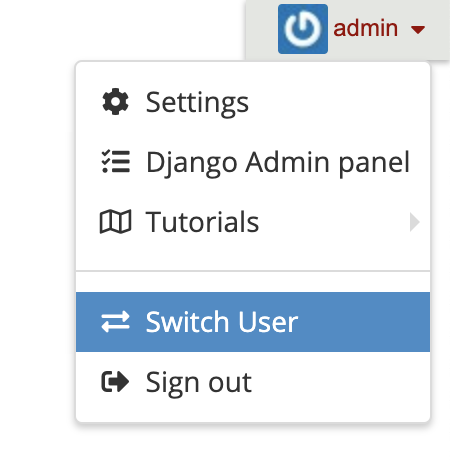

## 管理ツール

WireCloud は、管理者としてサインインすると、ユーザ・インターフェイスにいくつかの追加機能を提供します。
このセクションでは、これらの追加機能の場所と使用方法について説明します。


### 他のユーザになりすます (切り替え)

WireCloud では、管理者ユーザが他のユーザになりすますことができます。これは、特定のユーザとしてサインインしたときの
WireCloud の動作を確認するためのものです。この機能では、ユーザになりすますためにユーザの資格情報を知っている
必要はなく、問題のデバッグや他のユーザがタスクを実行するのに役立ちます。

この機能は、グローバル・メニューにあります :



完了したら、直接サインアウトするか、最初の管理ユーザとしてサインインします :


## 管理コマンド

WireCloud は、コマンドラインから、手動またはスクリプトによって、WireCloud インスタンスのフォルダ上で使用できる
一連のコマンドラインツールを提供します。

### addtocatalogue

1つ以上のパッケージ化されたマッシュアップ・アプリケーションのコンポーネントをカタログに追加します。
次のフラグの少なくとも1つを指定します　:

-   **redeploy**
    マッシュアップ・アプリケーションのコンポーネントのファイルを新しいものに置き換えます
-   **users**=USERS
    アップロードされたマッシュアップ・アプリケーションのコンポーネントへのアクセスを取得するユーザのカンマ区切りリスト
-   **groups**=GROUPS
    アップロードされたマッシュアップ・アプリケーションのコンポーネントへのアクセス権を取得するグループのカンマ区切り
    リスト
-   **public**
    任意のユーザがマッシュアップ・アプリケーションのコンポーネントにアクセスできるようにします

使用例 :

```bash
$ python manage.py addtocatalogue --users=admin,ringo file1.wgt file2.wgt
```


### changepassword

ユーザのパスワードを変更できます。パラメータとして与えられたユーザのパスワードを2回入力するように促します。
両者が一致すると、新しいパスワードがすぐに変更されます。ユーザにパスワードを指定しないと、
ユーザ名が現在のユーザと一致するパスワードが変更されます。

使用例 :

```bash
$ python manage.py changepassword ringo
```

### createorganization

空の組織を作成します。 作成したら、関連付けられたグループにユーザを追加できます。

使用例 :

```bash
$ python manage.py createorganization
```


### createsuperuser

スーパーユーザ・アカウント (すべての権限を持つユーザ) を作成します。これは、最初のスーパーユーザ・アカウントを
作成する必要がある場合、またはサイトのスーパーユーザ・アカウントをプログラムで生成する必要がある場合に便利です。

対話式に実行すると、このコマンドは新しいスーパーユーザ・アカウントのパスワードを要求します。非対話型で実行すると、
パスワードは設定されず、手動でパスワードが設定されるまでスーパーユーザ・アカウントにログインできなくなります。

-   **--noinput**
    Django にユーザに何らかの入力を促さないように指示します。他の必須フィールドのオプションと共に、**--noinput**
    とともに **--username** を使用する必要があります。**--noinput**で作成されたスーパーユーザは、
    有効なパスワードが与えられるまでサインインすることができません
-   **--username**
    スーパーユーザのログイン名を指定します
-   **--email**
    スーパーユーザの電子メールを指定します

新しいアカウントのユーザ名と電子メールアドレスは、コマンドラインで **--username** と **--email**
引数を使用して指定することができます。それらのいずれかが提供されていない場合、`createsuperuser`
は対話的に実行しているときに要求します。

使用例 :

```bash
$ python manage.py createsuperuser
```


### rebuild_index

WireCloud の検索エンジンで使用される Haystack インデックスを再構築します。
詳細を Haystack [ドキュメント][haystack_rebuild_index] を参照してください。

-   **--noinput**
    指定した場合、プロンプトはユーザに発行されず、データは消去されます。

使用例 :

```bash
$ python manage.py rebuild_index
```

[haystack_rebuild_index]: http://django-haystack.readthedocs.io/en/master/management_commands.html#rebuild-index

## WireCloud バックアップの作成と復元

1. インスタンス・フォルダのバックアップを作成します。例えば :

```bash
$ tar -cvjf wirecloud-backup.tar.bz2 -C /path/to/your/instance .
```

2. データベースのバックアップを作成します

WireCloud で使用されるデータベースに格納されたデータのバックアップを作成する方法はいくつかありますが、
それぞれに長所と短所があります。

> **注** : データの一貫性を確保するためにバックアップを作成する前に、必ず WireCloud を停止してください。

### Django を使用したデータベースバックアップ

Django には、バックアップの作成と復元に使用できる `dumpdata` と `loaddata` コマンドが用意されています。
これらのコマンドは、使用するデータベースエンジンとは独立して使用できます。さらに、特定のデータベース・エンジンを
使用してバックアップを作成し、別のバックアップを使用してそれらのバックアップを復元することもできます。
Django を使用してデータベースのバックアップを作成するには、次のコマンドを実行します :

```bash
$ python manage.py dumpdata > wirecloud.backup
```

バックアップを復元するには、クリーンなデータベースを使用して `loaddata` コマンドを実行するだけです :

```bash
$ python manage.py loaddata wirecloud.backup
```

> **注** : `dumpdata` 使用して作成したバックアップは、バックアップの作成に使用したものと同じ WireCloud
> バージョンを使用してのみ復元できます。別のバージョンを使用する必要がある場合は、元のバージョンを使用して
> バックアップを復元し、それをアップグレード/ダウングレードします。


### SQLite3 データベースのバックアップ

SQLite3 データベースのバックアップを作成するのは、データベースが格納されているファイルのコピーを作成するのと
同じくらい簡単です。考慮する必要があるのは、可能性のある矛盾を避けるためにコピーを作成する前に
WireCloud を停止することだけです。

復元手順は作成と同じくらい簡単ですが、`settings.py` ファイルを編集するか、コピーしたデータベースファイルを
WireCloud が期待する場所に移動するかで、コピーしたデータベースファイルを WireCloud で使用するだけです。

> **注** : これは、WireCloud インスタンスのフルバックアップを作成する場合、データベースのバックアップのための
> 余分な手順を必要としないことを考慮してください。このバックアップはすでにインスタンスディレクトリのバックアップに
> よって実行されています。

### PostgreSQL データベースのバックアップ

PostgreSQL バックアップの作成方法の詳細は、この[ページ](http://www.postgresql.org/docs/9.1/static/backup-dump.html)
を参照してください。基本的には、次のコマンドを実行する必要があります :

```bash
$ pg_dump <dbname> > wirecloud.backup
```

> バックアップを作成する前に WireCloud が実行されていないことを確認します

次のコマンドを使用してバックアップを復元できます :

```bash
$ psql <dbname> < wirecloud.backup
```


## 以前のバージョンからのアップグレード

1. 新しいバージョンの WireCloud をインストールする
2. 次のコマンドを実行して、データベースを移行し、新しい基本コンポーネントでデータベースを作成し、検索インデックスを
再構築して、新しい静的ファイルを収集します :

```bash
$ python manage.py migrate
$ python manage.py populate
$ python manage.py rebuild_index
$ python manage.py collectstatic --noinput
```

> **注** : wirecloud が提供するユーザを使用してこれらのコマンドを実行することを忘れないでください。
> 例 : `su wirecloud`

3. WireCloud を再ロード。例 : `$ service apache2 graceful`

現在インストールされているバージョンは、`wirecloud-admin --version` で判断できます :

```bash
$ wirecloud-admin --version
1.0.0

```

> **注** : WireCloud を新しいバージョンに移行する前に、完全なデータベースのバックアップを実行することを
> 強くお勧めします。


## 1.2.x から 1.3.x へ

WireCloud 1.3 は検索インデックス・スキーマに小さな変更を加えたので、 `rebuild_index` コマンドを実行して
検索インデックスを更新する必要があります。また、事前定義されたダッシュボードとウィジェットの新しいバージョンが
あるので、それらを更新するために `populate` コマンドを使用します


## 1.1.x から 1.2.x へ

WireCloud 1.2 は検索インデックスの管理に Haystack を使用するため、検索インデックスを使用に Whoosh
を直接使用しなくなりました。 Haystack は Whoosh を検索インデックス・バックエンドとして使用することを
サポートしていますが、検索インデックスに使用されるスキーマは異なります。 Haystack の設定を `settings.py`
ファイルに組み込んで、` rebuild_index` コマンドを実行してそれらを再構築する必要があります。

## 1.0.x から 1.1.x へ

NGSI バインディング (ngsijs) が `v1.0.2` に更新されました。これにより、`ngsi-proxy` に接続するときに WireCloud が
CORS 要求を直接使用できるようになります。欠点は WireCloud が使用されている `ngsi-proxy` のバージョンを検出することが
できないということです。したがって、`ngsi-proxy` バージョン v1.0.0 以下をサポートしなくてはなりませんでした。

WireCloud 1.1 がワークスペース検索インデックスのスキーマを変更したので、`resetsearchindexes` コマンドを実行して、
このインデックスを更新する必要があります。また、あらかじめ定義された新しいダッシュボードがあるので、`populate`
コマンドを実行する必要があります。

IdM の統合が `python-social-auth` から `social-auth-app-django` に移行されました。この変更の詳細については、
この[リンク](https://github.com/omab/python-social-auth/blob/master/MIGRATING_TO_SOCIAL.md)を参照してください。
