## インストール

-   ご使用のプラットフォーム用 の "Eclipse IDE for Java EE Developers" パッケージの最新バージョンを
    [Eclipse のダウンロード・セクション](http://eclipse.org/downloads/)からダウンロードします
-   [FIWARE PPP Public Files 領域](https://forge.fiware.org/frs/?group_id=7) から WireCloud IDE
    プラグインをダウンロードします
-   WireCloud IDE プラグインをインストールします :

    -   _Help -> Install New Software..._

        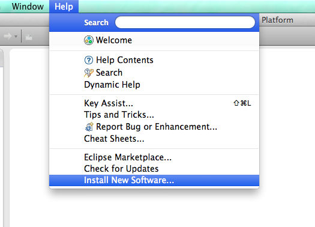

    -   _Add_ ボタンを使用して新しいリポジトリを追加します

        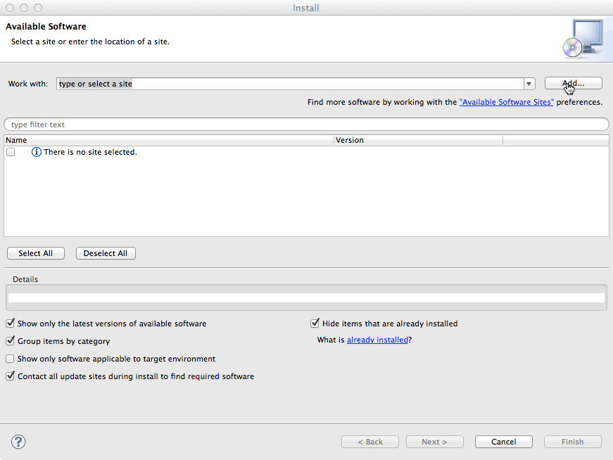

    -   _Archive_ をクリックし、前の手順でダウンロードした WireCloud IDE プラグイン・ファイルを選択します

        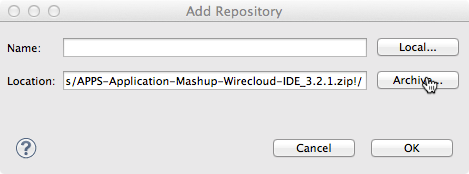

    -   WireCloud IDE entry を選択します

        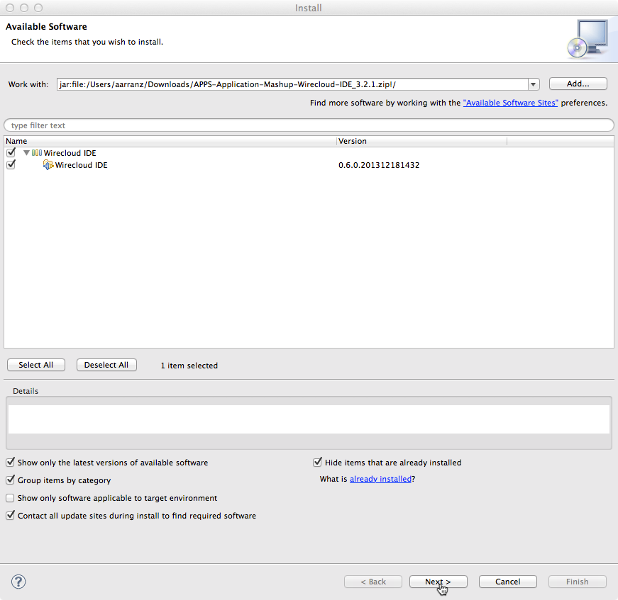

    -   _Next_ をクリックし、ウィザードを完了します

## WireCloud サーバの追加

WireCloud IDE は、Widget/Operator プロジェクトを WireCloud サーバに展開することをサポートします。WireCloud サーバは、
通常は Eclipse の開発画面の下半分にある、"Server" ビューから管理できます。このようなビューがない場合は、
_Window -> Show View -> Servers_ から追加できます :

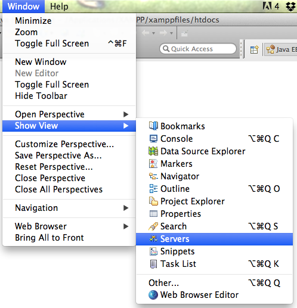

-   "Server" タブ内を右クリックして、_New Server_ ダイアログを開きます :

    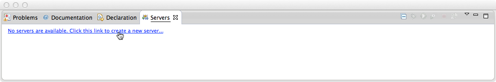

-   次のステップでは、定義するサーバのタイプとして、CoNWeTLab カテゴリにある、WireCloud を選択し、WireCloud
    が配置されているサーバのホスト名を更新して名前を付けます。この情報を入力したら、_Next_ をクリックします :

    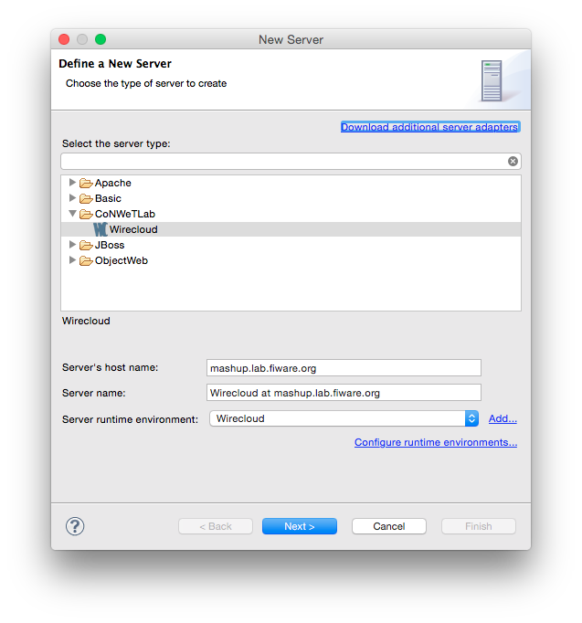

-   プロトコルとポートの設定を確認します。また、IdM から取得した client id と client secret を提供する必要があります。
    [KeyRock の User and Programmers Guide](https://fi-ware-idm.readthedocs.org/en/latest/user_guide/#registering-an-application)
    で新しい OAuth2 アプリケーションを作成する方法を参照してください。コールバック URL フィールドとして、
    `[WIRECLOUD_SERVER_URL]/oauth2/default_redirect_uri` を使用する必要があります。_Next_ をクリックします :

    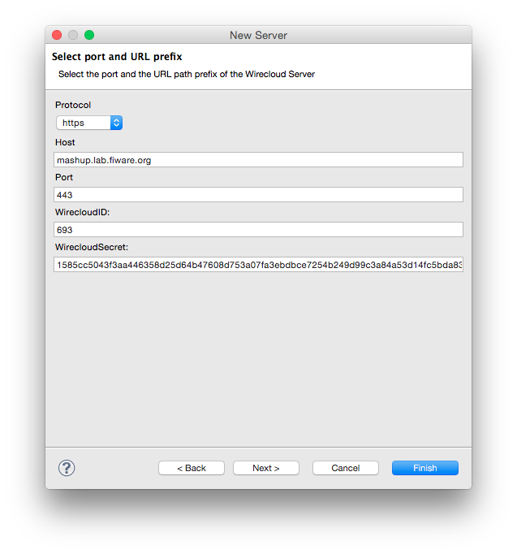

-   次のステップでは、WireCloud IDE がサーバにリソースをインストールとアンインストールすることを許可します。
    これには、WireCloud サーバにログインする必要があります。

    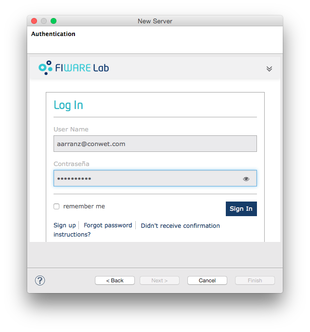

-   認可を確認するには :

    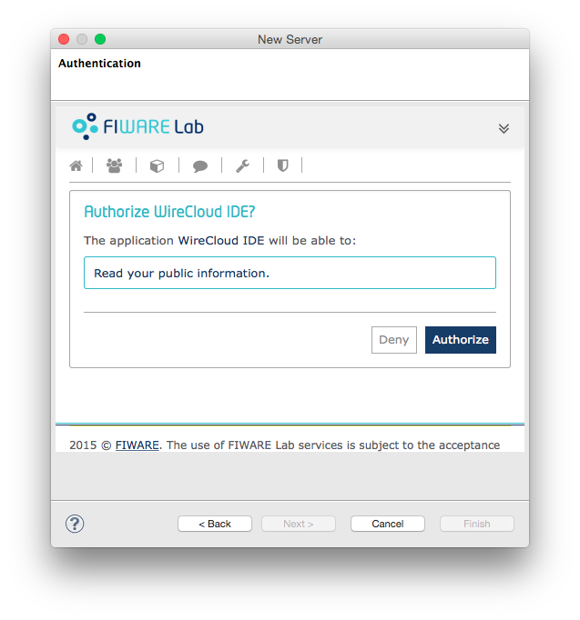

-   その後、確認メッセージが表示されます :

    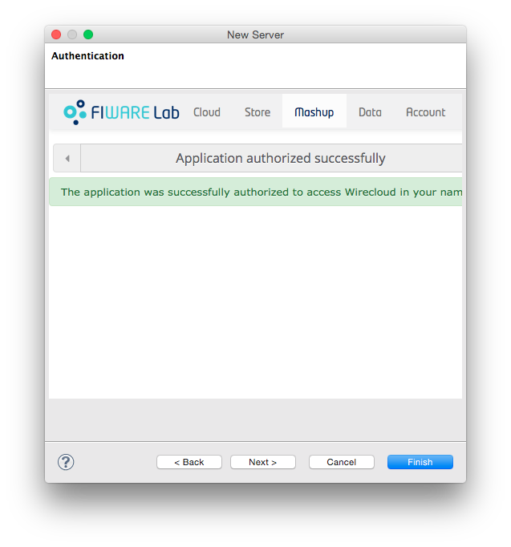

-   このステップでは、_Next_ をクリックして最初にアップロードするプロジェクトのリストを選択するか、必要な情報がすべて
    提供されたので *Finish* をクリックするかを選択できます。いずれの場合も、ウィザードを終了した後、新しい WireCloud
    サーバ が "Server" タブに表示されます :

    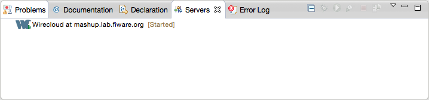

## Widget/Operator プロジェクトをゼロから作成する方法

-   新しいプロジェクトのウィザード・ページを開きます :

    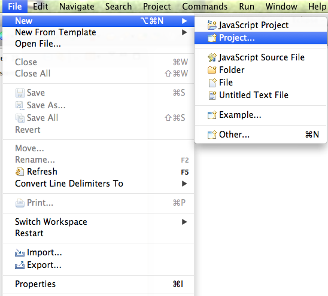

-   作成するリソースのタイプに応じてウィジェット/オペレータのプロジェクトを選択します。
    WireCloud プロジェクト・カテゴリで見つけることができます :

    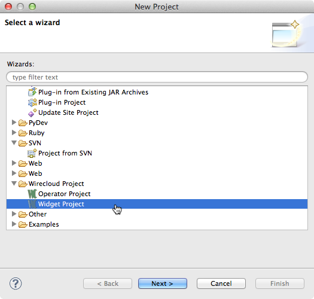

-   プロジェクトに名前を付け、_Finish_ をクリックします :

    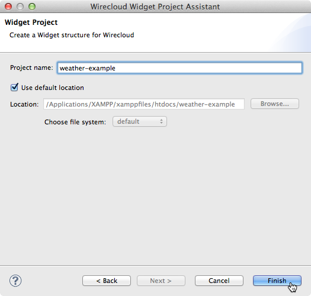

プロジェクトを作成したら、Eclipse が直接提供する機能に加えて、以下の機能を取得します :

-   JavaScript APIの自動補完
-   ウィジェット/オペレータの説明を編集するための支援
-   configure WireCloud servers からのインストールとアンインストールのサポート

## チュートリアル

-   まず、最初に、この[リンク](slides/attachments/Example1Skel.zip)からこの初期コードをダウンロードしてください。
    このコードには、基本的なHTML/スタイルコードを含むウィジェットの例のスケルトンが含まれています
-   ダウンロードしたファイルをウィジェット・プロジェクトにインポートします :

	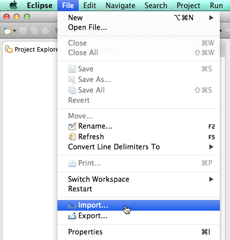
    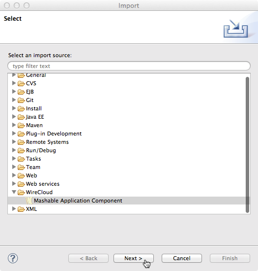
    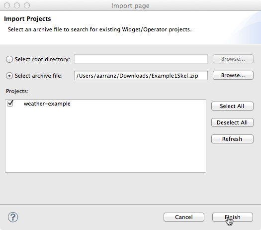

-   _3.1.3_ に従ってください。_Making requests and wiring tutorial_ が
    [FIWARE Academy の WireCloud コース](https://fiware-academy.readthedocs.io/en/latest/processing/wirecloud/index.html)で利用可能です 
-   "Servers" ビューを使用して、ウィジェットを WireCloud サーバに追加します。詳細については、
    "[WireCloud サーバの追加](#adding-wirecloud-servers)" のセクションを参照してください。最初のステップは、
    "Add and remove ..." ビューを開くことです : 

    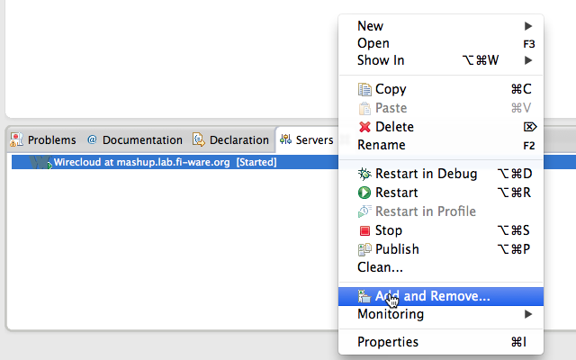

-   "Add and Remove"ビューを開いたら、プロジェクトを利用可能なセクションから構成済みのセクションに移動する
    必要があります :

    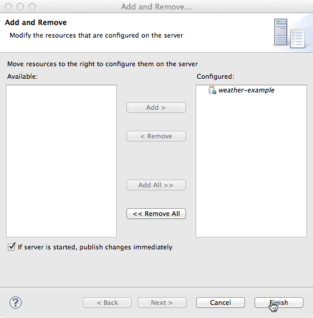

-   _Finish_ をクリックすると、選択したサーバにウィジェットがアップロードされ、チュートリアルで説明されている手順に
    従ってウィジェットをテストできます
