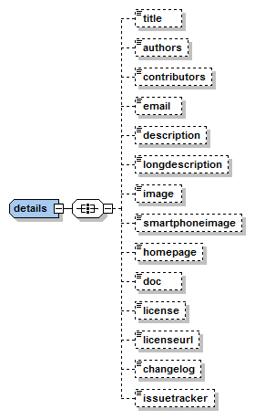
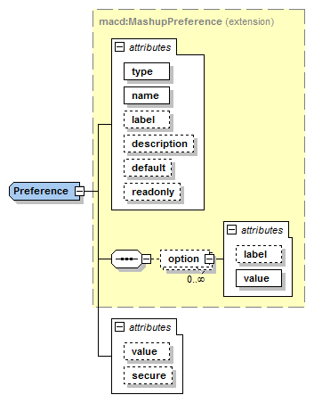
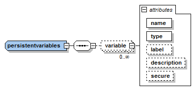
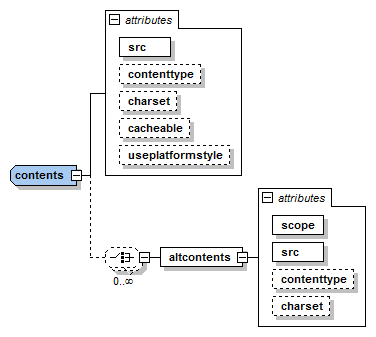
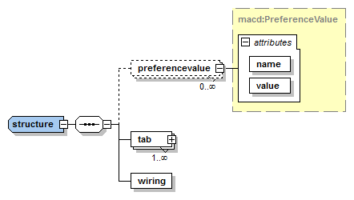
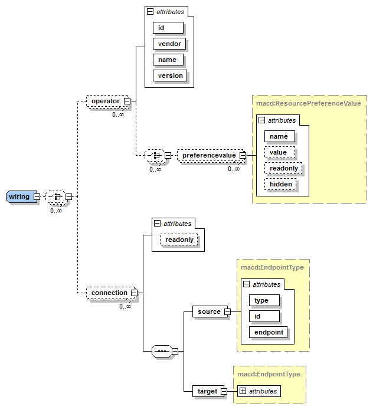

## イントロダクション

次のセクションで説明する XML スキーマの最新バージョンは、次の URL で入手できます :

-   [Mashable application component description language XML Schema]

マッシャブル・アプリケーション・コンポーネントの説明では、ルート要素の
`http://wirecloud.conwet.fi.upm.es/ns/macdescription/1` 名前空間を使用しています。ルート要素の名前は、コンポーネントの
種類によって異なり、 `widget`,`operator` または `mashup` です。一方、常に次の属性が必要です :

-   `vendor` : マッシャブル・アプリケーション・コンポーネントのベンダ/ディストリビュータの id。文字 "/" は使用できません
-   `name` : マッシャブル・アプリケーション・コンポーネントの名前。文字 "/" は使用できません
-   `version` : マッシャブル・アプリケーション・コンポーネントの現在のバージョン。ドットで区切られた数字の
    開始シーケンスを定義しなければなりません。さらに、ゼロは単独でしか使用できません(たとえば、0.1は有効ですが、03.2
    は使用できません)。リリース番号に続いて、リリース前のタグを付けることができます。プレ・リリースのタグは、
    a (アルファ)、b (ベータ) または rc (リリース候補) の文字のセリフです。その後に数字が続きます。プレ・リリースのタグ
    は、追加されるバージョンより古いバージョンとみなされます。したがって、リビジョン 2.4 はリビジョン 2.4rc1
    よりも新しいもので、2.4b1 または 2.4a1 より新しいものです

これらのツリー・フィールド(`vendor`, `name` および `version`)は、マッシャブル・アプリケーション・コンポーネントを
一意に識別します。そのため、WireCloud コンポーネントの任意のコレクション(ウィジェット、マッシュアップ、オペレータなど)
にこのような識別子を繰り返すことはできません。

  [Mashable application component description language XML Schema]: https://github.com/Wirecloud/wirecloud/blob/develop/src/wirecloud/commons/utils/template/schemas/xml_schema.xsd

## 共通のメタデータ

### `macversion` 要素

`macversion`要素はMACが使用するApplication Mashup GE仕様のバージョンを宣言するために使用される。 この要素は、Application Mashup GE仕様の古いバージョンと互換性を保つために必須では ないが、すべての新しいMACsに含めるべきである。

現在、この要素でサポートされている値は`1`だけである。 この要素がない場合、値`1`が仮定される。

### `details` 要素

`details` 要素

マッシャブル・アプリケーション・コンポーネントの説明には、それを使用して取得する情報、コンポーネントの開発者に関する
情報などの一般的な情報を提供する必要があります。この一般的な情報は、すべて `details` 要素を通じて提供されます。
この要素には、次のいずれかの要素を含めることができます :

-   `title` : マッシュアップ・アプリケーション・コンポーネントのユーザ・インターフェースで使用される名前。たとえば、
    マッシャブル・アプリケーション・コンポーネントをリストするときに使用されます。このフィールドは変換可能なため、
    このフィールドはマッシャブル・アプリケーション・コンポーネントを一意に識別するために使用されません。
    このフィールドは、ワークスペースに追加されたウィジェットのデフォルトのタイトルとしても使用されます
-   `authors` : コンマ区切りの開発者のリスト。例 : 
      
        Álvaro Arranz, Aitor Magan

    メール や URL を提供することもできます :

        Barney Rubble <b@rubble.com> (http://barnyrubble.tumblr.com/)

-   `contributors` : コントリビュータのカンマ区切りリスト。`authors` フィールドと同じフォーマットです
-   `email` : サポートを受けるための電子メールアドレス。これらのフィールドは、コンポーネントに問題が発生した人に
    役立つため、少なくともこのフィールドまたは、イシュー・トラッカー を指定することをお勧めします
-   `license` : マッシャブル・アプリケーション・コンポーネントに関連付けられているライセンスの名前
-   `licenseurl` : 完全なライセンス・ドキュメントを指し示す、絶対または記述ファイル相対のURL
-   `description` : マッシャブル・アプリケーション・コンポーネントの簡単な説明
-   `longdescription` : マッシャブル・アプリケーション・コンポーネントを記述するマークダウンファイルへの相対パス
-   `changelog` : 各バージョンのマッシャブル・アプリケーション・コンポーネントに対する変更を詳述する
    マークダウン・ファイルへの相対パス
-   `image` : カタログのマッシャブル・アプリケーション・コンポーネントのイメージの絶対または記述ファイル相対のURL
    (170 x 80 ピクセル)
-   `smartphone` : スマートフォンで使用する画像。(59 x 60 ピクセル)
-   `doc` : マッシャブル・アプリケーション・コンポーネントのドキュメントを含むマークダウン・ファイルへの相対パス。
    下位互換性のため、このフィールドは、Webページを指すコンポーネントのドキュメントへの絶対URLもサポートしています
-   `issuetracker` : コンポーネントのイシュー・トラッカーへの絶対 URL。これらのフィールドは、コンポーネントに問題が
    発生した人に役立つため、少なくともこのフィールドまたは `email` メールフィールドを指定することをお勧めします

### `requirements` 要素

`requirements` 要素

`requirements` 要素は、コンポーネントが依存する機能を宣言するために使用されます。現在、これらの機能は、特定の機能に
アクセスするために必要な API の WireCloud による注入に関連付けられています。たとえば、ウィジェットは WireCloud に
NGSI API を注入する必要がある NGSI 機能に依存します。Application Mashup GE の将来のリリースでは、この要素は他の種類の
依存関係 (例えば別のマッシャブル・アプリケーション・コンポーネント) を追加するためのサポートを提供しますが、
今のところこの要素は `feature` サブ要素のみを受け入れます。

#### `feature` 要素

-   `name` : アプリケーション・マッシュアップ・コンポーネントが必要とする機能の名前

## プラットフォーム・コンポーネントの対話要素

プラットフォームとコンポーネントとのやりとりを保証するために、テンプレートは環境に接続してさまざまなプラットフォーム・
オプションを設定するためにコンポーネントが使用する一連の要素も定義します。同様に、初期ウィジェット・サイズなどの
いくつかの他のインタフェース要素も定義します。それらはすべてプラットフォームによって管理され、永続性を保証します。

これらすべての要素を見てみましょう : 

### `preferences` 要素

最初のプラットフォーム関連の要素は、`preferences` です :

`preferences` 要素

これは、プラットフォームのインターフェースを通じて変更される可能性のあるユーザの設定を定義します。この要素は、1つ、多くの、または全くない `preference` サブ要素で構成されています。これは、実際のユーザ設定を定義します。それには次の属性が必要です :

-   `type : プリファレンス・データ型 : `text` (文字列), `number` および `boolean`, `password`, `list`
-   `name` : ソースコードで参照される設定の名前
-   `label` : ユーザ・インターフェイスでプリファレンスが表示されるテキスト
-   `description` : プリファレンスを説明するテキスト
-   `default` : プリファレンスのデフォルト値
-   `readonly` : このプリファレンスを変更できるかどうかを示します
-   `value` :  初期値。指定しない場合、デフォルト値が初期値として使用されます
-   `secure` : この属性の値が `true`の場合、この設定の値へのアクセスは許可されません。この設定の値は、アプリケーション・マッシュアップのクロスドメイン・プロキシを介して使用できます。デフォルト : `false`

`type` 属性が `list` に設定されている場合は、さまざまな選択肢が `option` 要素を用いて定義されています。これには次の属性があります :

-   `label : 選択リストに表示されるテキスト
-   `value : オプションが選択されたときに使用される値

### `persistentvariables` 要素

次の XML 要素は `persistentvariables` 要素です。その主な目的は、実行中にウィジェット/オペレータの状態を格納する変数の
セットを定義して、将来の実行ために使用できるようにすることです。その構造を下の図に示します :

`persistentvariables` 要素

この要素は、次の属性を必要とする `variable` 要素のリストで構成されています :

-   `name` :  プロパティ名
-   `type` : プロパティのデータ型 : ここでは、唯一の `text` (文字列)データ型が意味をなします
-   `label` : ユーザ・インターフェイスに表示されるテキスト
-   `description` :  説明文
-   `secure` : この属性の値が true の場合、この永続変数の値へのアクセスは許可されません。この変数の値は、
    アプリケーション・マッシュアップのクロスドメイン・プロキシを通じて使用可能になります。デフォルト : false
-   `multiuser` : この永続的な値は、ダッシュボードへのアクセス権を持つユーザごとに独自の値を格納します

### `wiring` 要素

これはおそらく最も重要な要素の1つです。ウィジェット/オペレータが他のウィジェット/オペレータと相互通信するために必要な
入力と出力の両方を定義します。Application Mashup GE の実装では、ワイヤーリングのメカニズムとその内部データフローを
管理および制御するために、この情報を考慮する必要があります。

下の図は `wiring` 要素を示しています :

`wiring` 要素

この要素は、`inputendpoint` と `outputendpoint` 要素 の任意の数が含まれていてもかまいません。

ウィジェットおよびオペレータは、出力エンドポイントを通じてデータやイベントを送信することがあります。これを行うには、
`outputendpoint` 要素を使用してエンドポイントを宣言する必要があります。これらの要素には、次の属性があります :

-   `name` : 出力エンドポイント名
-   `type` : 出力エンドポイントのデータ型 : ここでは、唯一の `text` (文字列)データ型が意味をなします
-   `label` : ユーザインターフェイスに表示されるテキスト
-   `description` : 出力を記述するテキスト
-   `friendcode` : 出力エンドポイントタグとして使用される、スペースで区切られた1つ以上のキーワード。これは、
    プラットフォームが配線プロセスの提案をするのに役立ちます

一方、ウィジェットおよびオペレータは、入力エンドポイントを介して非同期データを受け取ることができます。これらの
エンドポイントは、他のウィジェット/オペレータからのデータやイベントを受信するためにウィジェットおよびオペレータに
よって使用されることを意図しています。この`inputendpoint` 要素は次の属性をサポートしています :

-   `name` : エンドポイント名を入力します
-   `type` : 入力エンドポイントのデータ型 : ここでは、唯一の `text` (文字列)データ型が意味をなします
-   `label` : ユーザ・インターフェイスに表示されるテキスト
-   `actionlabel` : イベントがこの入力エンドポイントに送信された場合に何が起こるかを説明する短いテキスト。ウィジェット
    は、このテキストをボタン、選択ボックスなどで使用できます。エンドユーザは何をすべきかを選択できます。ウィジェットは
    関連するターゲット・エンドポイントにイベントを送信します
-   `description` : 入力を記述するテキスト
-   `friendcode` : 入力エンドポイント・タグとして使用される1つ以上のスペース区切りキーワード。これは、プラットフォーム
    がワイヤーリング・プロセスで提案を行うのに役立ちます

## 特定のウィジェットのメタデータ

下の図は、`widget` 要素の後に続く構造を示しています。したがって、widget のディスクリプションに続く構造は :

ウィジェット構造

### `contents` 要素

ウィジェットの説明は、ウィジェットの実際のソースコードにリンクする必要があります。これは`contents` 要素を通して
行われます。

`contents` 要素は、実際のウィジェットのソースコードを使用して説明をバインドします

`contents` 要素は次の属性をサポートしています :

-   `src` : ウィジェットのコードの絶対または説明ファイル相対 URL
-   `contenttype` : リンクされたリソースのコンテンツタイプ : 推奨される値は : `text/html`と  `application/xml+xhtml。
    これは省略可能な属性で、デフォルトでは`text/html`です。Application Mashup GE のすべての実装は、
    HTML ファイル(`text/html`)、SVG や Flash などのオプションをサポートする必要があります
-   `charset` : ソースファイルで使用される文字セット。これは省略可能な属性で、デフォルトは `utf-8`です
-   `cacheable` : リンクされたコードをプラットフォームによってキャッシュすることができるかどうかを設定。
    可能な値は `true`と false`。これは省略可能な属性で、デフォルトは `true` です
-   `useplatformstyle` : HTML 要素を表示するには、プラットフォームスタイルを使用します。省略可能な属性で、
    デフォルトは `false` です

これらの属性に加えて、`contents` 要素は、条件が満たされている (`scope` 属性によって制御されている) 場合、メインの
`contents` 要素に提供されるものの代わりに使用される (`altcontents ` サブ要素を介した) 追加のソースファイルのリストを
提供することを可能にします。

### `rendering` 要素

`rendering` 要素は、ユーザのワークスペースに展開された後のウィジェットのデフォルトの幅と高さを指定します。

`rendering` 要素

`rendering` 要素は次の属性をサポートしています :

-   `width` : レイアウト列としてのウィジェットの初期幅。Wirecloud v0.8.0 より、ピクセル単位 (例 : 200px) や
    パーセンテージ単位 (例 : 30%) も使用できます。以前のバージョンの WireCloud をサポートする必要がない場合は、
    ピクセル単位またはパーセンテージ単位を使用することをお勧めします
-   `height` : レイアウト行としてのウィジェットの初期高さ。Wirecloud v0.8.0 より、ピクセル単位 (例 : 200px) や
    パーセンテージ単位 (例 : 30%) も使用できます。以前のバージョンの WireCloud をサポートする必要がない場合は、
    ピクセル単位またはパーセンテージ単位を使用することをお勧めします

## 特定のオペレータ・メタデータ

下の図は、`operator` 要素の後に続く構造を示しています。したがって、'operator' ディスクリプションに続く構造は :

`operator` 要素

### `scripts` 要素

ウィジェットでは、一般に、HTML ファイルを使用してコードのエントリ・ポイントを定義しますが、オペレータは
ユーザ・インターフェイスを提供しないため、使用する javascript ファイルのリストを直接宣言する必要があります。
このスクリプトリストは、1つ以上の `scripts` サブ要素で構成される `scripts` 要素を使用して宣言されます。
`scripts` 要素は次の属性をサポートします : 

-   `src` : JavaScriptファイルの description-file-relative URL

## 特定のマッシュアップ・メタデータ

下の図は、`mashup` 要素の後に続く構造を示しています。したがって、mashup の ディスクリプション に続く構造は :

`mashup` 要素

### `structure` 要素

`structure` 要素は、マッシュアップの構造を説明する担当しています。下の図は、それがどのように見えるかを示しています :

`structure` 要素

`preferencevalue` 要素は、最終的なワークスペースの設定の初期値の変更を可能にします。

`tab` 要素は、マッシュアップを構築するタブのそれぞれを記述するために使用されています。これはマッシュアップの視覚的な
部分を記述するための重要な要素です。

`wiring` 要素は、マッシュアップのワイヤーリング/パイピングの構成を説明するために使用されます。この要素は、
マッシュアップで使用されるオペレータを記述するためにも使用されます。この要素は、ディスクリプションのルートで
使用されている `wiring` 要素と同じ名前ですが、この要素の構造は異なります。

### `tab` 要素

`tab` 要素

`structure` 要素には、Application Mashup GE ダッシュボードのタブを表す少なくとも1つの `tab` 要素が含まれている必要が
あります。それは以下の属性を持っています :

-   `name` : タブの名前
-   `id` : タブの識別。この id はディスクリプションの内部にあります

`tab` 要素にはresource、マッシュアップで使用されるウィジェット・インスタンスを表す任意の数の要素を含めることができます。
これには次の属性があります :

-   `vendor` : ウィジェットのベンダー
-   `name` : ウィジェットの名前
-   `version` : ウィジェットのバージョン
-   `title` : ダッシュボードに表示される名前
-   `readonly` : ウィジェットがダッシュボードから削除できるかどうかを示します
-   `id` : ウィジェットの識別。この id はマッシュアップのディスクリプションの内部にあります

`preferencevalues` と `variablevalues` 要素は、初期値の変更とぷリファレンスの振る舞いを永続的な変数にそれぞれ許可
します。各プリファレンス/永続変数のパラメータ化は、それらの要素とその属性の1つによって制御されます :

-   `name`  : パラメータ設定するプリファレンス/永続変数の名前
-   `value`  : プリファレンス/永続変数の初期値。指定されていない場合は、ウィジェットの説明から取得した初期設定の値が
    使用されます
-   `readonly`  : プリファレンス/永続変数を変更できるかどうかを示します
-   `hidden`  : ユーザが Application Mashup GE のユーザ・インターフェース上のこのプリファレンス/永続変数の値を見ること
    ができるかどうかを示します

この `position` 要素は、ウィジェットの位置をダッシュボードに記述します。これには次の属性があります :

-   `x`  : ウィジェットのX座標
-   `y`  : ウィジェットのY座標
-   `z`  : ウィジェットのZ座標

` rendering`  要素は、ウィジェット表現のいくつかの特徴を説明しています。これには次の属性があります :

-   `width`  : ダッシュボードのウィジェット幅
-   `minimized`  : ウィジェットがダッシュボードで最小化されるかどうかを定義するブール属性
-   `layout`  : ダッシュボードのウィジェットレイアウト
-   `height`  : ダッシュボードのウィジェットの高さ
-   ``fulldragboard`  : ウィジェットがすべてのダッシュボードを使用しているかどうかを示すブール属性

##### マッシュアップの `wiring` 構造の要素

この要素は、マッシュアップ内のウィジェットとオペレータが出力エンドポイントと入力エンドポイントを使用してどのように
接続されているかを記述します。

マッシュアップの ` wiring`  要素

`wiring` 要素は、任意の数の`operator`  要素を含むことができます。`operator`  要素はワイヤーリングに使用される
オペレータを定義します。これには次の属性があります :

-   `id` : オペレータの識別。この id はマッシュアップのディスクリプションの内部にあります
-   `vendor` : オペレータのベンダー
-   `name` : オペレータ名
-   `version` : オペレータのバージョン

`vendor`, `name`, `version` フィールドは、[イントロダクション](#introduction)に定義されているのと同じパターンに
従います。

`wiring` 要素は、任意の数の`connection` 要素を含むことができます。これらの要素は、どの出力エンドポイントがどの
入力エンドポイントに接続されているかを示します。`connection` 要素は、`source` 要素及び `target` 要素で構成されています。

`source` 要素は、接続の出力エンドポイントを定義します。それには次の属性があります。

-   `type` : 出力エンドポイントを持つ要素の型。この属性は、`widget`または `operator`を持つことができます
-   `id` : 出力エンドポイントを持つ要素の id。この id は、要素がウィジェットの場合は `resource`  要素に定義されている
    id と同じですが、要素がオペレータの場合は `operator` 要素に定義されている id と同じです
-   `endpoint` : 出力エンドポイントの名前。この名前は、`outputenpoint` 要素で定義されたものと同じです

この `target` 要素は、接続の入力エンドポイントを定義します。これには次の属性があります :

-   `type` : 入力エンドポイントを持つ要素の型。この属性の可能な値は `widget`または `operator`です
-   `id` : 入力エンドポイントを持つ要素の id。この id は、要素がウィジェットの場合は `resource` 要素に定義されている
    id と同じですが、要素がオペレータの場合は `operator` 要素に定義されている id と同じです
-   `endpoint` : 入力エンドポイントの名前。この名前は `inputenpoint` 要素で定義されたものと同じです
