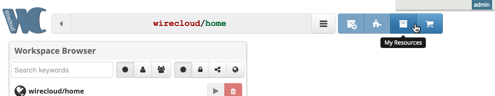
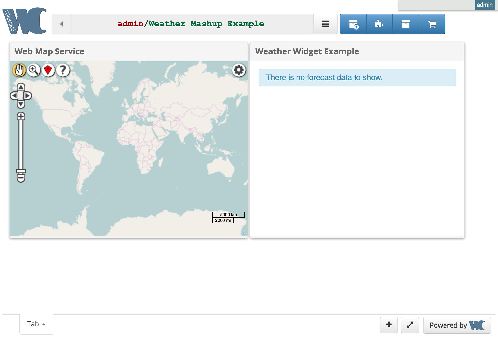

## イントロダクション

このドキュメントでは、WireCloud version 1.4 (FIWARE release 7.7 以降) のインストール方法について説明します。
バグ、タイプミス、あなたが含まれるべきだが含まれていないと思うものなど、このドキュメントに関するフィードバックは
大歓迎です。

## 要件

これらの依存関係は、ドキュメントを通してインストールされるため、この手順で手動でインストールすることはできません。
**いずれにしても、次の Python パッケージをインストールする必要があります** :

- A Database Manager (MySQL, PostgreSQL, SQLite3...)
- Python 3.4+. 以下の python パッケージをインストールする必要があります :
    - Django 2.0+
    - lxml 2.3.0+
    - django-appconf 1.0.1+
    - django_compressor 2.0+
    - rdflib 3.2.0+
    - requests 2.1.0+
    - selenium 3.4+
    - pytz
    - django_relatives 1.x
    - user-agents
    - regex
    - markdown
    - haystack 2.4.1+
    - whoosh 2.7.2+
    - pycrypto
    - pyScss 1.3.4+
    - Pygments
    - pillow
    - jsonpatch

これらの依存関係はすべて Linux, Mac OS, Windows で 利用できるため、WireCloud はこれらのオペレーティングシステムの
いずれかで動作するはずです。しかし、Debian Wheezy +、CentOS 6+、Ubuntu 12.04+、またはMac OS X 10.9+
(開発/テストでのみ推奨)  のオペレーティング・システムはアクティブにテストされているので、
これらを使用する方がよいでしょう

- Ubuntu 16.04
- Ubuntu 14.04
- Ubuntu 12.04
- CentOS 6
- CentOS 7
- Debian Wheezy
- Debian Jessie
- Mac OS 10.9+

## 基本的な依存関係のインストール

WireCloud をインストールする前に、python と
[pip](http://www.pip-installer.org/en/latest/installing.html)
などのいくつかの基本的な依存関係をインストールする必要があります。

> **注** : virtualenv は必須ではありませんが、使用する場合は、WireCloud をインストールする前にインストールする
> 必要があります。CentOS/Red Hat に WireCloud をインストールするときは、virtualenv を使用することを
> 強くお勧めします。詳しくは [virtualenv セクション](#using-virtualenv)を参照してください。
> これらのシステムは通常、公式リポジトリから、そして同時に pip から python パッケージをインストールする際に
> 問題を引き起こします。これらのシステムではよくあるケースは、一部のパッケージは WireCloud との互換性のために
> 更新する必要がありますが、他のシステムアプリケーションの要件であることです。難しいですが、
> virtualenv を使わずにこれらのシステムに WireCloud をインストールすることは可能です。


### Debian/Ubuntu

このガイドは、システムのパッケージリストが最新であることを前提としています。それ以外の場合は、次のコマンドを実行します :

```bash
$ apt-get update
```

Debian/Ubuntu にソフトウェアをインストールする前に :

```bash
$ apt-get install python python-pip --no-install-recommends
```

pip のインストールをアップグレードすることをお勧めします :

```bash
$ pip install -U pip
```

そして、setuptools の最新バージョンがインストールされていることを確認してください :

```bash
$ pip install "setuptools>18.5"
```

また、次のパッケージをインストールすることをお勧めします :

```bash
$ apt-get install build-essential python-dev libxml2-dev libxslt1-dev zlib1g-dev libpcre3-dev libcurl4-openssl-dev libjpeg-dev
```

および、次の pip パッケージ をインストールしてください :

```bash
$ pip install pyOpenSSL ndg-httpsclient pyasn1
```

### CentOS & Red Hat Enterprise Linux


#### CentOS/RHEL 6

CentOS/RHEL 6 はPython 2.6 しかサポートしないので、Python 2.7 を別のリポジトリからインストールする必要があります。
Software Collection respository を使用することをお勧めします :

```text
# 1. システムにリポジトリを含むパッケージをインストールします :
# CentOS で、CentOS レポジトリにある centos-release-scl パッケージをインストールします:
$ sudo yum install centos-release-scl

# RHEL で、RHSCL リポジトリを有効にします
$ sudo yum-config-manager --enable rhel-server-rhscl-7-rpms

# 2. Collection をインストールします :
$ sudo yum install python27

# 3. Software Collections　の使用を開始します :
$ scl enable python27 bash
```

Software Collections から Python 2.7 をインストールした後、`easy_install` を使用して pip
を手動でインストールする必要があります :

```bash
$ easy_install pip
```

また、次のパッケージをインストールすることをお勧めします :

```bash
$ yum install gcc libxslt-devel zlib-devel pcre-devel libcurl-devel libjpeg-devel libffi-devel openssl-devel
```

および、次の pip パッケージをインストールしてください :

```bash
$ pip install pyOpenSSL ndg-httpsclient pyasn1
```

> **注** : SCL 自動インストール `python27-python-devel` を使用して python2.7 をインストールしてください。
> 別のソースを使用して Python をインストールする場合は、同等のパッケージもインストールされていることを
> 確認する必要があります。

#### CentOS/RHEL 7

CentOS/RHEL 7 によってデフォルトで出荷される Python パッケージは、WireCloud を使用するのに十分なので、
リポジトリから直接インストールすることができます : 

```bash
$ yum install python
```

pip やその他のパッケージはサードパーティのリポジトリからインストールする必要があります。最も一般的なものは
EPEL リポジトリです。追加方法については http://fedoraproject.org/wiki/EPEL を参照してください。
リポジトリがある場合は、次のコマンドを使用してpipをインストールできます :

```bash
$ yum install epel-release
$ yum install python-pip
```

また、次のパッケージをインストールすることをお勧めします :

```bash
$ yum install gcc python-devel libxslt-devel zlib-devel pcre-devel libcurl-devel libjpeg-devel libffi-devel openssl-devel
```

および、次の pip パッケージをインストールしてください :

```bash
$ pip install pyOpenSSL ndg-httpsclient pyasn1
```

### Mac OS

Python は Mac OS にデフォルトでインストールされるため、インストールする必要はありません。
pip は、次のコマンドを使用してインストールできます :

```bash
$ sudo easy_install pip
```

ただし、Mac 用の [Homebrew](http://brew.sh/) ツールを使用して Python インストールをアップグレードすることを
お勧めします :

```bash
$ brew install python
```

このコマンドは pip コマンドツールを bonus としてインストールします。

また、次のパッケージをインストールすることをお勧めします :

```bash
$ brew install pcre
```

xcode のコマンドライン開発ツールも必要です。次のコマンドを実行してインストールできます :

```bash
$ xcode-select --install
```

<a name="using-virtualenv"></a>

### virtualenv の使用

[virtualenv](http://virtualenv.readthedocs.org/en/latest/virtualenv.html) は、独立した Python
環境を作成するためのツールです。これらの仮想環境は、Python の独立した作業コピーであり、
他のプロジェクトに影響を与えることなく、特定のプロジェクトに取り組むことができます。

pip を使用して virtualenv をインストールすることができます : 

```bash
$ pip install virtualenv
```

一度 virtualenv をインストールすると、次のコマンドを使用して仮想環境を作成できます :

```bash
$ virtualenv venv
```

これにより、仮想環境に関連するすべてのリソースを格納するための  `venv` フォルダが作成されます。
仮想環境の使用を開始するには、仮想環境をアクティブにする必要があります :

```bash
$ source venv/bin/activate
```

その後、システムのデフォルトの Python やその他の仮想環境に影響を与えずに、新しいモジュールをインストールすることが
できます。現時点で仮想環境での作業が完了している場合は、仮想環境を非アクティブにすることができます :

```bash
$ deactivate
```

これにより、インストールされているすべてのライブラリを持つ、システムのデフォルト Python インタプリタに戻ります。


仮想環境を削除するには、そのフォルダを削除するだけです。


## pip を使った WireCloud のインストール

pip を使用して常に最新の安定版 WireCloud をインストールすることができます :

```bash
$ sudo pip install wirecloud
```


## ソースからの WireCloud のインストール

WireCloud ソースコードは、[GitHub WireCloud repository](https://github.com/Wirecloud/wirecloud) で利用できます。

最新の開発コードを入手するには、次の2つのオプションのいずれかを選択します :

- GitHub の WireCloud リポジトリに移動し、`1.0.x` ブランチに切り替え(または特定の 1.0.x タグを選択してください。
  例 : 1.0.0)、*Download ZIP* をクリックしてリポジトリを zip ファイルとしてダウンロードするか、この
  [リンク](https://github.com/Wirecloud/wirecloud/zipball/1.0.x)をクリックしてください。
  ダウンロードが完了したら、解凍します。
- または、GitHub から最新の開発版を取得するために [GIT](http://git-scm.com/) クライアントを使用してください :

```bash
$ git clone https://github.com/Wirecloud/wirecloud.git
$ cd wirecloud
$ git checkout 1.0.x
```

> **注** : この `1.0.x` ブランチは、WireCloud の `1.0 ` バージョン、つまり、このガイドで説明されている
> バージョンの最新の安定バージョンを提供します。`1.0.x` シリーズの最新の開発版が `1.0.x-dev` ブランチから
> 提供され 、最新の開発版の WireCloud を develop ブランチから入手できます。
>
> `1.0.x` ブランチを使用する代わりに、`develop` ブランチから最新バージョンの WireCloud をインストールする場合は、
> このガイド (この[リンク](https://wirecloud.readthedocs.io/en/latest/installation_guide/)
> にしたがって) の最新版を読んでいるかどうかを確認することをお勧めします。

ソースコードをダウンロードしたら、`setup.py` スクリプトを使用して WireCloud をインストールできます。
この手順は root 権限が必要です :

```bash
$ cd ${path_to_source_code}/src
$ python setup.py bdist_wheel
$ sudo pip install dist/wirecloud-${version}-py2.py3-none-any.whl
```

ここでの `${version}` は、インストールする WireCloud のバージョンです。

> **注** : `setup.py` スクリプトを使用するための余分な依存関係があります。`setuptools` >= 18.5 と `wheel` > 0.24
> です。pip を使ってインストールできます : `pip install "setuptools>18.5" "wheel>=0.24"`


## Docker を使用した WireCloud のインストール (推奨)

WireCloud は、[Docker](https://www.docker.com/) を使用してデプロイすることもできます。イメージは、
[Docker Hub](https://hub.docker.com/r/fiware/wirecloud/) で見つけることができます。このガイドでは、
Docker を使用した WireCloud のインストールについては触れていません。他の Docker イメージとして使用できるため、
[Docker のドキュメント](https://docs.docker.com/userguide/dockerimages/) を参照してください(Docker Machine
でも使用できます)。このケースでどのように実行するかについての詳細については、WireCloud のイメージについての
Docker Hub のドキュメントを参照してください。いずれにしても、このガイドで説明されている手順に従って WireCloud
コンテナの設定を変更したり、[管理ガイド](administration_guide.md)のセクションで説明している管理手順を
使用したりすることができます。

> WireCloud の DockerFiles と イメージのドキュメントは、
> [docker-wirecloud](https://github.com/Wirecloud/docker-wirecloud/) リポジトリでホストされています。

## WireCloud の新しいインスタンスを作成

WireCloud をインストールすると、`wirecloud-admin` スクリプトにアクセスできます。このスクリプトは、とりわけ、
WireCloud の新しいインスタンスをデプロイするために使用されます。インスタンスを作成する前に、WireCloud
を管理および実行するための特別なユーザを作成することをお勧めします。このユーザを使用することにより、
WireCloud はセキュリティ侵害の潜在的な影響を制限することができます。

たとえば、Debian/Ubuntu の次のコマンドを使ってそのようなユーザを作成することができます : 

```bash
$ adduser --system --group --shell /bin/bash wirecloud
```

新しいインスタンスの作成、`manage.py` スクリプトの実行、WireCloud インスタンスの実行
(Apache を使用する場合など) にこのユーザを使用することを忘れないでください 。

WireCloud の新しいインスタンスは、`wirecloud-admin` の `startproject` コマンドを使用して作成できます。
これにより、新しいインスタンスに関連する `manage.py` スクリプト、設定ファイルなどを含む新しいディレクトリが
作成され ます。さらに、このディレクトリに新しい Python モジュールを追加してインスタンスをカスタマイズする
こともできます。

```bash
$ cd /opt
$ wirecloud-admin startproject wirecloud_instance
```

> **注** : このガイドでは、WireCloud インスタンスが `/opt` に作成されていることを前提としていますが、
> ファイル・システムの任意の場所に作成できます。とにかく、`/opt` へのインストールを決定し、WireCloud
> のユーザを作成することを選択した場合は、このユーザが `/opt` 内部に書き込むための十分な権限を持っていない
> 可能性があることを考慮してください。
>
> 1つのオプションは、十分な権限を持つユーザ(例 `root`) を使用してインスタンスを作成し、次にそのインスタンスの
> 所有者を変更することです。例 : `chown wirecloud:wirecloud -R /opt/wirecloud_instance`

新しいインスタンスを作成した後は、データベースを選択してデータベースを作成し、最終的な Django
設定を実行するように設定する必要があります。これらの手順は、`--quick-start` オプションを使用してスキップできます。
これにより、デフォルト `admin` ユーザ、パスワード : `admin` で SQLite3 を使用するようにインスタンスが設定されます。
このメソッドは、テスト用に WireCloud インスタンスを作成する場合に非常に便利です。

```bash
$ cd /opt
$ wirecloud-admin startproject wirecloud_instance --quick-start
```

> **注** : できるだけ早く、デフォルトの `admin` の資格情報を変更することを忘れないでください。
> 特に、インスタンスに一般にアクセスできる場合は特に注意してください。

`--quick-start` オプションを使用する場合は、"[WireCloud の実行](#running-wirecloud)" のセクションに
直接移動する必要があります。


## データベースのインストールと構成

データベース・エンジンを設定するには、インスタンス `settings.py` ファイルの `DATABASE`
設定を変更する必要があります。たとえば、`/opt/wirecloud_instance/wirecloud_instance/settings.py` です。
[Django でサポートされているデータベース・エンジン](https://docs.djangoproject.com/en/1.11/ref/settings/#databases)
を使用できます。

次の例は、SQLite データベースと PostgreSQL データベースを設定する方法を示しています。


### SQLite

SQLite データベースを設定するには、次のパラメータを `settings.py` ファイルに使用して数秒で達成できます :

```python
DATABASES = {
      'default': {
             'ENGINE': 'django.db.backends.sqlite3',
             'NAME': '${dbfile}',
             'USER': '',
             'PASSWORD': '',
             'HOST': '',
             'PORT': '',
     }
}
```

ここで、`${dbfile}` はデータベース・ファイルへのフルパスです。

Python は、SQLite を直接サポートしていますが、pysqlite2 モジュールをインストールすることをお勧めします :

```bash
$ sudo pip install pysqlite
```

最後に、SQLite データベースは**プロダクション目的として推奨されていない**ことを考慮してください。
これは評価目的にのみ役立ちます。


### PostgreSQL

プロダクション目的のために、PostgreSQL データベースは、はるかに良い選択です。これを行うには、次のパラメータを
`settings.py` に設定する必要があります :

```python
DATABASES = {
      'default': {
             'ENGINE': 'django.db.backends.postgresql',
             'NAME': '${dbname}',
             'USER': '${dbuser}',
             'PASSWORD': '${dbpassword}',
             'HOST': '${dbhost}',
             'PORT': '${dbport}',
     }
}
```

ここで、`${dbname}` はデータベースの名前を表し、`${dbuser}` は、データベースに対する権限を持つユーザの名前で、
`${dbpassword}` はユーザの認証に使用するパスワードです。`${dbhost}` と `${dbport}` は、
使用するデータベース・サーバのホストとポートです。サーバが WireCloud と同じマシン上で実行されている場合は、
これらの設定は空のままです。

残りの設定は、PostgreSQL 用の Python バインディングをインストールすることだけです :

```bash
$ sudo pip install psycopg2
```

あるいは、Debian/Ubuntu の場合 : 

```bash
$ sudo apt-get install python-psycopg2
```

#### Debian/Ubuntu に PostgresSQL をインストール

最初に、オブジェクト・リレーショナル・データベース・システムをインストールします。

```bash
$ sudo apt-get install postgresql
```

その後、プロジェクト・データベースを作成する必要があります。あなたのユーザは PostgreSQL でスーパー管理者権限を
持っているものとします。これは通常、あなたが postgres ユーザ、つまり `$ sudo su postgres`としてログインする必要があることを意味します。

PostgreSQL データベースとそのユーザは、次のコマンドで作成できます :

```bash
$ createuser ${dbuser} [-P]
$ createdb --owner=${dbuser} ${dbname}
```

パスワードで保護されたユーザを作成する場合は、この `-P` オプションを使用する必要があります。

'wirecloud' という名前のデータベースと、このデータベースの権限を持つ 'wc_user' というユーザを作成する場合は、
次のように記述する必要があります :

```bash
$ createuser wc_user [-P]
$ createdb --owner=wc_user wirecloud
```

最後に、データベースへのローカル接続、つまり WireCloud をインストールするコンピュータからのローカル接続も
許可する必要があります。これを行うには、`/etc/postgresql/X.X/main/pg_hba.conf` ファイルの先頭に次の規則を
追加します。つまり、次の2つのルールは、ファイルの最初の2つのルールでなければなりません :

```text
    # TYPE  DATABASE           USER            CIDR-ADDRESS          METHOD
    local   wirecloud          wc_user                               trust
    local   test_wirecloud     wc_user                               trust # only necessary for testing Wirecloud

次のコマンドを使用して、PostgreSQLサーバに `pg_hba.conf` をリロードします :

    $ sudo service postgresql reload

そして最後に、PostgreSQL を再起動し、あなたのユーザがこのコマンドを使ってアクセスできるかどうかを確認してください : 

```bash
$ psql wirecloud -U wc_user
```

#### 他のプラットフォームへの PostgreSQL のインストール

[公式の PostgresSQL インストールガイド](http://www.postgresql.org/download/) に従ってください。

## データベースの作成

WireCloud を実行する前に、データベースを作成する必要があります。これは、次のコマンドを使用して実現できます :

```bash
$ python manage.py migrate
```

このコマンドは、異なるバージョンの WireCloud 間でデータベースを移行するために使用されますが、最初に実行されると、
初期データベース構造の作成に役立ちます。作成したら、WireCloud にログインしてWeb インターフェイスから管理タスクを
実行できるようにスーパーユーザを作成する必要があります。このようなユーザを作成するには、`createsuperuser`
コマンドを使用します。`user/password` が `admin/admin` の場合、コマンド出力の例は、次のとおりです :

```bash
$ python manage.py createsuperuser

Username (leave blank to use 'wirecloud'): admin
Email address: admin@myemaildomain.com
Password: ***** (admin)
Password (again): ***** (admin)
Superuser created successfully.
```

WireCloud 1.0  にはいくつかの定義済みのダッシュボードが追加されているため、次のコマンドを実行して
作成する必要があります :

```bash
$ python manage.py populate
```


## 検索インデックス の設定

Wirecloud は [Haystack](http://haystacksearch.org/) を使用して検索インデックスを処理します。

現在、[Solr](http://lucene.apache.org/solr/),
[ElasticSearch2](https://www.elastic.co/products/elasticsearch),
[Whoosh](https://whoosh.readthedocs.io/en/latest/)
がサポートされています。Whoosh はデフォルトで有効になっています。

検索エンジンの設定を変更するには、インスタンス `settings.py` ファイルの
`HAYSTACK_CONNECTIONS` 設定を変更する必要があります。たとえば、
`/opt/wirecloud_instance/wirecloud_instance/settings.py` です。


### Whoosh の設定

[Whoosh](https://whoosh.readthedocs.io/en/latest/) は、純粋な Python で実装された、
高速で機能豊富なフル・テキスト・インデックス作成および検索ライブラリです。
設定は非常に簡単で、サービスを設定する必要がないため、基本的なインストールに
理想的です。これにより、このエンジンは WireCloud を使用するためのデフォルトエンジンに
なります。高可用の WireCloud　インストールを提供する必要がある場合は、おそらく、
ElasticSearch 2 または Solr がより良い選択です。

これがデフォルト設定です :

```python
HAYSTACK_CONNECTIONS = {
    'default': {
        'ENGINE': 'wirecloud.commons.haystack_backends.whoosh_backend.WhooshEngine',
        'PATH': path.join(BASEDIR, 'index'),
    },
}
```

`settings.py` ファイルに `HAYSTACK_CONNECTIONS` 設定を追加して、Whoosh インデックスが
保存される `PATH` を変更することができます。

### ElasticSearch2 の設定

[ElasticSearch](https://www.elastic.co/products/elasticsearch) サポートはデフォルトでは
インストールされていませんので、最初に ElasticSearch に接続するのに必要な
python モジュールをインストールします :

```
$ pip install elasticsearch==2.4.1
```

次のステップは、ElasticSearch を使用するようにhaystack を設定することです :

```python
HAYSTACK_CONNECTIONS = {
    'default': {
        'ENGINE': 'wirecloud.commons.haystack_backends.elasticsearch2_backend.Elasticsearch2SearchEngine',
        'URL': 'http://127.0.0.1:9200/',
        'INDEX_NAME': 'wirecloud',
    },
}
```

ここでの `URL` は、サーバの URL です。


### Solr の設定

Solr のサポートはデフォルトではインストールされていないので、まず最初に Solr
への接続に必要な python ライブラリをインストールします :

```bash
$ pip install pysolr
```

`pysolr` をインストールしたら、Haystack の設定を変更する必要があります :

```python
HAYSTACK_CONNECTIONS = {
    'default': {
        'ENGINE': 'wirecloud.commons.haystack_backends.solr_backend.SolrEngine',
        'URL': 'http://127.0.0.1:8983/solr/wirecloud_core',
        'ADMIN_URL': 'http://127.0.0.1:8983/solr/admin/cores',
    },
}
```

ここでの `URL` 設定は、Solr コアの URL を指します。

Haystack は Solr スキーマを生成するためのコマンド (Solr コアを作成するために必要) を提供しますが、
そのコマンドを実行する前に Solr エンジンを使用するように haystack を設定する必要があります。
Solr サーバでコアを作成したら、無効な URL (空の文字列など) を指定してこの設定を変更することができます。

Solr コアは、Solr インストールで `bin/solr create -c wirecloud_core -n basic_config`
コマンドを実行することで作成できます：、ここでの `wirecloud_core` はコアの名前です。そして、
WireCloud インストールの `--configure-directory` オプションと一緒に
` python manage.py build_solr_schema` コマンドを実行しなければなりません。理想的には、Solr
コアの設定フォルダ (たとえば、`${SOLR_ROOT}/server/solr/wirecloud_core/conf`) を指すために
`--configure-directory` を使うべきです。そうすれば自動的に設定されます。しかし、これができない場合
(フォルダがリモート・サーバにあるため)、一時フォルダにそれをポイントし、生成されたファイル
(`schema.xml` と `solrconfig.xml`) を最終的な保存先にコピーする必要があります。このファイルは
デフォルトで作成され、Haystack によって作成された設定と競合するため、設定フォルダに
`managed-schema.xml` ファイルが含まれていないことも確認する必要があります。

## 追加オプション

WireCloud で利用可能な一般的な設定のリストとそのデフォルト値は次のとおりです。これらの設定は
`settings.py` ファイル内で設定されます。また、これらの設定のほとんどは Django が提供する設定に
基づいていることを考慮してください。詳細については、
[Django ドキュメント](https://docs.djangoproject.com/en/dev/ref/settings)
を参照してください。


<a name="admins"></a>
### ADMINS

> (Tuple, default: `()` [Empty tuple])

コードエラー通知を受け取る人をリストするタプル。`DEBUG=False` で ビューが例外を発生させときに、WireCloud
は完全な例外情報でこれらの人々にメールを送ります。タプルの各メンバーは、フルネームとEメールアドレスのタプル
でなければなりません。例 : 

```python
(('John', 'john@example.com'), ('Mary', 'mary@example.com'))
```

エラーが発生したときはいつでも、Django はこれらすべての人にメールを送ります。


### ALLOW_ANONYMOUS_USER

> (Boolean; default: `True`)

匿名ユーザのアクセスをオン/オフにするブール値。匿名アクセスを無効にすると、ログインするユーザが必要なため、
埋め込みワークスペースとパブリック・ワークスペースの有用性が低下することを考慮してください。


<a name="debug"></a>
### DEBUG

> (Boolean; default: `False`)

デバッグモードをオン/オフにするブール値。

**`DEBUG` をオンにしてサイトを本番環境に展開しないでください。**

デバッグモードの主な機能の1つは、詳細なエラーページの表示です。`DEBUG` が `True`とき、WireCloud で例外が
発生した場合、Django は、現在 `settings.py` で 定義されているすべての Django の設定のような、
使用している環境に関するメタデータを含む、詳細なトレースバックが表示されます。


### DEFAULT_LANGUAGE

> (String; default: "browser")

デフォルトで使用する言語コード (例 : "en")。この設定では、他の値もサポートしています :  "browser" は、
"ブラウザから検出された言語を使用する"ことを意味し、"default" は `LANGUAGE_CODE` 設定値を使用します。


<a name="fiware_portals"></a>
### FIWARE_PORTALS

> (TUPLE, DEFAULT: `()`[Empty tuple])

関連するポータルのリスト。この設定は ユーザが Wirecloud からサインアウトすると同時に他のポータルから
ログアウトし、シングルサイン・アウトの経験を提供するために使用されます。この設定は`wirecloud.fiwarelabtheme`
と `wirecloud.fiwarelabdarktheme` テーマを使用するときにナビゲーションバーを作成するためにも使用されます。

例として、これはFIWARE Lab で使用される設定です : 

```python
FIWARE_PORTALS = (
    {
        "name": "Cloud",
        "url": "https://cloud.lab.fiware.org",
        "logout_path": "/logout"
    },
    {
        "name": "Store",
        "url": "https://store.lab.fiware.org",
        "logout_path": "/logout"
    },
    {
        "name": "Mashup",
        "url": "https://mashup.lab.fiware.org",
        "logout_path": "/logout"
    },
    {
        "name": "Data",
        "url": "https://data.lab.fiware.org",
        "logout_path": "/user/logout"
    },
    {
        "name": "Account",
        "url": "https://account.lab.fiware.org",
        "logout_path": "/auth/logout/"
    },
    {
        "name": "Help&info",
        "url": "http://help.lab.fiware.org"
    },
)
```

このリストにポータルを追加し、ナビゲーションバーには追加しない場合は、display 属性を使用するだけです。 

```python
FIWARE_IDM_SERVER = "https://account.mydomain.com"
FIWARE_PORTALS = (
    {
        "name": "Mashup",
        "url": "https://mashup.mydomain.com",
        "logout_path": "/logout"
    },
    {
        "name": "Account",
        "url": FIWARE_IDM_SERVER,
        "logout_path": "/auth/logout/",
        "display": False
    },
)
```

### FORCE_DOMAIN

> (String, default: `None`)

内部 URL を構築する際に WireCloud に具体的なドメイン名 (ポートを含まない) を使用させる場合は、文字列を使用して
`FORCE_DOMAIN` を設定します。この設定が `None` (デフォルト)の場合、WireCloud はドメイン情報を取得するために
[Django のサイト・フレームワーク](https://docs.djangoproject.com/en/1.11/ref/contrib/sites/)
を使用しようとします。サイト・フレームワークが使用されていない場合、ドメインはリクエストから抽出されます。

**使用例**:

```python
FORCE_DOMAIN = "mashup.lab.fiware.org"
```

> この設定は、主に WireCloud がプロキシとして機能する Web サーバの背後にある場合に便利です。


### FORCE_PORT

> (Integer, default: `None`)

内部 URL を構築するときに WireCloud が強制的にそのポートを使用するようにするには、数値を使用して
`FORCE_PORT` を設定します。

この設定が `None` (デフォルト)の場合、WireCloud は着信要求からのポート情報を使用して内部 URL を構築します。

> この設定は、主に WireCloud がプロキシとして機能する Web サーバの背後にある場合に便利です。


### FORCE_PROTO

> (String, default: `None`)

内部URLを構築するときにWireCloudにこれらのスキームの1つを使用させる場合は、"http" または "https" に
`FORCE_PROTO` を設定します。

この設定が `None` (デフォルト)の場合、WireCloud はセキュリティ保護された接続からのリクエストかどうかをチェックし、
その場合は内部 URL を構築するためのスキームとして https を使用します。それ以外の場合、WireCloud は内部 URL
のスキームとして http を使用します。

> この設定は、主に WireCloud がプロキシとして機能する Web サーバの背後にある場合に便利です。


### LANGUAGE_CODE

> (String; default: "en-us")

指定されたリテラルがユーザの優先言語に変換されていないときにフォールバックとして使用する言語コードを表す
文字列です。たとえば、米国英語は "en-us" です。


<a name="LOGGING"></a>
### LOGGING

> (Dictionary; default: A logging configuration dictionary)

構成情報を含むデータ構造。このデータ構造の内容は、
[LOGGING_CONFIG](https://docs.djangoproject.com/es/1.11/ref/settings/#logging-config)
に記述されている構成メソッドに引数として渡されます。

とりわけ、デフォルトのロギング設定では、`DEBUG` が `False` のときに HTTP 500 サーバエラーを
Eメール・ログ・ハンドラに渡します。

デフォルトのロギング設定は、wirecloud/commons/utils/conf.py または
[オンライン・ソース](https://github.com/Wirecloud/wirecloud/blob/1.3.x/src/wirecloud/commons/utils/conf.py)
を参照することで確認できます。


<a name="server_email"></a>
### SERVER_EMAIL

> (String; default: 'root@localhost')

`ADMINS` に送信されたエラーメッセージなど、エラーメッセージが送信された電子メールアドレス。


### THEME_ACTIVE

> (String, default: "wirecloud.defaulttheme")

WireCloud のテーマに使用するモジュールを表す文字列。WireCloud に同梱されている現在のテーマは
`wirecloud.defaulttheme`, `wirecloud.fiwaretheme` および `wirecloud.fiwarelabtheme` です。
[カスタムテーマ](development/platform/themes) を使用することもできます。

> **注** : `wirecloud.fiwarelabtheme` は、以前 `wirecloud.oiltheme` として知られていました(WireCloud 0.8.1-) 。
> まだそれを `wirecloud.oiltheme` として参照することができますが 、新しい名前 `wirecloud.fiwarelabtheme`
> に切り替えることをお勧めします。


### URL_MIDDLEWARE_CLASSES

> (Dictionary; default: A middleware configuration dictionary)

URL グループごとのミドルウェア構成を含むデータ構造。URL グループ名は辞書のキーであり、値はそのグループに
使用するミドルウェアクラスのタプルでなければなりません。

この設定は、Django の MIDDLEWARE_CLASSES 設定の代わりに使用するべきです。
[Djangoのミドルウェアのドキュメント](https://docs.djangoproject.com/en/1.11/topics/http/middleware/)
を参照してください。

現在、利用可能なグループは、"default", "api", "proxy" です。たとえば、ミドルウェアクラスを "api"
グループに追加する場合は、次のコードを使用できます :

```python
URL_MIDDLEWARE_CLASSES['api'] += ('my.middleware.module.MyMiddlware',)
```


### WIRECLOUD_HTTPS_VERIFY

> *WireCloud 0.7.0 の新機能*
>
> (ブール型または文字列、デフォルト : `True`)

WireCloud で HTTPS 証明書を検証しない場合は、`WIRECLOUD_HTTPS_VERIFY` 設定を `False` にします。この設定が
`True` (デフォルト)場合、WireCloud は、Python リクエストにバンドルされた CA 証明書を使用して https
証明書を検証します。これは、システムによって提供された証明書を使用します(これは、Python
リクエスト・モジュールをインストールする手順に依存します)。代わりに使用する CA バンドルファイルへのパスを
指定することもできます。例 : `WIRECLOUD_HTTPS_VERIFY = "/etc/ssl/certs/ca-certificates.crt"`


## Django の設定

`settings.py` ファイルでは、WireCloud でのいくつかのオプションを設定できます。`DEBUG` が `False` の場合は、
次のコマンドを使用して WireCloud の静的ファイルを収集し、確認に対して、'yes' と答える必要があります :

```bash
$ python manage.py collectstatic
```

さらに、[Apache](http://httpd.apache.org/), [Nginx](http://nginx.org/), [Gunicorn](http://gunicorn.org/)
などの高速 HTTP サーバを使用して静的ファイルを提供する必要があります。
[Apache 2 を使用して WireCloudを 実行する方法](#running-wirecloud-using-apache-2)
に関するドキュメントを提供しています。とにかく、Gunicorn などの他の http サーバを使いたい場合、Django は
[それを行う方法に関するドキュメント](https://docs.djangoproject.com/en/dev/howto/deployment/) を提供しています。

> **注** : WireCloud コードが更新されるたびに collectstatic コマンドを再実行することを忘れないでください。
> これは、WireCloud プラグインまたは Django アプリが有効/無効にされ、デフォルトのテーマが変更される時を含みます。


## 高度な設定

### WireCloud Pub Sub アドオンのインストール

Pub Sub アドオンの開発は [github リポジトリ](https://github.com/conwetlab/wirecloud-pubsub) で行われます。
リポジトリのメインページで、インストールと使用方法に関する最新情報を、いつでも見つけることができます。

新しいバージョンの Pub Sub アドオンは、pip を使用して直接インストールできます :

    $ pip install wirecloud-pubsub


wirecloud_pubsub が `django.contrib.static` の機能を使用しているため、それを `settings.py` の `INSTALLED_APPS`
を追加する必要があります : 

```python
INSTALLED_APPS = (
    # ...
    'wirecloud_pubsub',
    # ...
)
```

最後のステップとして、使用する broker のURL を `DEFAULT_SILBOPS_BROKER` 設定に追加します :

```python
DEFAULT_SILBOPS_BROKER = 'http://pubsub.server.com:8080/silbops/CometAPI'
```

WireCloud インストールで collectstatic コマンドを実行することを忘れないでください : 

    $ ./manage.py collectstatic


### NGSI proxy

WireCloud には、ウィジェットとオペレータが NGSI-9/10 サーバに接続できるようにする JavaScript
ライブラリが付属しています。このサポートは、ウィジェットとオペレータに直接通知を受け取ることを除いて、
WireCloud をインストールするときにすぐに使用できます。これを有効にするには、WireCloud には
[NGSI proxy](https://github.com/conwetlab/ngsi-proxy) が必要です。このプロキシは NGSI
通知を受信してウィジェットまたはオペレータに渡すファサード (facade) です。

この NGSI proxy は、WireCloud と同じマシンにインストールする必要はなく、他の WireCloud
インスタンスと共有することもできます。このような NGSI proxy をインストールし設定する方法の詳細については、
この[リンク](https://github.com/conwetlab/ngsi-proxy) をクリックしてください。


### IdM GE との統合

考慮に入れるべき最初の事柄は WireCloud のこのバージョンは、Keyrock v6 および Keyrock v7
と互換性があるということです。この統合を可能にするための最初のステップは、使用する予定の
IdM サーバ (例えば : `https://account.lab.fiware.org`) を使用して新しいアプリケーションを
作成することです。そのようなアプリケーションを作成する方法についての詳細は
[Keyrock のユーザおよびプログラマーズ・ガイド](https://fi-ware-idm.readthedocs.org/en/latest/user_guide/#registering-an-application)
を参照してください。リダイレクト URI は `http(s)://${wirecloud_server}/complete/fiware/`
でなければなりません。 * Client ID* と *Client Secret*の値 (これらの値は *OAuth2認証情報*
セクション内のアプリケーションの詳細ページで利用可能です) に注意してください。後で使用します。

WireCloud インスタンスの場合 : 

<zbr>1.   `social-auth-app-django` モジュールをインストールします。例えば、`pip install "social-auth-app-django`

<zbr>2.   `settings.py` を編集します : 

 -  `INSTALLED_APPS` から `wirecloud.oauth2provider` を削除します
 -  `INSTALLED_APPS` に `social_django` を追加します
 -  `AUTHENTICATION_BACKENDS` に `wirecloud.fiware.social_auth_backend.FIWAREOAuth2` を追加します。例 : 

```python
AUTHENTICATION_BACKENDS = (
    'wirecloud.fiware.social_auth_backend.FIWAREOAuth2',
)
```

> **注**: Django はいくつかの認証バックエンドをサポートしています (
> [こちら](https://docs.djangoproject.com/en/2.2/topics/auth/customizing/#specifying-authentication-backends)
> を参照してください)。たとえば、このガイドには記載されていない追加の設定が必要になりますが、
> `AUTHENTICATION_BACKENDS` の中の `django.contrib.auth.backends.ModelBackend` もリストに追加することで、
> ローカル db を使用してユーザ認証の処理を続けることができます。

   -  使用するIdM サーバを指す `FIWARE_IDM_SERVER` 設定を追加します。
      例 : `FIWARE_IDM_SERVER = "https://account.lab.fiware.org"`
   -  IdM によって提供される *Client ID * と *Client Secret* 値を使用した
      `SOCIAL_AUTH_FIWARE_KEY` と `SOCIAL_AUTH_FIWARE_SECRET` 設定を追加します。このような設定をします : 

```python
SOCIAL_AUTH_FIWARE_KEY = "43"
SOCIAL_AUTH_FIWARE_SECRET = "a6ded8771f7438ce430dd93067a328fd282c6df8c6c793fc8225e2cf940f746e6b229158b5e3828e2716b915d2c4762a34219e1792b85e4d3cdf66d70d72840b"
```

<zbr>3.   `urls.py` を編集します : 
   -  ログイン・エンドポイントを置き換えます :
       -  ファイルの先頭に次のインポート行を追加します : `from wirecloud.fiware import views as wc_fiware`
       -  Remove:
          `url(r'^login/?$', django_auth.login, name="login"),`
       -  Add:
          `url(r'^login/?$', wc_fiware.login, name="login"),`
   - パターンリストの最後に、`social-auth-app-django` url エンドポイントを追加します : `url('', include('social_django.urls', namespace='social')),`

<zbr>4.   [オプション] : `THEME_ACTIVE` 設定を `wirecloud.fiwarelabtheme` に変更します。このテーマは、
   FIWARE Lab の Mashup ポータルで使用されるテーマです

<zbr>5.   [オプション] : `[FIWARE_PORTALS](#fiware_portals)` 設定を行います。この設定は、ユーザが WireCloud
   からサインアウトすると同時に他のポータルからサインアウトし、シングルサインアウトの経験を提供するために
   使用されます。この設定は、ナビゲーションバーの作成にも使用されます

<zbr>6.   [オプション]: ソーシャル認証パイプラインに `wirecloud.fiware.social_auth_backend.sync_role_groups` を追加して、
    ロール・グループ (role-group) の同期を有効にします。このロール・グループの同期を有効にすることにより、KeyRock
    アプリケーションで構成された各ロールは WireCloud グループに関連付けられ、ユーザは KeyRock の指示に従ってそれらの
    グループに関連付けられます。これは、ロール・グループの同期が有効になっているデフォルトのソーシャル認証パイプラインです :

```python
SOCIAL_AUTH_PIPELINE = (
    'social_core.pipeline.social_auth.social_details',
    'social_core.pipeline.social_auth.social_uid',
    'social_core.pipeline.social_auth.auth_allowed',
    'social_core.pipeline.social_auth.social_user',
    'social_core.pipeline.user.get_username',
    'social_core.pipeline.user.create_user',
    'social_core.pipeline.social_auth.associate_user',
    'social_core.pipeline.social_auth.load_extra_data',
    'social_core.pipeline.user.user_details',
    'wirecloud.fiware.social_auth_backend.sync_role_groups',
)
```

<zbr>7.  `python manage.py migrate; python manage.py collectstatic --noinput` を実行します

### リアルタイム同期サポートの有効化

WireCloud 1.0 では、Web  ソケットを介したリアルタイム同期の実験的サポートが追加されています。

このサポートを有効にする手順は次のとおりです :

<zbr>1.   [Django チャンネル](https://channels.readthedocs.io/en/latest/)をインストール :


```bash
pip install "channels<2.4"
```

<zbr>2.   `channels` と` wirecloud.live` を `settings.py` ファイルの `INSTALLED_APPS` 設定に追加します。

<zbr>3.   `ASGI_APPLICATION` と `CHANNEL_LAYERS` 設定を構成して、チャネル・フレームワークを設定します。
    たとえば、次の設定を使用できます :

```python
ASGI_APPLICATION = 'wirecloud.live.routing.application'
CHANNEL_LAYERS = {
    'default': {
        'BACKEND': 'channels_redis.core.RedisChannelLayer',
        'CONFIG': {
            "hosts": [('127.0.0.1', 6379)],
        },
    },
}
```

これらの手順が完了すると、runserver コマンドを使用して WireCloud を使用できます。スタンドアロン
Apache 設定を使用してリアルタイム同期サポートを使用する場合は、WireCloud をデプロイできないことを
考慮してください。このケースでは、準備が整った環境で WireCloud をデプロイする方法について、
より良いドキュメントと例を提供するために取り組んでいます。その間に、
[Django channels documentation](https://channels.readthedocs.io/en/latest/deploying.html)
を見ることができます。

<a name="running-wirecloud"></a>
## WireCloud の実行

WireCloud は Apache Web Server をベースにして実行することをお勧めします。ただし、テスト目的のために
Django の内部 Web サーバを使用して実行することもできます。いずれにせよ、WireCloud は HTTPS
を介してサービスされるように設定する必要があります。これは、別のサーバをフロントエンドとして使用し、
そのサーバで暗号化を構成できるように、いくつかの方法で実行できます。https セキュリティパラメータを
効率的に設定する方法の詳細については、mozilla の
[Security/Server Side TLS](https://wiki.mozilla.org/Security/Server_Side_TLS)
ページを参照することをお勧めします。

### Django の内部 Web サーバを使用して WireCloud を実行

> **注** : この方法で、WireCloud を実行する場合、評価/テスト目的で使用する必要があることに注意してください。
> 本番環境では使用しないでください。

WireCloud を起動するには、次のコマンドを入力します :

    $ python manage.py runserver 0.0.0.0:8000 --insecure

次に、`http://computer_name_or_IP_address:8000/ ` に移動します。`computer_name_or_IP_address` は、
WireCloud がインストールされているコンピュータの名前または IP アドレスです。次に、プラットフォームに
サインインするために、データベースにデータを追加するときに指定したユーザ名とパスワードを使用します。

<a name="running-wirecloud-using-apache-2"></a>
### Apache 2 を使用して WireCloud を実行する方法

WireCloud を Apache にデプロイする場合は、[mod_wsgi](https://github.com/GrahamDumpleton/mod_wsgi)
モジュールをインストールする必要があります。Apache も同様です。

#### Debian/Ubuntu に Apache 2 をインストール

これを行うには、Debian/Ubuntu で次のコマンドを入力してください :

    $ sudo apt-get install apache2 libapache2-mod-wsgi

Apache と mod_wsgi をインストールしたら、最新のものを有効にする必要があります : 

    $ a2enmod wsgi

次のステップは、Apacheの設定ファイルを使用して WireCloud の `VirtualHost` を作成することです。
Debian と Ubuntu の上での VirtualHosts の設定ファイルは `/etc/apache2/sites-available`に保存されており、
`a2enmod` と `a2dissite` を使用して、有効と無効となります。`VirtualHos` 定義の構文はシステムの
Apache 2 のバージョンに依存するので、別のセクションで説明します。

#### CentOS/Red Hat に Apache 2 をインストール

```bash
$ yum install httpd mod_wsgi
```

#### Apache 2.2

このテンプレートを出発点として使用できます :

```ApacheConf
<VirtualHost *:80>
        ...
        ### Wirecloud ###
        WSGIPassAuthorization On

        WSGIDaemonProcess wirecloud python-path=${path_to_wirecloud_instance} user=${wirecloud_user} group=${wirecloud_group}
        WSGIScriptAlias / ${path_to_wirecloud_instance}/${wirecloud_instance}/wsgi.py
        <Location />
                WSGIProcessGroup wirecloud
        </Location>

        Alias /static ${path_to_wirecloud_instance}/static
        <Location "/static">
                SetHandler None
                <IfModule mod_expires.c>
                        ExpiresActive On
                        ExpiresDefault "access plus 1 week"
                </IfModule>
                <IfModule mod_headers.c>
                        Header append Cache-Control "public"
                </IfModule>
        </Location>
        <Location "/static/cache">
                <IfModule mod_expires.c>
                        ExpiresDefault "access plus 3 years"
                </IfModule>
        </Location>
        ...
</VirtualHost>
```

`/opt/wirecloud_instance` で WireCloud インスタンスが利用可能で、システム上に `wirecloud` ユーザ
を作成したとすると、次の値を設定します :

- `${path_to_wirecloud_instance}` = `/opt/wirecloud_instance`
- `${wirecloud_instance}` = `wirecloud_instance`
- `${wirecloud_user}` = `wirecloud`
- `${wirecloud_group}` = `wirecloud`

最終的に次のような設定になります : 

```ApacheConf
<VirtualHost *:80>
        ...
        ### Wirecloud ###
        WSGIPassAuthorization On

        WSGIDaemonProcess wirecloud python-path=/opt/wirecloud_instance user=wirecloud group=wirecloud
        WSGIScriptAlias / /opt/wirecloud_instance/wirecloud_instance/wsgi.py
        <Location />
                WSGIProcessGroup wirecloud
        </Location>

        Alias /static /opt/wirecloud_instance/static
        <Location "/static">
                SetHandler None
                <IfModule mod_expires.c>
                        ExpiresActive On
                        ExpiresDefault "access plus 1 week"
                </IfModule>
                <IfModule mod_headers.c>
                        Header append Cache-Control "public"
                </IfModule>
        </Location>
        <Location "/static/cache">
                <IfModule mod_expires.c>
                        ExpiresDefault "access plus 3 years"
                </IfModule>
        </Location>
        ...
</VirtualHost>
```

サイトを有効にしたら、Apache を再起動します :

    # apache2ctl graceful

WireCloud に入るために、`http://computer_name_or_IP_address/` に移動します。

https セキュリティ・パラメータを効率的に設定する方法の詳細については、
[Apache 2.2 documentation about how to configure the TLS encryption](http://httpd.apache.org/docs/2.2/ssl/ssl_howto.html)
と mozilla から提供されている、
[Security/Server Side TLS](https://wiki.mozilla.org/Security/Server_Side_TLS)
のページを参照してください。


#### Apache 2.4

このテンプレートを出発点として使用できます : 

```ApacheConf
<VirtualHost *:80>
        ...

        <Directory ${path_to_wirecloud_instance}/${instance_name}>
                <Files "wsgi.py">
                        Require all granted
                </Files>
        </Directory>

        ### Wirecloud ###
        WSGIPassAuthorization On

        WSGIDaemonProcess wirecloud python-path=${path_to_wirecloud_instance} user=${wirecloud_user} group=${wirecloud_group}
        WSGIScriptAlias / ${path_to_wirecloud_instance}/${instance_name}/wsgi.py
        <Location />
                WSGIProcessGroup wirecloud
        </Location>

        Alias /static ${path_to_wirecloud_instance}/static
        <Location "/static">
                SetHandler None
                Require all granted
                <IfModule mod_expires.c>
                        ExpiresActive On
                        ExpiresDefault "access plus 1 week"
                </IfModule>
                <IfModule mod_headers.c>
                        Header append Cache-Control "public"
                </IfModule>
        </Location>
        <Location "/static/cache">
                Require all granted
                <IfModule mod_expires.c>
                        ExpiresDefault "access plus 3 years"
                </IfModule>
        </Location>
        ...
</VirtualHost>
```

`/opt/wirecloud_instance` で、 WireCloud インスタンスが利用可能で、システム上に `wirecloud`
ユーザを作成したとすると、次の値を設定します :

- `${path_to_wirecloud_instance}` = `/opt/wirecloud_instance`
- `${wirecloud_instance}` = `wirecloud_instance`
- `${wirecloud_user}` = `wirecloud`
- `${wirecloud_group}` = `wirecloud`

最終的に次のような設定になります :  

```ApacheConf
<VirtualHost *:80>
        ...

        <Directory /opt/wirecloud_instance/wirecloud_instance>
                <Files "wsgi.py">
                        Require all granted
                </Files>
        </Directory>

        ### Wirecloud ###
        WSGIPassAuthorization On

        WSGIDaemonProcess wirecloud python-path=/opt/wirecloud_instance user=wirecloud group=wirecloud
        WSGIScriptAlias / /opt/wirecloud_instance/wirecloud_instance/wsgi.py
        <Location />
                WSGIProcessGroup wirecloud
        </Location>

        Alias /static /opt/wirecloud_instance/static
        <Location "/static">
                SetHandler None
                Require all granted
                <IfModule mod_expires.c>
                        ExpiresActive On
                        ExpiresDefault "access plus 1 week"
                </IfModule>
                <IfModule mod_headers.c>
                        Header append Cache-Control "public"
                </IfModule>
        </Location>
        <Location "/static/cache">
                Require all granted
                <IfModule mod_expires.c>
                        ExpiresDefault "access plus 3 years"
                </IfModule>
        </Location>
        ...
</VirtualHost>
```

サイトを有効にしたら、Apache を再起動します :

    # apache2ctl graceful

WireCloud に入るために、`http://computer_name_or_IP_address/` に移動します。

https セキュリティパラメータを効率的に設定する方法の詳細については、
[Apache 2.2 documentation about how to configure the TLS encryption](http://httpd.apache.org/docs/2.2/ssl/ssl_howto.html)
と mozilla から提供されている、
[Security/Server Side TLS](https://wiki.mozilla.org/Security/Server_Side_TLS)
のページを参照してください。


## FAQ

### 不明なエラー (例 : Internal Server Errors) が発生しました。 問題についてより良い情報を得る方法はありますか？

サーバのセキュリティを損なうことなく、最良のオプションは、[`ADMINS`](#admins), [`SERVER_EMAIL`](#server_email),
[`LOGGING`](#logging), ... の設定のために adecuate 値を提供することです。このようにして、WireCloud
で検出されたエラーごとに詳細なEメールが届きます。

それらのE メールを受信しなかった場合、またはインスタンスを作成しているだけの場合は、[DEBUG](#debug)
設定を `True` に設定して、エラーが発生した場合に WireCloud でより詳細で具体的な Web ページを作成できます。

> *注* : `DEBUG` 設定を以前の値 の `False` に復元することを忘れないでください。


### pip には lxml のインストールに問題があります。必要な対応は？

詳細については、` http://lxml.de/installation.html#installation` を参照してください。

例えば、Debian と Ubuntuでは、`python-dev` `libxml2-dev` `libxslt1-dev`
パッケージをインストールする必要があります :

```bash
$ sudo apt-get install python-dev libxml2-dev libxslt1-dev
$ pip install lxml
```

Mac OS では、XCode とそのコマンドラインツールをインストールすることを忘れないでください。
これが動作せず、Mac 用の [Homebrew](http://brew.sh/) ツールを使用している場合は、
次のコマンドを試すことができます : 

```bash
$ brew install libxml2
$ pip install lxml
```


### Django の無効な HTTP_HOST メールを受信したくありません

Django は、デフォルトで発生した `SuspiciousOperation`  例外のメールを送信します。
これらのメールを無効にするには、次のスニペットを `settings.py` ファイルに追加します :

```python
LOGGING['loggers']['django.security.DisallowedHost'] = {
    'handlers': ['null'],
    'propagate': False,
}
```

このメソッドは、他の `SuspiciousOperation` エラーメールを無効にするためにも使用できます。詳細については、
[Django のドキュメント](https://docs.djangoproject.com/es/1.10/topics/logging/#django-security)
を参照してください。

### 管理者の資格情報を忘れました。どうすれば回復できますか？

2つの選択肢があります : 

- 管理者のパスワードを変更してください : `python manage.py help changepassword`
- 新しい管理者ユーザを作成します : `python manage.py help createsuperuser`


### `manage.py` スクリプトの実行中または、`startproject` コマンドの実行中にエラーが発生します

エラーが次のような場合 : 

       Traceback (most recent call last):
         File "./manage.py", line 8 in <module>
           from django.core.management import execute_from_command_line
       ImportError: No module named django.core.management

WireCloud の実行に使用される Python インタプリタを使用して、Python インストールが
正しく設定されていることを確認します :

    $ python
    Python 2.7.6 (default, Nov 13 2013, 20:19:29)
    [GCC 4.2.1 Compatible Apple LLVM 5.0 (clang-500.2.79)] on darwin
    Type "help", "copyright", "credits" or "license" for more information.
    >>> import django
    >>> django.VERSION
    (1, 5, 5, 'final', 0)

### WireCloud サーバが 503 のエラー応答を返します

Apache のログファイルに次のようなメッセージが表示された場合 : 

    (13)Permission denied: mod_wsgi (pid=26962): Unable to connect to WSGI \
    daemon process '<process-name>' on '/etc/httpd/logs/wsgi.26957.0.1.sock' \
    after multiple attempts.

`/etc/httpd/conf.d/wsgi.conf` を編集して、次の行を追加します :

    WSGISocketPrefix /var/run/wsgi

この問題の詳細については、次の
[リンク](https://code.google.com/p/modwsgi/wiki/ConfigurationIssues#Location_Of_UNIX_Sockets)
を参照してください。


### 次のエラーが表示されます...

#### Error processing proxy request: 'HTTPResponse' object has no attribute 'stream'

python リクエスト・モジュールのバージョンを確認してください。

#### AttributeError: This StreamingHttpResponse instance has no \`content\` attribute. Use \`streaming_content\` instead.

`settings.py` ファイルから `MIDDLEWARE` 構成を削除します。

## サニティチェック手順

サニティチェック手順は、システム管理者がインストールのテスト準備が整ったことを確認するための手順です。
したがって、単体テスト、統合テスト、ユーザ検証に進む前に、明白なまたは基本的な誤動作が修正されていることを
確認するための予備テスト・セットです。

### エンド・ツー・エンドのテスト

この手順を実行する前に、以下の情報が必要です :

- computer_name_or_IP_address : WireCloud がインストールされているコンピュータの名前または IP アドレスです
- テストする WireCloud インスタンスの有効な資格情報 : 例 : user : `admin` / password : `admin`、
  このガイドの[Database 作成](#database-population) のセクションに記載されています。

次のファイル :

- [CoNWeT_weather-mashup-example_1.0.2.wgt](attachments/CoNWeT_weather-mashup-example_1.0.2.wgt)

アプリケーションが実行されているかどうかを素早く確認するには、次の手順を実行します :

1. ブラウザを開き、アドレスバーに `http://${computer_name_or_IP_address}/login` を入力します

2. 次のユーザのログインフォームが表示されます :

    

3. 資格情報を入力し、_Login_ ボタンをクリックします

4. _My Resources_ ボタンをクリックします :

    

5. _Upload_ ボタンをクリックします :

    

6. アップロードフォームに `CoNWeT_weather-mashup-example_1.0.2.wgt` ファイルを追加し、_Upload_ をクリックします

7. 2つのウィジェットと1つのマッシュアップ・コンポーネントが表示されます。_Web Map Service_ と _Weather Widget Example_ と、_Weather Mashup Example_ です :

    

8. エディタ・ビューに戻ります :

    

9. _New workspace_ オプションをクリックします :

    

10. _Weather Mashup Example_ をテンプレートとして使用します :

    

11. ビューは自動的に _Weather Example Mashup_ ワークスペースに変更され、ウィジェットがその中に表示されます :

    

12. 画面に示されているように、_Web Map Service_ widget の適切なボタンをクリックしてピン・ツールを選択します
13. 希望の場所をクリックします。_Weather Widget Example_ は、予報情報を更新する必要があります :

    

この一連の手順を実行することで、WireCloud Mashup プラットフォームが実行され、正しくデプロイされ、
データベースが正しく設定されて入力されていることを確認します。

### 実行中プロセスのリスト

Apache Web server と Postgres データベースが実行されていることを確認する必要があります。
WireCloud　は Python インタプリタを使用しますが、実行時には apache2 に組み込まれていません。
次のコマンドを実行すると :

```bash
ps -ewF | grep 'apache2\|postgres' | grep -v grep
```

次のようなものが表示されます :

```bash
$ ps -ewF | grep 'apache2\|postgres' | grep -v grep
```

```bash
postgres  1631     1  0 25212  9452   0 Jul03 ?        00:00:19 /usr/lib/postgresql/9.1/bin/postgres -D /var/lib/postgresql/9.1/main -c config_file=/etc/postgresql/9.1/main/postgresql.conf
postgres  1702  1631  0 25208  3784   0 Jul03 ?        00:00:47 postgres: writer process
postgres  1703  1631  0 25208  1452   0 Jul03 ?        00:00:39 postgres: wal writer process
postgres  1704  1631  0 25462  2964   0 Jul03 ?        00:00:16 postgres: autovacuum launcher process
postgres  1705  1631  0 17370  1660   0 Jul03 ?        00:00:18 postgres: stats collector process
root      3811     1  0 50067 10848   0 13:13 ?        00:00:00 /usr/sbin/apache2 -k start
www-data  3818  3811  0 68663 39820   0 13:13 ?        00:00:00 /usr/sbin/apache2 -k start
www-data  3819  3811  0 68687 39448   0 13:13 ?        00:00:00 /usr/sbin/apache2 -k start
www-data  3822  3811  0 68901 40160   0 13:13 ?        00:00:00 /usr/sbin/apache2 -k start
```


### ネットワーク・インターフェースのアップとオープン

使用中およびリッスン中のポートをチェックするには、次のコマンドを実行します :

```bash
$ sudo netstat -ltp
```

期待される結果は、次のようなものでなければなりません :

```text
Active Internet connections (only servers)
Proto Recv-Q Send-Q Local Address           Foreign Address         State       PID/Program name
tcp        0      0 localhost:postgresql    *:*                     LISTEN      1631/postgres
tcp        0      0 *:https                 *:*                     LISTEN      3811/apache2
```

マシンが IPv6 を使用するように設定されている場合は :

```text
Active Internet connections (only servers)
Proto Recv-Q Send-Q Local Address           Foreign Address         State       PID/Program name
tcp        0      0 localhost:postgresql    *:*                     LISTEN      1631/postgres
tcp6       0      0 [::]:https              [::]:*                  LISTEN      3811/apache2
```


### データベース

一度、プロセスとポートを特定したら、健全性チェックの最後のステップは、稼動して、
クエリを実行できなければならないさまざまなデータベースを確認することです。
次のコマンドを実行すると :

```bash
$ psql -U wc_user wirecloud
```

次のようなメッセージ・テキストが表示されます :

```text
psql (9.1.4)
Type "help" for help.

wirecloud=>
```


## 診断手順

診断手順は、GE のエラーの原因を特定するためにシステム管理者が行う最初の手順です。
これらのテストでエラーの性質が特定されると、システム管理者はエラーの正確なポイントと可能な
解決方法を特定するために、より具体的で特定のテストに頼らざるを得なくなります。
このような特定のテストは、このセクションの範囲外です。

### リソースの可用性

WireCloud は512MBの利用可能な RAM (1024MB推奨) と 10GB のハードディスク容量で最低限に動作します。
それにもかかわらず、メモリー使用量は同時ユーザ数に大きく依存します。ログ履歴から得られる
通常の使用パターンによれば、ユーザあたり 256MB を超えるメモリ使用量は異常に高いとみなされます。
WireCloud は CPU を大量に消費するものではないため、ユーザあたりの CPU 使用率が5%を超えると異常
と見なされます。WireCloud は I/O インテンシブで、1秒あたり12回以上の HTTP リクエストは
異常と見なされます。

FIWARE Lab Mashup ポータルの使用状況を監視した結果は、前述の範囲が有効であることを示しています。

### リソース消費

リソース消費は負荷、特に同時ログインしているユーザの数に大きく依存します。

- Apache Web サーバの主メモリ消費量は、64 MB から 1024 MB の間である必要があります
- PostgreSQL は 64MB 以下の少量のメモリを消費する必要があります

### I/O フロー

予想される唯一の I/O フローは、Apache Web Server の設定ファイルで定義されたポート上の
HTTP または HTTPS タイプです。
