## サポートしているブラウザ

WireCloud 1.3 は、次のデスクトップ・ブラウザをサポートしています :

-   Firefox 52+
-   Chrome 57+
-   Safari 10.1+
-   Opera 43+

WireCloud 1.3 は、ワイヤリングエディタが現在タッチスクリーンでは動作しないことを除けば、以前のブラウザのモバイル版
でも動作します。

> **注意**： WireCloud はこれらのブラウザをサポートしていますが、一部のウィジェットやオペレータはこれらのブラウザの
> すべてをサポートしていない場合があります。使用しているブラウザに制限があるかどうかを知るために、各ウィジェットと
> オペレータのドキュメントを読んでください。

## 新しいワークスペースの作成

WireCloud のマッシュアップは、**workspaces** のコンテキストで構築されています。ワークスペースは、複数のタブに
またがってマッシュアップできるウィジェットとオペレータのセットで構成されています。ワークスペース内のウィジェット
およびオペレータは、データ・フローまたはイベント・ベースのメカニズムを介してデータを共有できます。

使用中のワークスペースが画面上部に表示されます。これはよく知られている REST 命名法に似ています。たとえば、次の
スクリーンショットは、"Workspace" という名前のワークスペースを示しています。ユーザ "admin" に関連し、FIWARE Lab の
WireCloud インスタンスで実行されています。つまり、admin/Workspace という名前です。

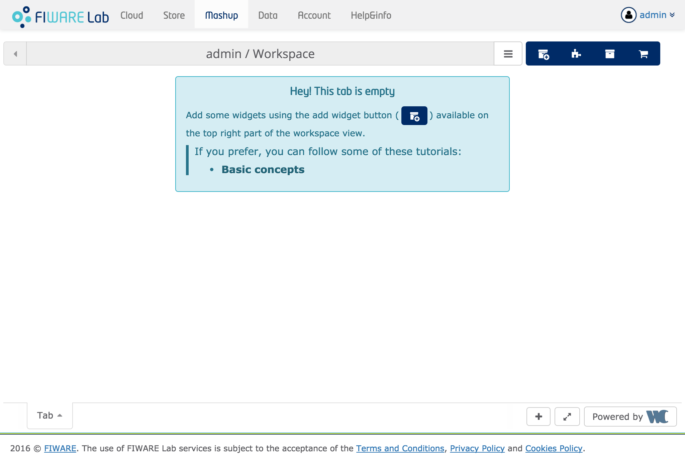

ワークスペース名の近くには、クリックしてワークスペース・ドロップダウン・メニューを展開できるボタンがあります :


展開されると、メニューには既に作成されたワークスペースのリストが表示されます。上の図のワークスペース、
_My Multimedia Workspace_ および _IssueTrouble_ を参照してください :

-   **New workspace** は、新しいワークスペースを作成します
-   **Rename** は、現在のワークスペースの名前を変更します
-   **Share** は、現在のワークスペースの共有設定を表示します
-   **Upload to my resources** は、現在の作業領域をローカル・カタログに保存して後で使用できるようになります
-   **Embed** は、他の Web ページに現在のワークスペースを埋め込む方法を表示します
-   **Settings** は、現在のワークスペースの設定を変更します
-   **Remove** は、現在のワークスペースを削除します

"History Info" という名前の新しいワークスペースを作成したい場合は、ドロップダウンメニューで、_New workspace_
を選択します :

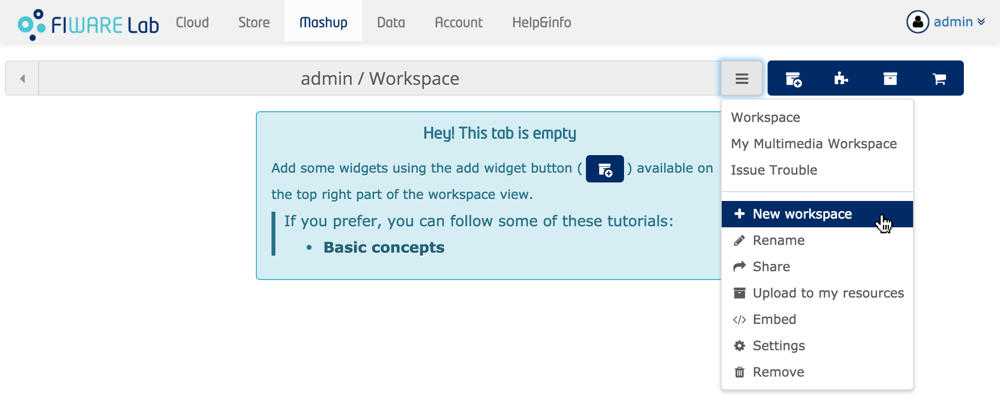

新しいワークスペースの名前を要求するダイアログが表示されます。設定したい名前を入力し、Accept ボタンをクリックします :

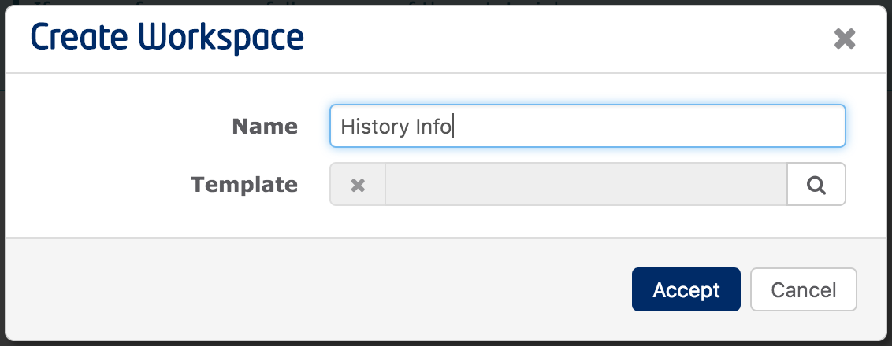

受け付けられると、新しいワークスペースの名前がウィンドウの上部に表示されます :

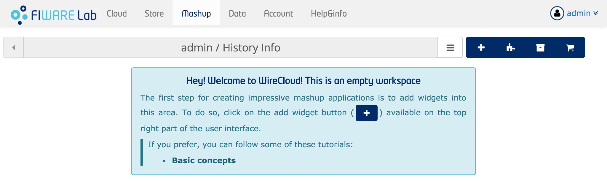

次のスクリーンショットは、ワークスペース機能を設定できる "Settings" メニューを示しています :

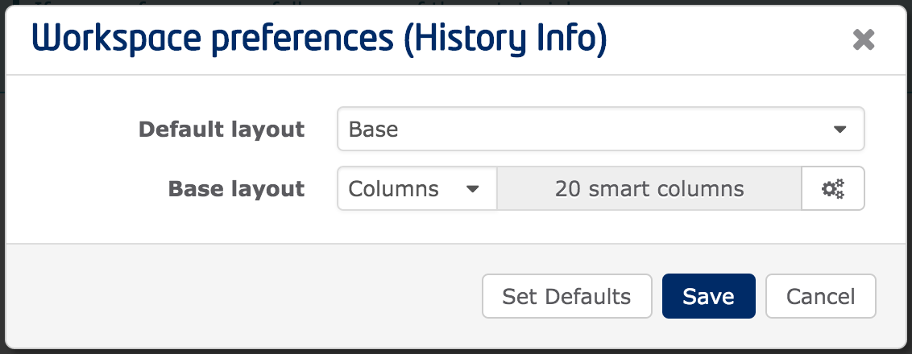


## マーケットプレイスの閲覧

WireCloud のようなマッシュアップツールは、商品のようなウィジェットやオペレータを通してアクセス可能にされたサービスを
提供し処理することができる**マーケットプレイス** へのアクセスをサポートしなければなりません。

マーケットプレイスでは、ウィジェットとオペレータをすばやく見つけて比較することができます。これにより、以前よりも優れた
業界のエコシステムに参加することができます。ウィジェット、オペレータ、さらには事前に構築されたマッシュアップは、
インターネットベースのマーケットプレイスで提供および取得できる取引な可能商品になります。パートナー企業や他のユーザは、
既存のサービスと新しいサービスを組み合わせることで、新しいビジネスモデルが発生し、付加価値の高いチェーンが
拡張されます。

次の図は、WireCloud のスクリーンショットで、FIWARE Lab マーケットプレイスを示しています。

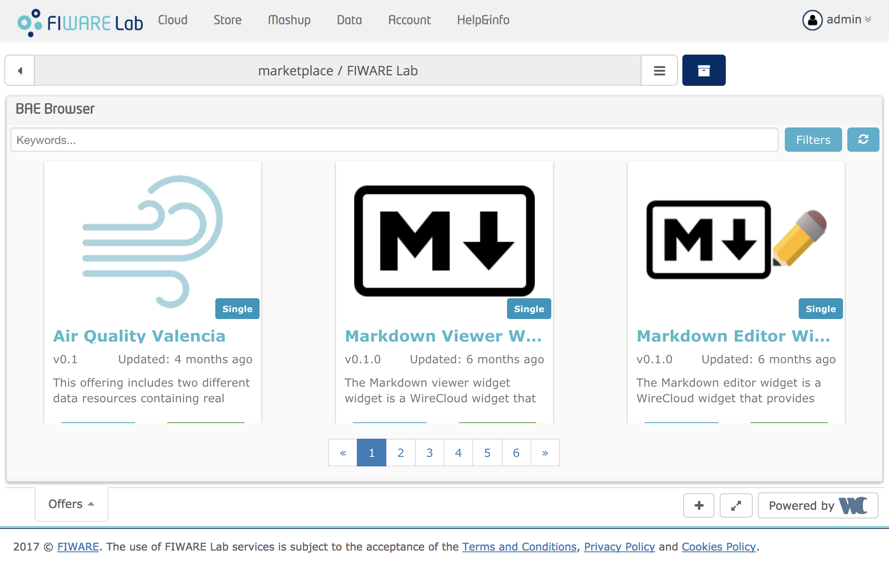


### マーケットプレイスの管理

ウィジェット、オペレータ、マッシュアップのオファーを探すときは、まずマーケットプレイスを選択する必要があります。
この目的のために、ワークスペース・パスに表示されるドロップダウン・メニューを使用してください。

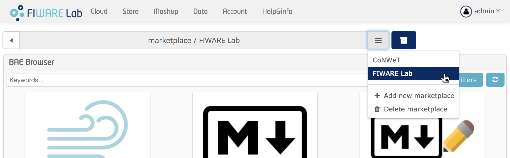

前のスクリーンショットに示されているように、このメニューではアクセスしているさまざまなマーケットプレイスの中から
選択することができます。新しいマーケットプレースを追加するには、そのエンドポイント (URL) を指定するだけです。
コンテキスト・メニューの _Delete Marketplace_ オプションで、現在のマーケットプレイスを削除することもできます。

次のスクリーン・ショットに示すように、_Add new marketplace_ オプションを使用して、FIWARE Lab マーケットプレイス
を追加できます :

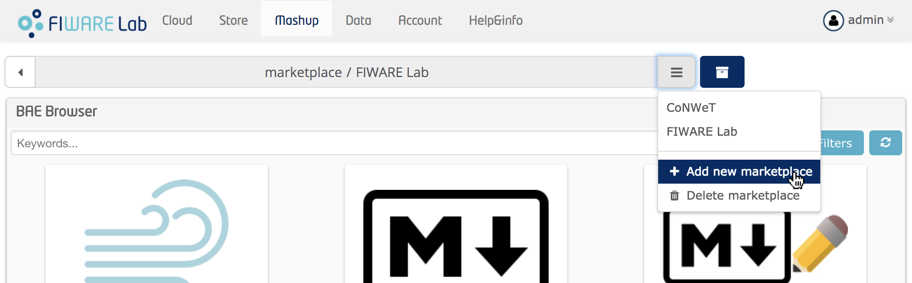

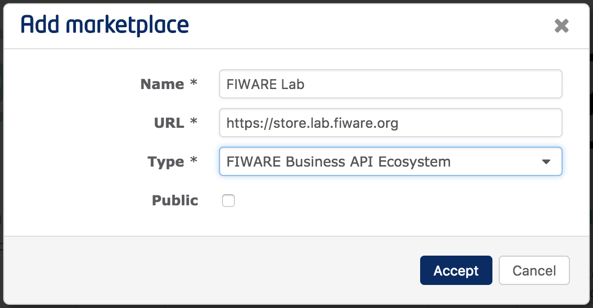

WireCloud には _My Resources_ と呼ばれる組み込みのローカル・カタログが用意されています。これにより、ユーザが
現在利用できるウィジェット、オペレータ、マッシュアップの中から検索することができます。次の図は、WireCloud
の特定のインスタンスのユーザの _My Resources_ のスクリーン・ショットを示しています。

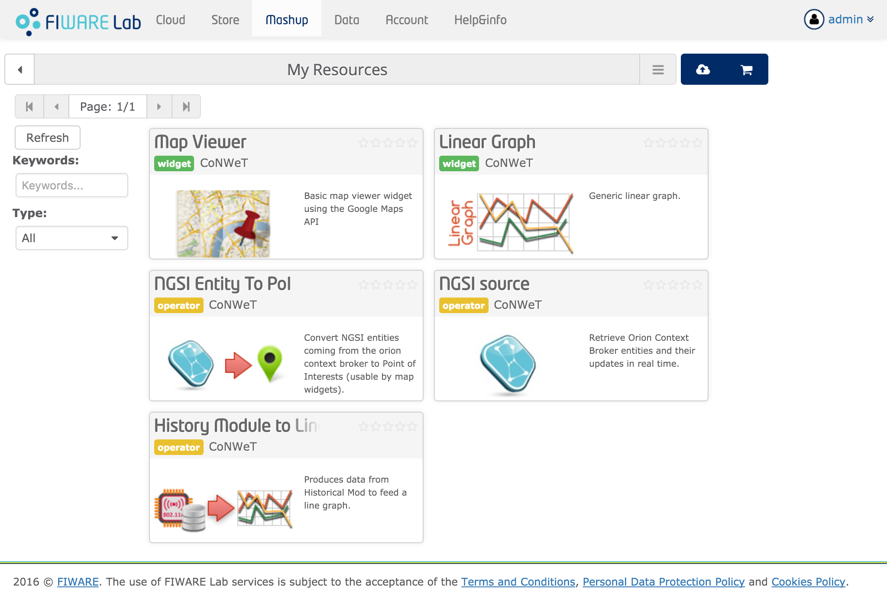

あなたが共有する全く新しいウィジェットを持っているウィジェット開発者であるか、どこかから WireCloud 対応ウィジェットをダウンロードしたばかりであれば、_My Resources_ ビューの _Upload_ ボタンを使って、簡単に新しいウィジェットを内蔵のローカルカタログにアップロードすることができます。

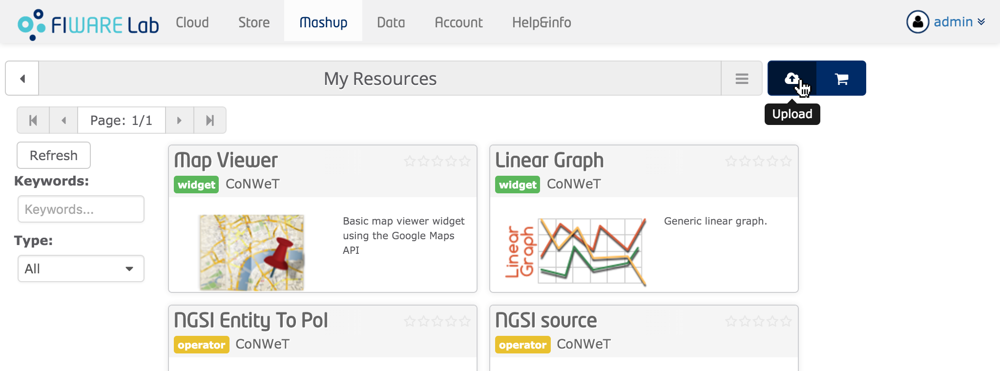

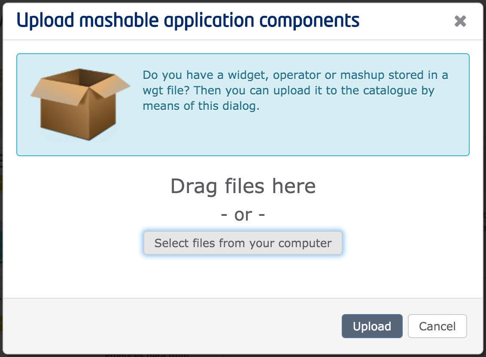

## GitHub で既存のオープンソース・ウィジェットをブラウズ

多くのウィジェットは GitHub から無料でダウンロードできます。次の検索クエリは `wirecloud-widget` とタグ付けされた
すべてのリポジトリを取得します。

```text
https://github.com/search?q=wirecloud-widget&type=Repositories
```

[付録](widgets.md) には、GitHub で利用可能な80を超える一連のオープンソース・ウィジェットの最新バージョンへの詳細と
リンクの一覧があります。`git clone` して最新の開発ソースを直接構築することもできます。

## 新しいマッシュアップの構築

"[Creating a new workspace](#creating-a-new-workspace)" のセクションに記載されている手順に従った場合は、
"History Info" のワークスペースが必要です。この点から始めてみましょう：


マーケットプレイスにアクセスして、カタログ内のマッシュアップで使用したいコンポーネントを選択します :

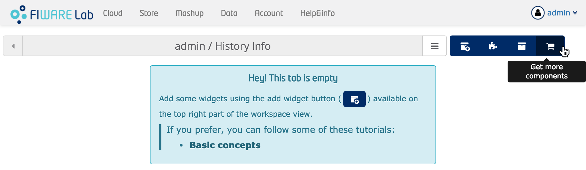

このマッシュアップ例のために必要なウィジェット/オペレータを確実に見つけるには、FIWARE Lab マーケットプレイスで、
[_WireCloudUserGuide_ offering](https://store.lab.fiware.org/#/offering/458) を使用して、それらをインストールして
ください。次の URL を使用してダウンロードすることもできます :

-   [CoNWeT_simple-history-module2linear-graph_2.3.2.wgt](attachments/CoNWeT_simple-history-module2linear-graph_2.3.2.wgt)
-   [CoNWeT_ngsi-source_3.0.7.wgt](attachments/CoNWeT_ngsi-source_3.0.7.wgt)
-   [CoNWeT_ngsientity2poi_3.0.3.wgt](attachments/CoNWeT_ngsientity2poi_3.0.3.wgt)
-   [CoNWeT_map-viewer_2.6.2.wgt](attachments/CoNWeT_map-viewer_2.6.2.wgt)
-   [CoNWeT_linear-graph_3.0.0b3.wgt](attachments/CoNWeT_linear-graph_3.0.0b3.wgt)

インストールしたら、この例で使用されているすべてのウィジェット/オペレータを _My Resources_ ビューで見ることができます :


エディタ・ビューに移動して、_Add components_ ボタンをクリックします :

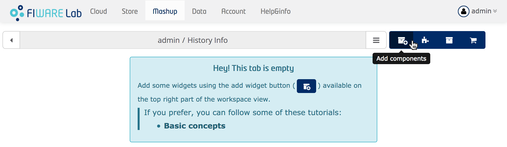

_Linear Graph_ ウィジェットを探し、_Add to workspace_ ボタンをクリックします :

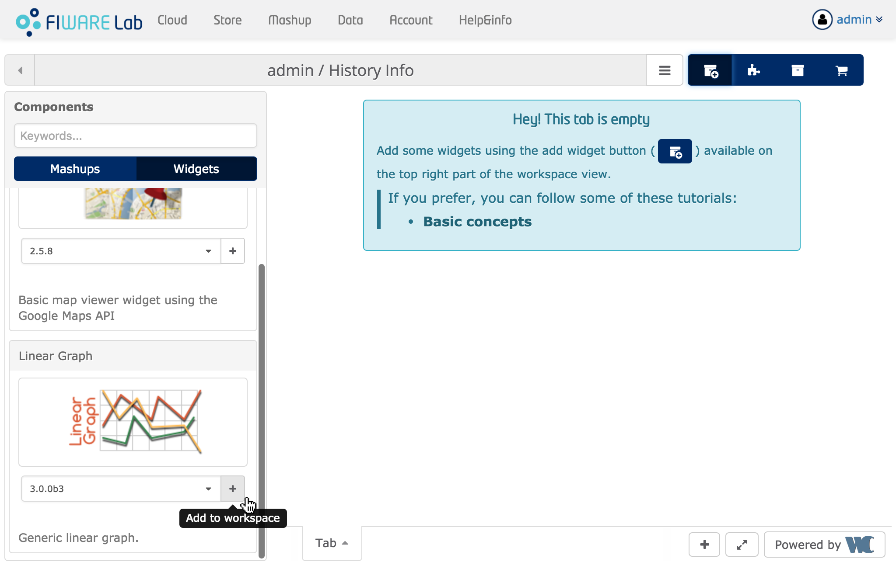

これにより、_Linear Graph_ ウィジェットがダッシュボードに追加されます。必要なレイアウトが得られるまで移動して
サイズを変更することができます :

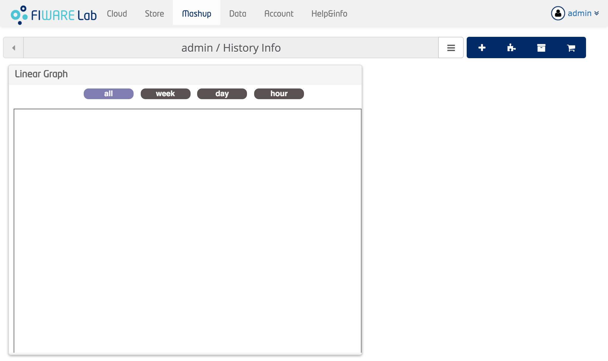

_Linear Graph_ ウィジェットの追加手順と同じ手順に従って、_Map Viewer_ ウィジェットをダッシュボードに追加します。
並べ替え後、次のビューが表示されます。このビューには、デフォルトのタブにある2つのウィジェットが表示されます。
フッター・バーのワークスペースで使用されているタブが表示され、新しいタブを作成して、マッシュアップ内のウィジェットの
整理することができます。

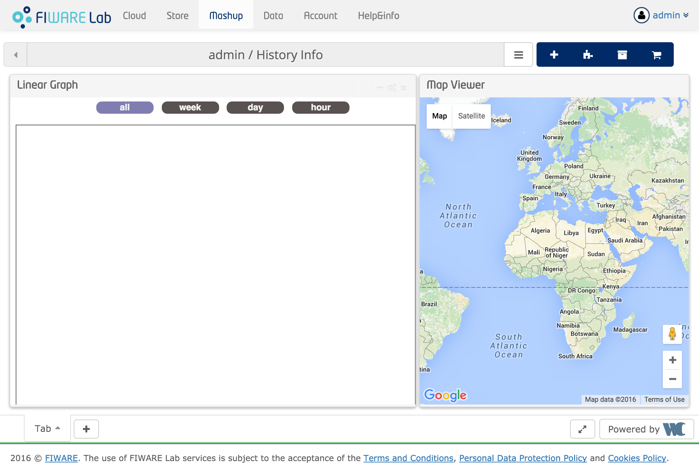

### ウィジェットの設定を変更

目的のウィジェットをマッシュアップに追加し、そのウィジェットを配置してサイズを変更して、選択した情報ダッシュボードを
構成したら、その設定を変更できます。これを行うには、ウィジェットの右上隅に移動し、次のスクリーン・ショットに示すように
プロパティ・アイコンをクリックします :

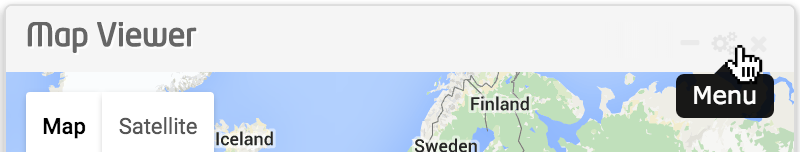

次に、いくつかのオプションを含むドロップダウン・メニューが表示されます。

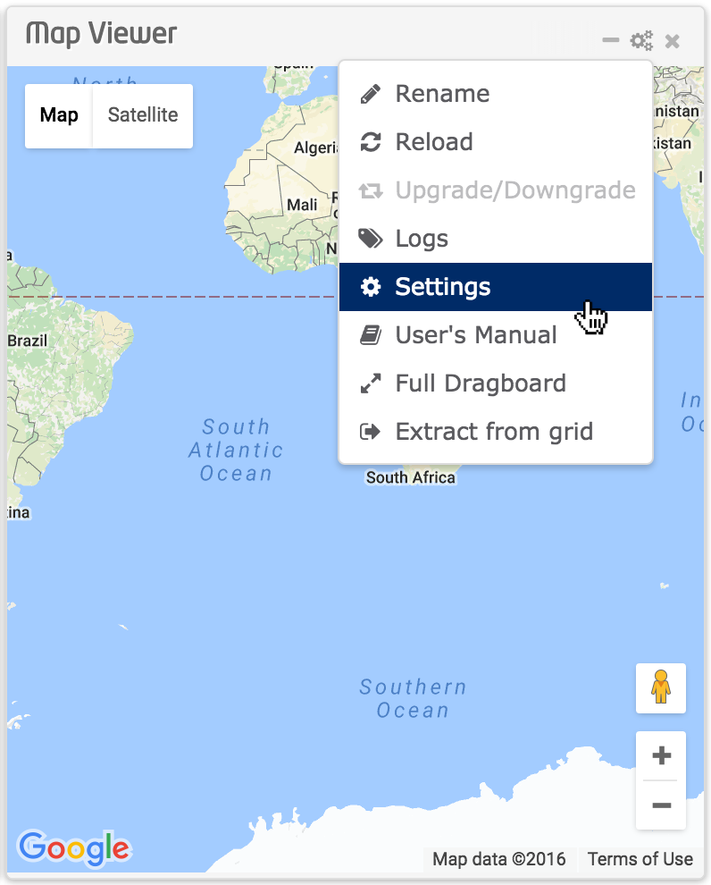

-   **Rename** は、ワークスペース・エディタおよびワイヤーリング・エディタのビューに表示されるウィジェット名を変更します
-   **Reload** は、ウィジェットをリロードします
-   **Upgrade/Downgrade** は、 ウィジェットのバージョンを変更することができます
-   **Logs** は、 ウィジェットのログ履歴を含むダイアログが表示されます
-   **Settings** は、現在のウィジェットの設定を変更するためのフォームが表示されます
-   **User's Manual** は、ウィジェットのドキュメントを開きます
-   **Full Dragboard** は、選択したウィジェットを最大化するので、キャンバス領域全体を占有します。このオプションは、
    ウィジェットがすでに"Full Dragboard" モードになっている場合は、**Exit Full Dragboard** になります。その場合、
    このオプションはウィジェットのサイズを最大化する前のサイズに戻します
-   **Extract from grid** は、グリッドからの抽出はキャンバスからウィジェットを持ち上げ、キャンバス上に、
    他のウィジェットの上にでも配置することができます。ウィジェットが現在グリッド外にある場合、このオプションは 
    **Snap to grid** になります。この場合、このオプションはウィジェットをグリッドにドッキングします

最後に、**Settings** をクリックすると、ウィジェットの設定用のカスタマイズされたダイアログが表示されます。この例では、
視覚化をカスタマイズするために、 _Map Viewer_ に初期位置、ズームレベル、および マーク・シャドウ半径
(Mark shadow radius) を指定する必要があります。

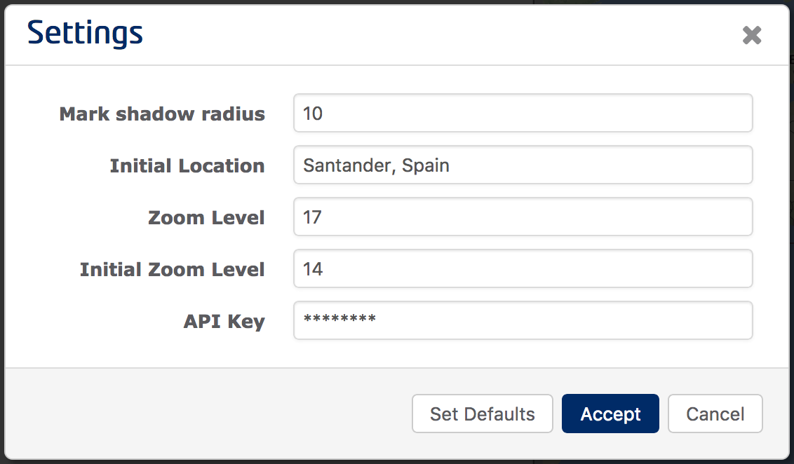

初期位置と初期ズームを設定したので、ウィジェットをリロードする必要があります。これを行うには、プロパティのアイコンを
再度クリックしてから、 _Reload_ オプションをクリックします。

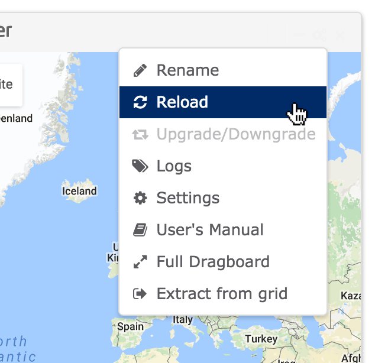

今度はウィジェットを新しい場所のサンタンデールを中心にし、設定した初期ズームレベルを使用します。

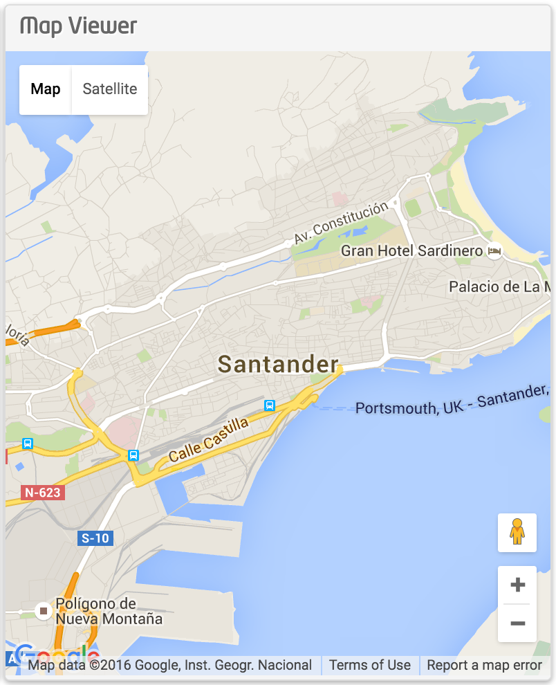

現時点では、2つの個別のウィジェットでマッシュアップを作成しています。_Linear Graph_ ウィジェットは空で、描画するための
情報を提供して何かをワイヤーリングする必要があり、_Map Viewer_ は、"Points of Interest" のいずれかの種類を表示して、
ユーザがそれらを容易に選択できるようにするには良いオプションです。

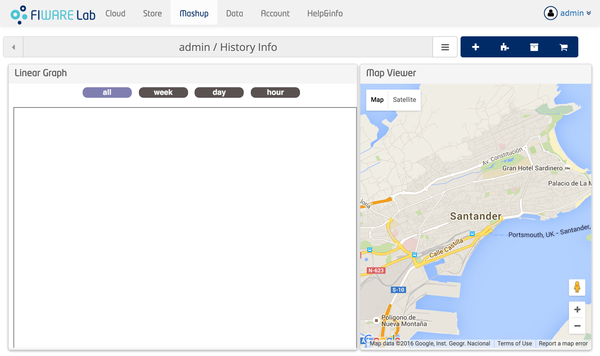

### ワイヤーリング・ウィジェットとオペレータ

必要なウィジェットを選択したら、それらのウィジェットをワイヤーリングして相互通信を可能にし、調整された動作を実現
できます。WireCloud のウィジェットとオペレータは、エンドポイントと呼ばれる明確に識別されたポートを通じてイベントと
データを送受信できます。互換性のある2つのエンドポイントを接続すると、2つ目のエンドポイント、つまり入力エンドポイント
またはターゲットエンドポイントは、最初の1つ、つまり出力エンドポイントまたはソースエンドポイントからのデータフローおよび/またはイベントを受信する準備をします。

#### 基本的なワイヤーリングの概念

ウィジェットを接続してオペレータをマッシュアップに追加するには、ツールの Wiring ビューに移動します :

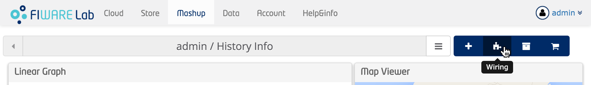

次に、空のワイヤーリング構成が表示されます。ウェルカム・メッセージを表示する空のキャンバスと表示されます :

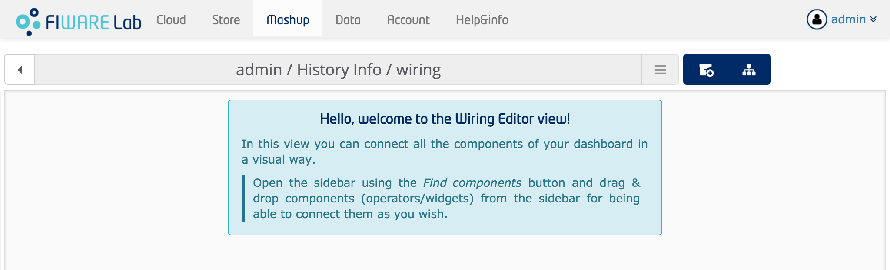

ウィジェットの設計に内在する最も重要な特性の1つは、ウィジェットができるだけジェネリックでなければならないということ
です。たとえば、データソースをハードコーディングした特定の情報源を持つよりも、任意の情報源にオペレータを介して
ワイヤーリングできる汎用の _Map Viewer_ ウィジェットを持つ方がはるかに意味があります。オペレータは、特定の
マッシュアップのコンテキストで使用したい具体的なサービスまたは情報源とウィジェットを動的に関連付ける手段を表すため、
この一般性を実現する手段を表します。

この場合、*Map Viewer* ウィジェットにデータ情報を提供する NGSI ソースオペレータがあります。この種のオペレータは
パイピング・オペレータ (piping operators) と呼ばれます。したがって、これをワイヤーリングに追加する必要があります。

これを行うには、コンポーネントのサイドパネルを開いて、_NGSI source_ オペレータを検索し、_Create_ ボタンをクリック
します :

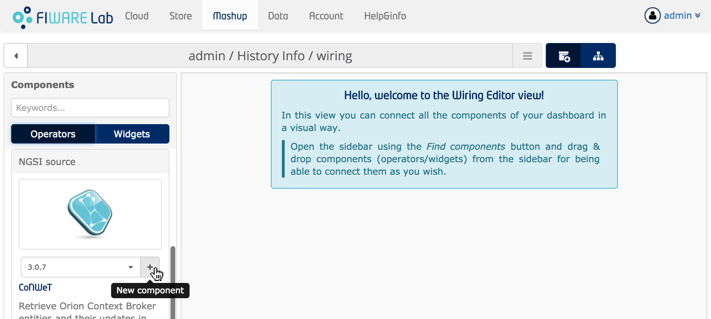

これにより、そのオペレータのインスタンスが作成され、_NGSI Source_ オペレータに関連付けられたボックスの下部に
表示されます。新しいオペレータがワイヤーリング設定で使用されていないことを示すハイライト表示されていることが
わかります。ワイヤーリング・エディタを離れるときに使用されないすべてのオペレータは、ワイヤーリング設定から
削除されます。

オペレータをオペレータ・リストからワイヤリング・キャンバスにドラッグします：

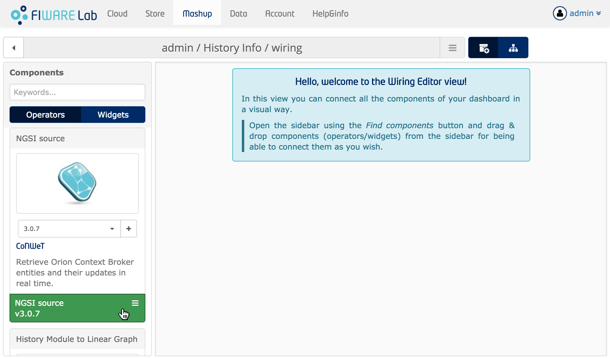

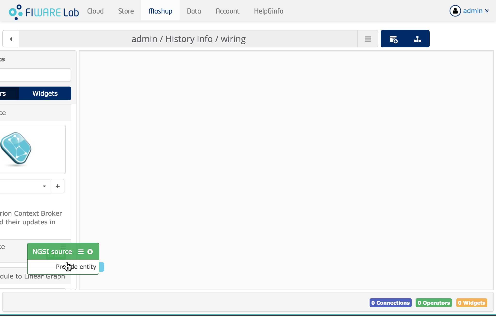

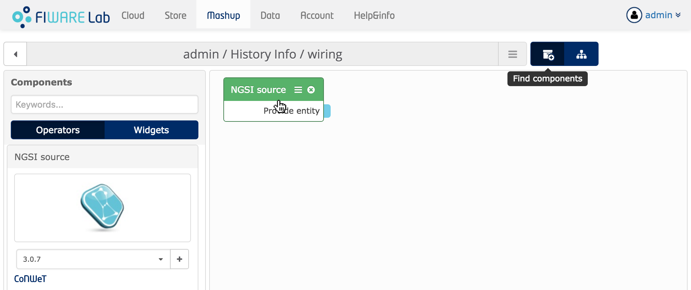

一度追加すると、
[Orion Context Broker](http://catalogue.fiware.org/enablers/publishsubscribe-context-broker-orion-context-broker)
から取得する情報とそのインスタンスを知るように設定する必要があります。これを行うには、_Settings_ メニュー項目を
クリックします :

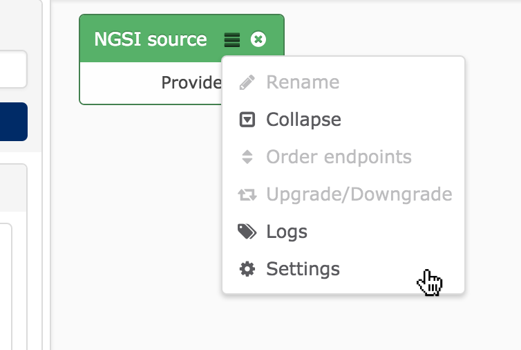

そして、次の設定が使用されていることを確認してください :

-   **NGSI server URL**: `http://orion.lab.fiware.org:1026/`
-   **NGSI proxy URL**: `https://ngsiproxy.lab.fiware.org`
-   **Use the FIWARE credentials of the user**: Enabled
-   **Use the FIWARE credentials of the workspace owner**: Disabled
-   **NGSI tenant/service:** Emtpy
-   **NGSI scope:** `/`
-   **NGSI entity types**: `Node, AMMS, Regulator`
-   **Id pattern**: Empty
-   **Monitored NGSI attributes**: `Latitud, Longitud, presence, batteryCharge, illuminance, ActivePower,
    ReactivePower, electricPotential, electricalCurrent`

さて、_Map Viewer_ ウィジェットに表示される情報源を準備しました。次のステップは _Map Viewer_ ウィジェットを
ワイヤリング・キャンバスに追加することです。この方法でそれらを接続することができます。これは、_NGSI Source_
オペレータと同じ方法で行いますが、サイド・バーの _Widget_ タブを使用して行います :

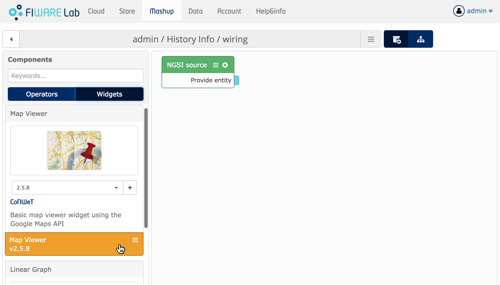

> **注**：エディタ・ビューで _Map Viewe_ ウィジェットのインスタンスを作成しましたが、_Create_ ボタンを使用して
> ワイヤエディタからウィジェット・インスタンスを作成することもできます :
>
> 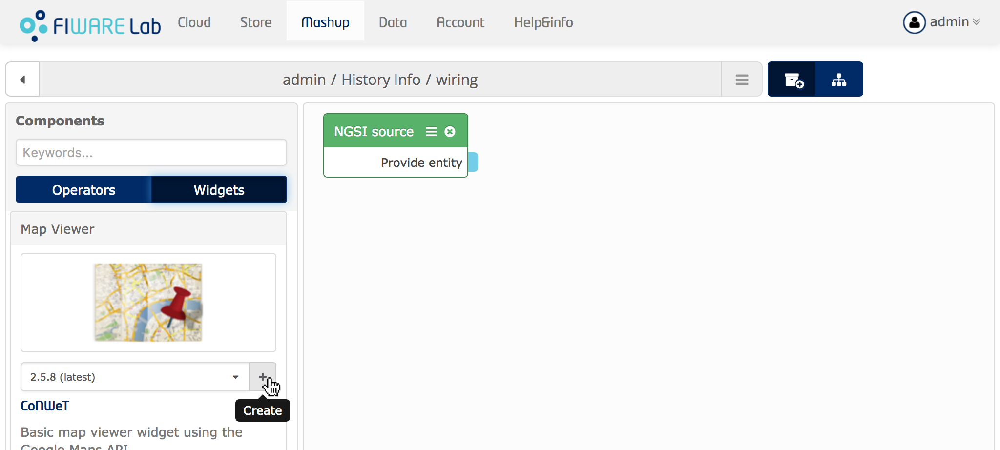
>
> ワイヤーリング・エディタを終了したら、新しいウィジェットのサイズを変更して配置してください。

_Map Viewer_ ウィジェットをワイヤリング・キャンバスに追加した後は、これと同じようなものが必要です :

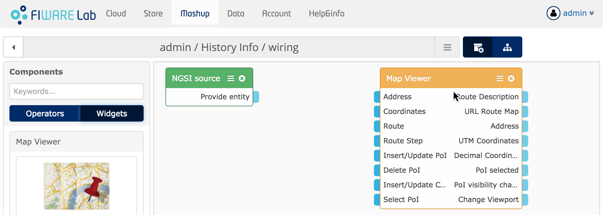

ワイヤーリング・エディタには、接続用の推奨システムが付属しています。たとえば、_Provide entity_ エンドポイントに
ポインタを移動します。エンドポイントが強調表示されていることがわかります。これは、推奨システムが互換性のある
エンドポイントを検索していることを意味します。この場合、互換性のあるエンドポイントはありません。

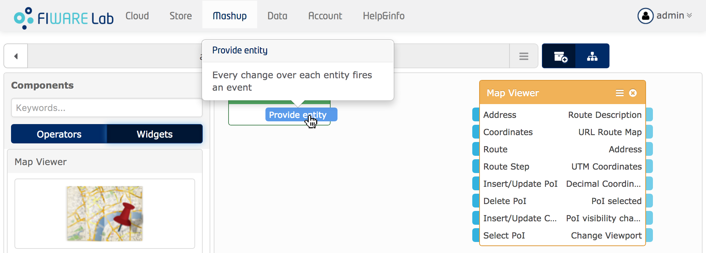

これは、_NGSI source_ の出力を _Map Viewer_ ウィジェットを直接接続できないためです。変換オペレータを使用して、
_NGSI source_ オペレータによって提供されるイベントデータを _Map Viewer_ ウィジェットが使用するフォーマットに変換する
ことができます。この例では、この変換を実行しようとするオペレータは、_NGSI Entity to PoI_ と呼ばれます :

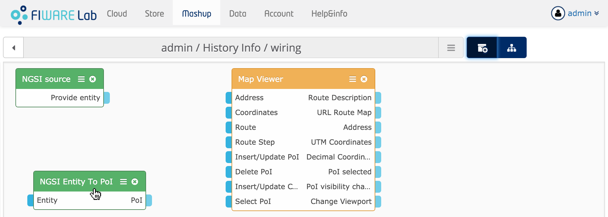

オペレータを追加した後、ポインタを _Provide entity_ エンドポイントに移動して、推奨の接続があることを確認できます :

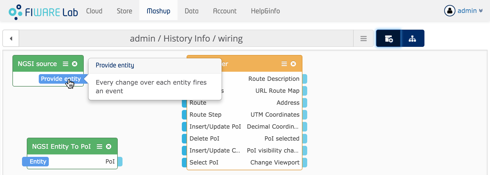

それで、それを接続することができます。これを行うために、_Provide entity_ エンドポイント上で、マウスボタンを押し下げて、
_Entity_ エンドポイントに矢印をドラッグします：

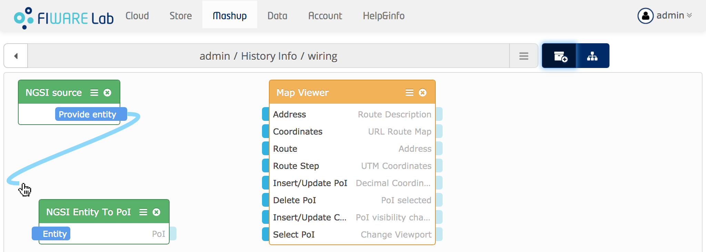
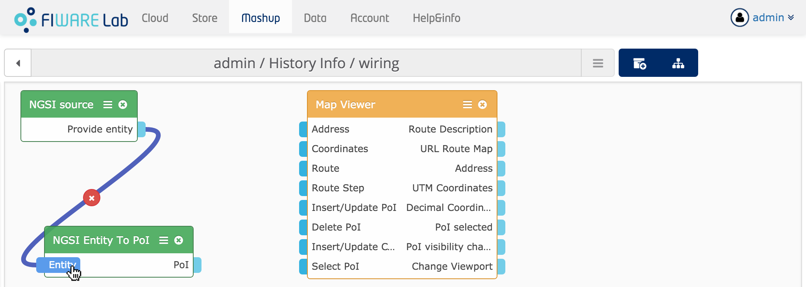

_Map Viewer_ ウィジェットの _Insert/Update PoI_ エンドポイントに _NGSI Entity To PoI_ オペレータの _PoI_
エンドポイントも接続する必要があります :

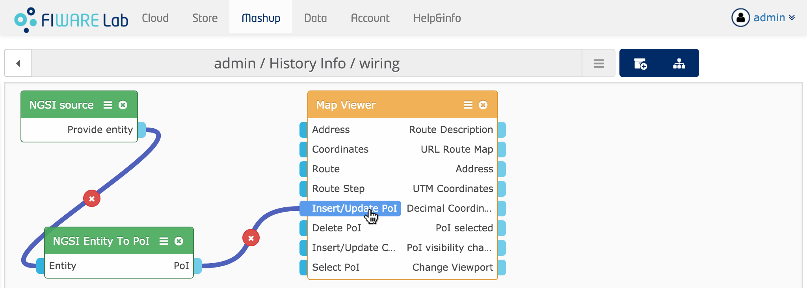

もう一度、_NGSI Entity To PoI_ オペレータを構成する必要があります。これは、_NGSI Source_ と同じ方法で行われます。
この場合、値は次のようになります :

-   **Coordinates attribute**: `Latitud, Longitud`
-   **Marker Icon**: Empty

_Editor_ ビューに戻ると、マップ・ウィジェットが更新され、_NGSI source_ オペレータから取得した PoIs が表示されます。

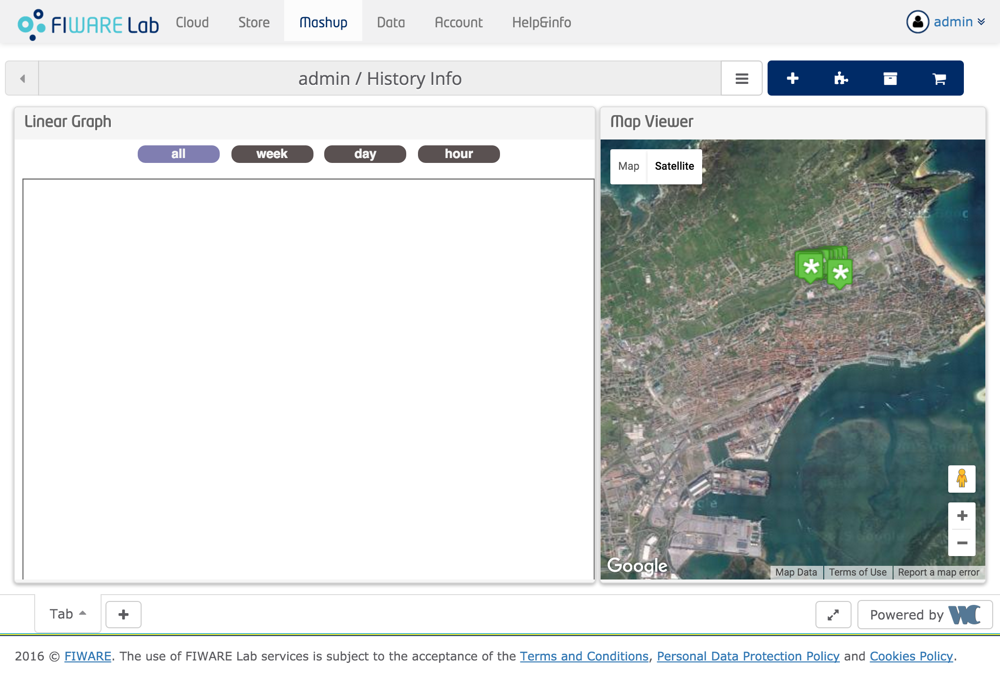

_Map Viewer_ を使用して、ビュー・ポートを移動したり、PoI を選択したりすることができます。実際には、データソースに
接続された _Map Viewer_ ウィジェットだけですが、パイピングと変換オペレータを使用することで大きな柔軟性が得られます。

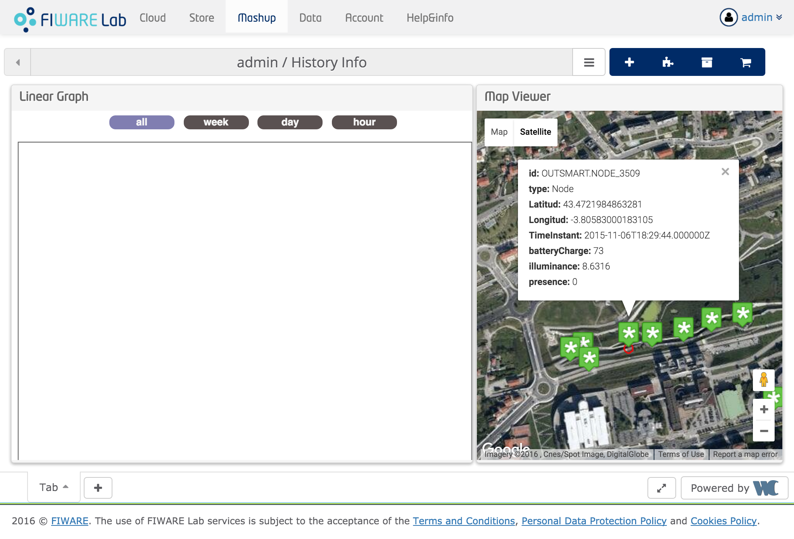


#### その他の一般的なワイヤーリング

最も一般的な操作の1つは、ワイヤーリングで接続を削除する作業です。たとえば、何らかの理由で間違えた場合は、接続の途中に
表示される _Remove_ ボタンをクリックして修正できます :


場合によっては、接続の1つを変更することが必要な場合もあります。ワイヤーリング・エディタを使用すると、接続を削除したり、
新しい接続を作成しなくても、この操作を実行できます。これを行うには、接続を選択して、変更するエンドポイントから接続を
ドラッグするだけです :

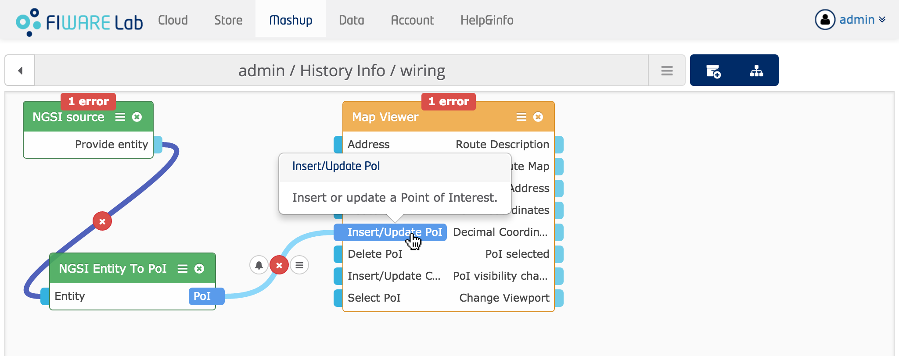
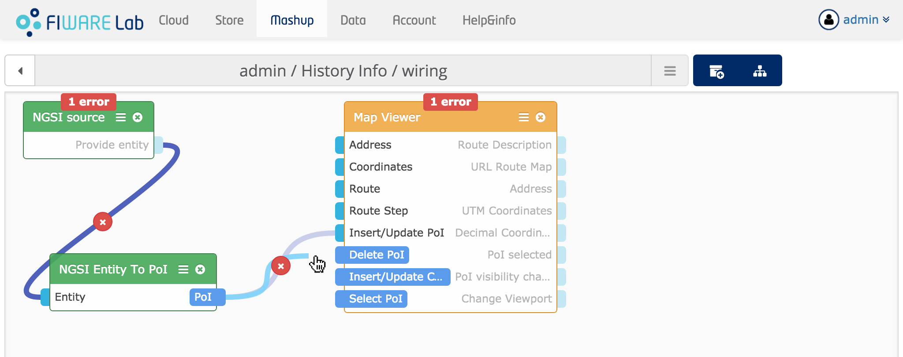
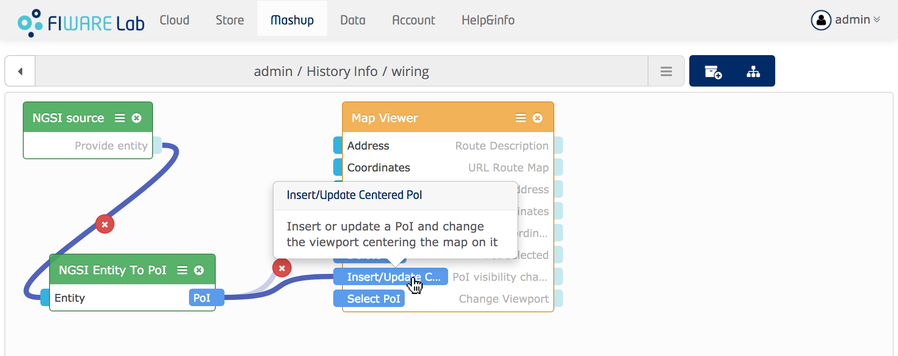
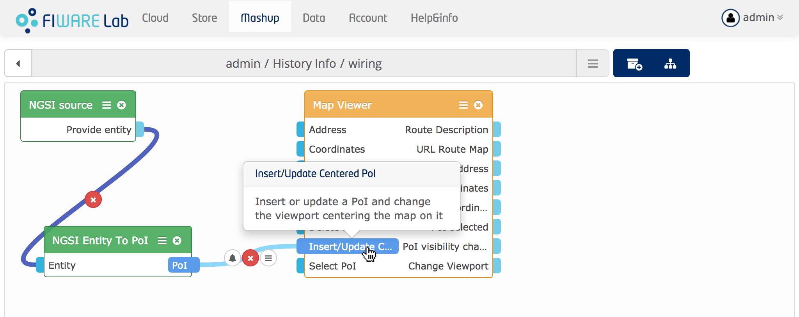

別の一般的なタスクは、接続の形状を変更することです。これを行うには、接続の _Customize_ オプションをクリックする必要が
あります :

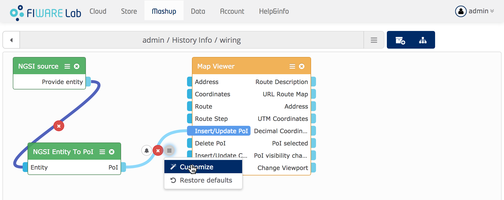

有効になると、接続の形状を変更するために表示されるハンドルを移動するだけで済みます。


接続のカスタマイズを停止する場合は、接続の外側をクリックするか、_Stop Customizing_ オプションを使用します :


また、スペース使用量を改善するためにオペレータを最小化することもできます。これは、コンポーネントメニューに表示される
_Collapse_ オプションを使用して実行できます  :


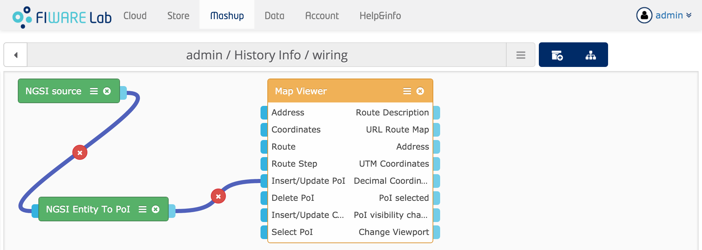

#### 例のまとめ

あなたの直感や、ドキュメンテーション、各ウィジェット/オペレータが提供するコンテキスト・ヘルプに従って、マッシュアップの
残りのウィジェットを引き続きワイヤーリングします。念のため、次のスクリーンショットで最終結果を確認できます：

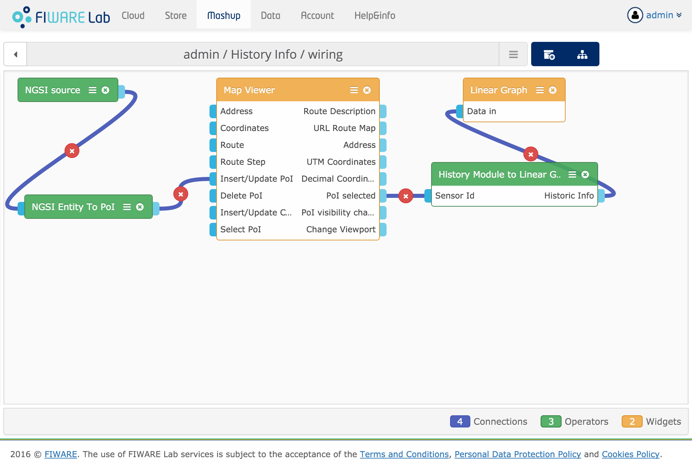

これで新しいワークスペースで遊ぶことができます。

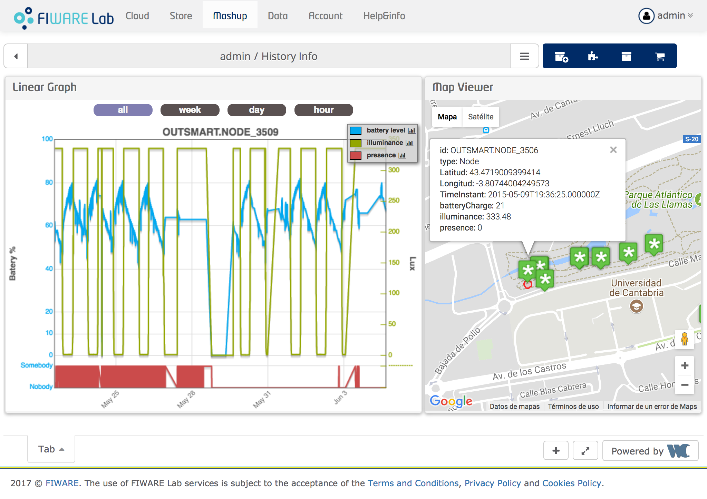

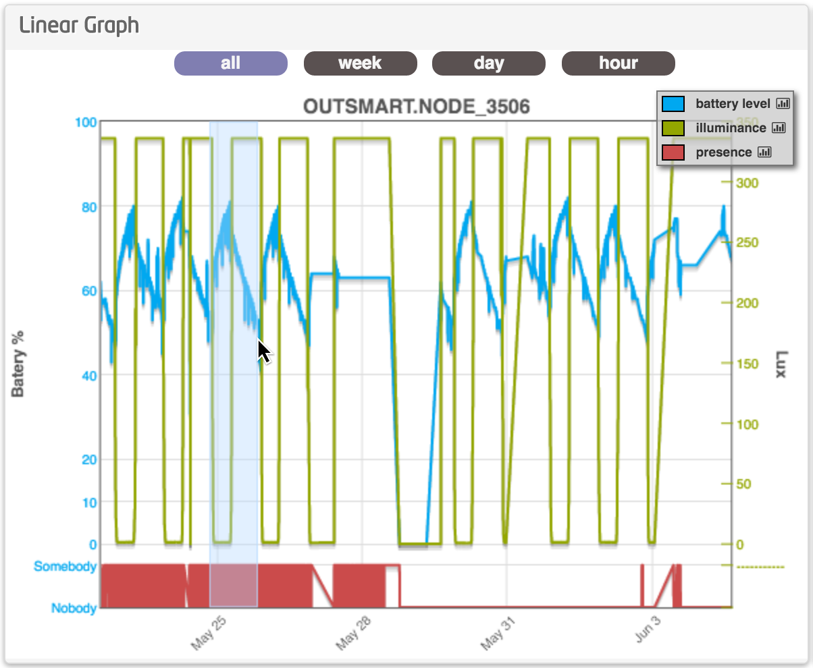


## ビヘイビア指向のワイヤーリング

WireCloud 0.8.0 から、いくつかの _behaviours_ を合成することでワイヤーリング設定を作成することができます。

_behaviours_ は、アプリケーションのマッシュアップに機能やビヘイビアを追加するために、それらの間に確立された接続を
持つコンポーネントのセットです。たとえば、前のセクションで作成したダッシュボードで使用されていたワイヤーリング設定を
2つのビヘイビアに分割できます :

-   最初のものは、**Show lampposts on map** を呼び出すことができます。この動作は、`NGSI Source`, `NGSI Entity To PoI`,
    `Map Viewe` コンポーネントとそれらのコンポーネント間の接続で構成されます :

    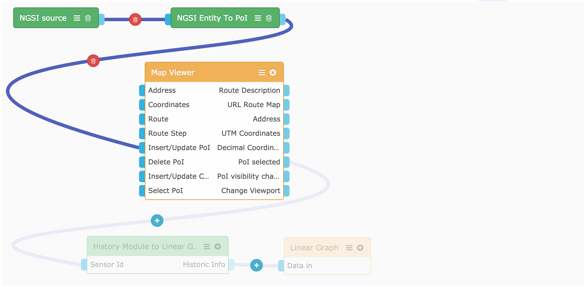

-   2番目のものは、**Show lamppost details** を呼び出すことができます。この動作は、`Map Viewer`, `History Module`,
    `Map Viewer`, `Linear Graph` コンポーネントとそれらのコンポーネント間の接続で構成されます :

    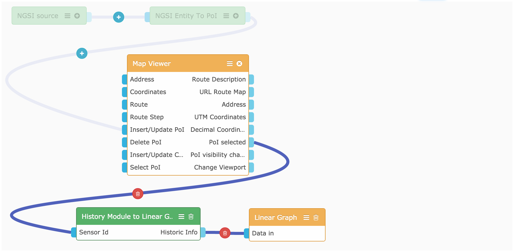

> コンポーネントと接続が複数の動作で存在する可能性があることを考慮してください。たとえば、前の例では、_Map Viewer_
> ウィジェットが両方のビヘイビアで使用されていました。

WireCloud は、ビヘイビア方法論を使用することなく、アプリケーション・マッシュアップの作成をサポートし続けます。
ただし、この新機能を使用すると、WireCloud は、いくつかの利点を提供します :

-   ワイヤーリング構成を複数のビヘイビアに分割することで、より組織的で構造化されたダイアグラムと、特定の方法で
    コンポーネントを使用して接続する理由をドキュメント化する方法を提供できます
-   ビヘイビア指向ワイヤーリングを使用することで学習曲線がより困難になるという事実を無視して、ワイヤーリング構成の
    開発が容易になり、いくつかのフェーズを使用して開発することができます
-   このドキュメントは、初心者の開発者や、特定のアプリケーション・マッシュアップのビヘイビアを再現したい開発者の
    ための良い出発点でもあります。他のユーザによって開発されたアプリケーションマッシュアップにアクセスし、
    ビヘイビアの記述を読むことによってワイヤーリング構成がどのように機能するかを知る必要があります

### ビヘイビア・エンジンの有効化/無効化

ビヘイビア指向の方法論を使用する前に、それを有効にする必要があります。これを行うには、ワイヤリング・エディタ・ビューに
移動し、_List behaviors_ ボタンをクリックします。

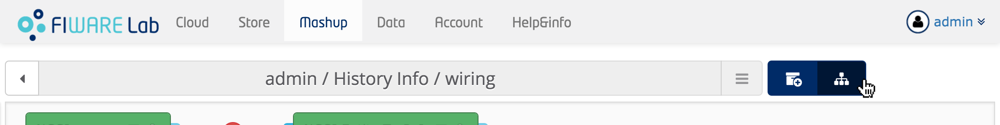

これは、現在、ビヘイビアがないサイドパネルを表示します。_Enable_ ボタンをクリックします :

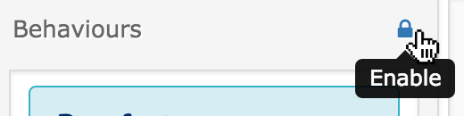

有効になると、ワイヤーリング構成に以前に追加されたすべてのコンポーネントと接続を使用して、最初のビヘイビアを持ちます。

> _注_：_disable_ ボタンをクリックして、ビヘイビア・エンジンを使用しないように、いつでも戻すことができます。
>
> 
>
> ビヘイビア・エンジンを無効にすると、すべてのコンポーネントと接続が単一のビューに収縮します。
>
> この操作を元に戻すことはできません。

### ビヘイビア指向のワイヤーリング・ユーザインターフェイスの使用

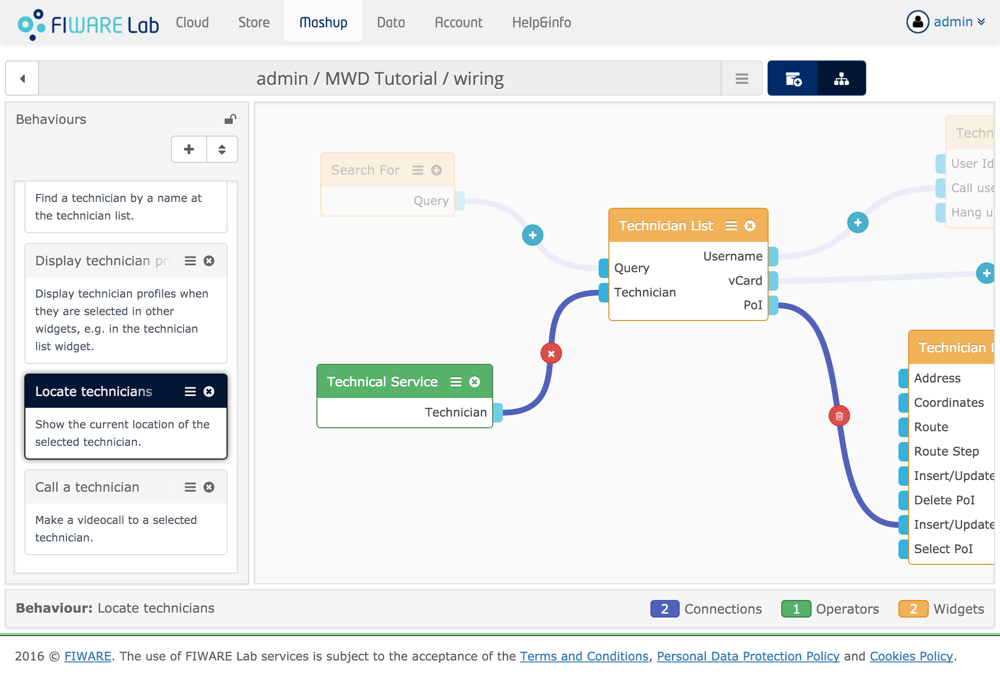

これは、ビヘイビア・エンジンが有効になっているときのワイヤーリング・エディタ・インターフェイスの外観です。_Behaviours_
セクションの各パネルはビヘイビアを表し、表現されたビヘイビアの名前と説明を表示します。

注目するのは、ビヘイビアの1つが強調表示されていることです。これは、一度に1つのビヘイビアだけを編集できるためです。
これはアクティブなビヘイビアです。アクティブなビヘイビアの名前はワイヤーリングエディタのフッターにも表示されるので、
ビヘイビア・リストパネルが非表示になっている場合も含めて、常にどのビヘイビアがアクティブなビヘイビアであるかを
知ることができます。アクティブなビヘイビアを変更することは、ビヘイビアを表すパネルをクリックするだけです。

注意すべき他の重要なことは、ワイヤリング・キャンバス内にいくつかの "色あせた(faded)" コンポーネントがあることです
(_Search For_ ウィジェットなど)。バックグラウンド・コンポーネントは、アクティブ・ビヘイビアの一部を形成しないため、
他のビヘイビアの一部を形成しますが、色あせします。

#### コンポーネントの追加と接続の作成

ビヘイビア・エンジンを無効にしたときに追加されたのと同じ方法で、新しいコンポーネントをビヘイビアに追加できます。
すなわち、それらをコンポーネントのサイドパネルからドラッグします。考慮する必要があるのは、これらのコンポーネントが
アクティブなビヘイビアに追加されることだけです。

他のビヘイビアにすでに含まれているコンポーネントを使用する場合は、含めたいバックグラウンド・コンポーネントの
_Add_ ボタンを使用できます :

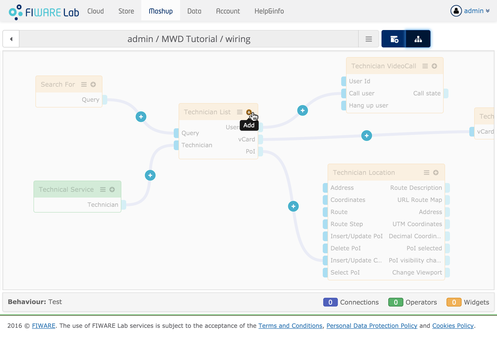

接続にも同じことが適用されます。新しい接続を作成すると、その接続はアクティブな動作にのみ追加されます。すでに他の
ビヘイビアで使用可能な接続を含める場合は、バックグラウンド接続の _Add_ ボタンをクリックします :


> **注**：バックグラウンド接続がバックグラウンド・コンポーネントを意味する場合、その接続を追加すると、
> そのバックグラウンド・コンポーネントもアクティブなビヘイビアに追加されます。

#### 新しいビヘイビアを作成

新しいビヘイビアを作成するには、リスト・ビヘイビアのサイドパネルで _Create behaviour_ ボタンをクリックします。

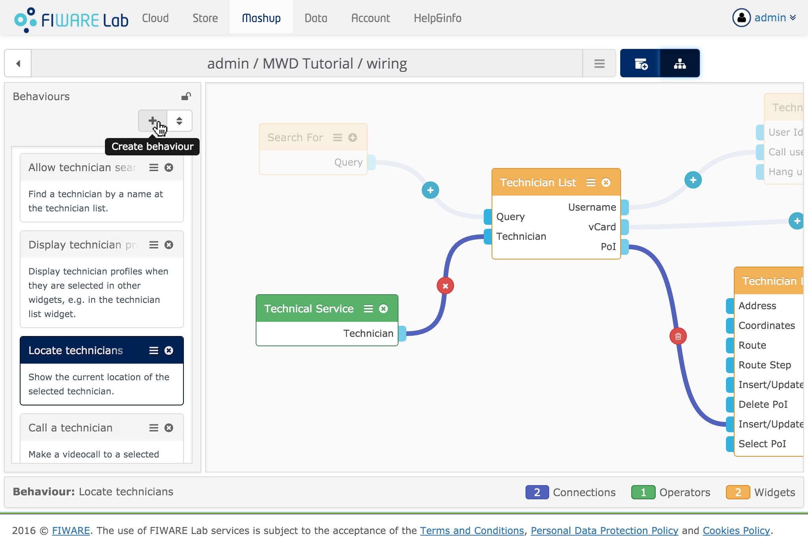

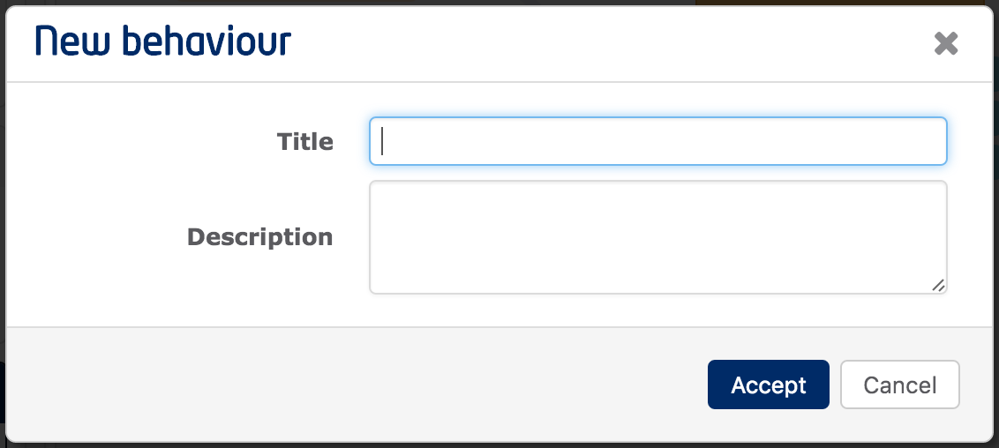

ビヘイビアのタイトルと説明を編集するには、環境設定メニューを開き、_Settings_ オプションをクリックします :


#### ビヘイビアの削除

ビヘイビアが1つしかない場合 (ビヘイビア・エンジンが有効なときに少なくとも1つのビヘイビアがワイヤーリング設定に
存在する必要があります) を除いて、いつでもビヘイビアをいつでも削除できます。これを行うには、削除する動作の _Remove_
ボタンをクリックします :


> **注**：他のビヘイビアで使用されていないすべてのコンポーネントは、ワイヤーリング設定から削除されます。
> また、この操作を元に戻すことができないことも考慮してください。

#### コンポーネントと接続の削除

ビヘイビアからコンポーネントを削除するには、_Delete_ ボタンをクリックします :


使用可能なビヘイビアで使用されていないコンポーネントは、ワイヤーリング構成から完全に削除されます。

接続にも同じことが適用されますが、_Delete_ ボタンを使用してビヘイビアな動作から削除できます :


この場合も、接続がすべてのビヘイビアから削除されると、ワイヤーリング構成から接続が削除されます。

#### ビヘイビアの順序

ビヘイビア・エンジンの主な目的は、ワイヤーリング構成をドキュメント化することであり、その意味で、人間は特定の順序を
使用してアイデアを公開する傾向があります。ワイヤーリング・エディタでは、ビヘイビア・リストで使用されている順序を
変更できますが、その順序はワイヤーリング・エンジンに適用されません。

ビヘイビア順を変更するには、 _Order behaviours_ ボタンをクリックする必要があります :

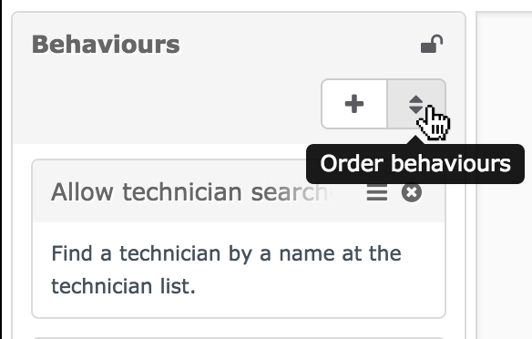

順序モード (ordering mode) を起動すると、ビヘイビア・ボックスをドラッグ＆ドロップできます：

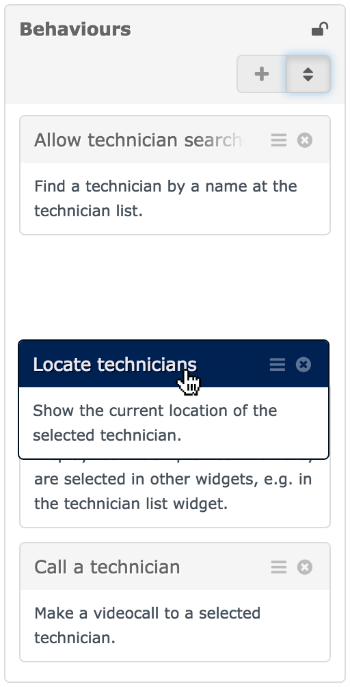

最後に、_Order behaviours_ ボタンを再度クリックして、オーダー・モード を終了します :

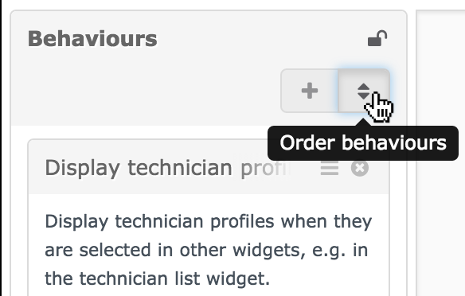

> **注**：いずれにしても、サイドバーを閉じるか、サイドバー内のサーチ・コンポーネントのフォームを開いて、ビヘイビアの
> オーダー・モードを終了することもできます。


## マッシュアップの共有

ワークスペースは、以下のように設定を変更して公開することができます :

1.  ワークスペース・メニューボタンをクリックし、_Share_ をクリックします :
    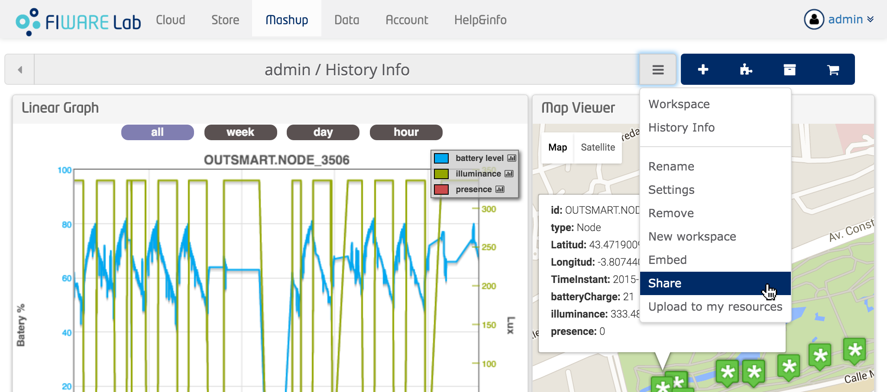

2.  ワークスペースの共有設定を編集するためのダイアログが表示されます :
    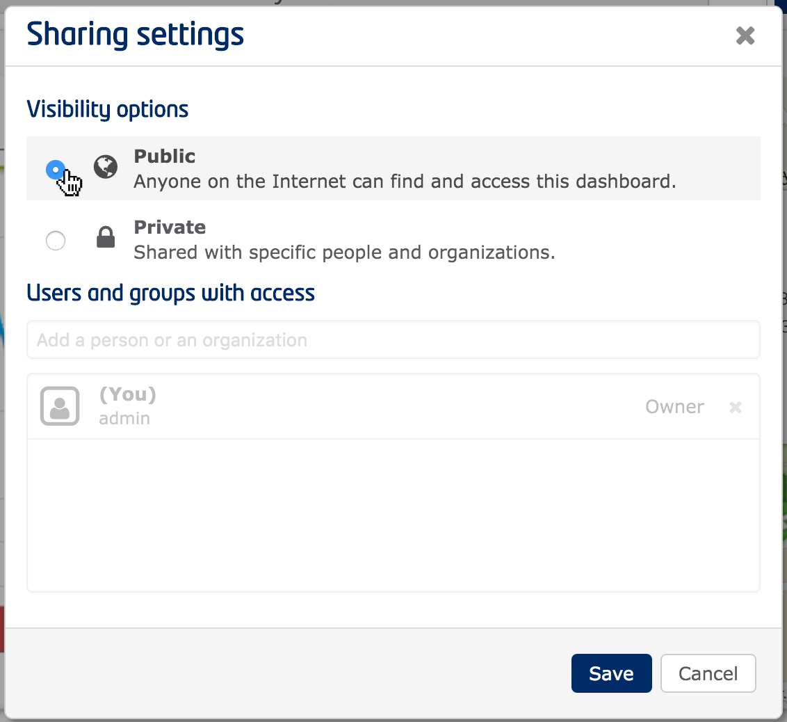

ワークスペースをパブリックにすると、ワークスペースの URL を他のユーザと共有することができます

### マッシュアップを他の Web ページに埋め込む

すべてのワークスペースを埋め込むことができますが、WireCloud からワークスペースを直接使用する場合に適用されるアクセスルールは同じです。ワークスペースをパブリックにしない場合は、ユーザは WireCloud にログインし、十分なアクセス権が必要です。このため、マッシュアップを他の Web ページに埋め込む前に、ワークスペースの共有設定を最初に変更する必要があります。

また、次の手順に従って、他のWebページにコピー＆ペーストする必要があるコードを取得することもできます :

1.  ワークスペース・メニューボタンをクリックし、*Embed* をクリックします :
    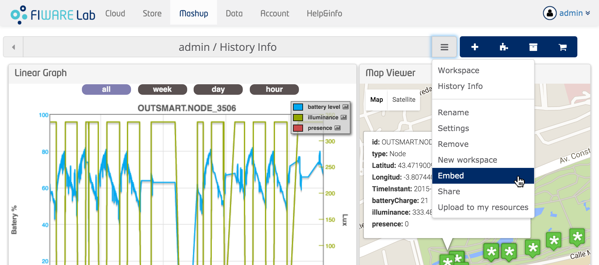

2.  マッシュアップを埋め込むためのコードを示す新しいウィンドウです。HTML ドキュメントにコピー＆ペーストします :
    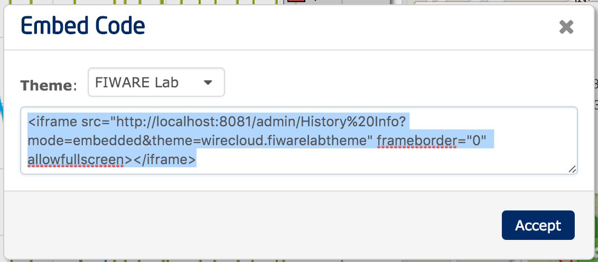

## その他の情報源

さまざまな視点 (エンドユーザ、開発者、管理者) から WireCloud を使用する方法の詳細については、FIWARE Academy の
[Application Mashup GE fundamentals course ](https://fiware-academy.readthedocs.io/en/latest/processing/wirecloud/index.html) を参照してください。
もう一つの情報源は [WireCloud のウェブサイト](https://conwet.fi.upm.es/wirecloud/) で、より一般的な情報や
デモ・ビデオなどの興味深いリソースがあります。
