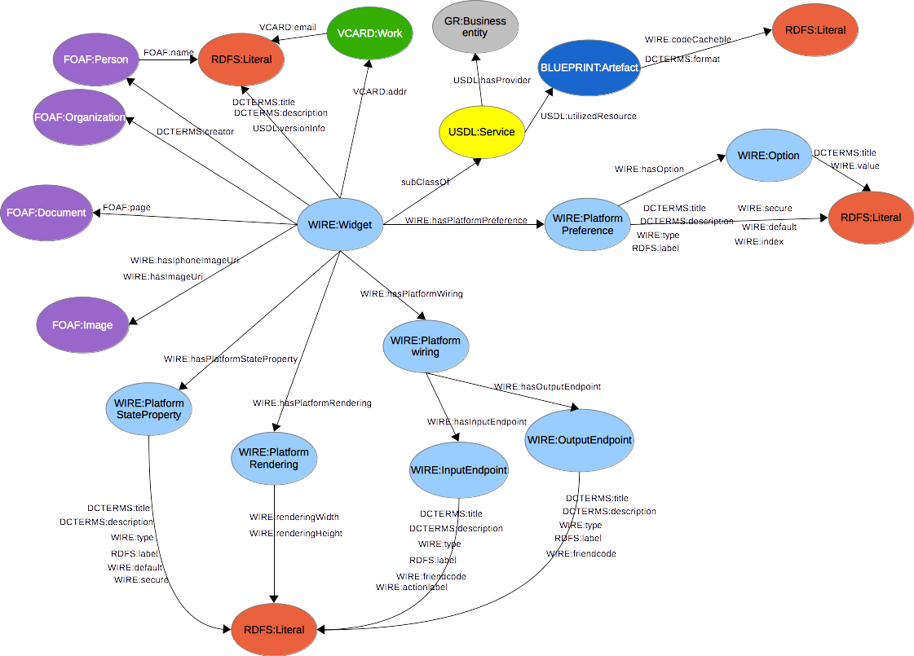
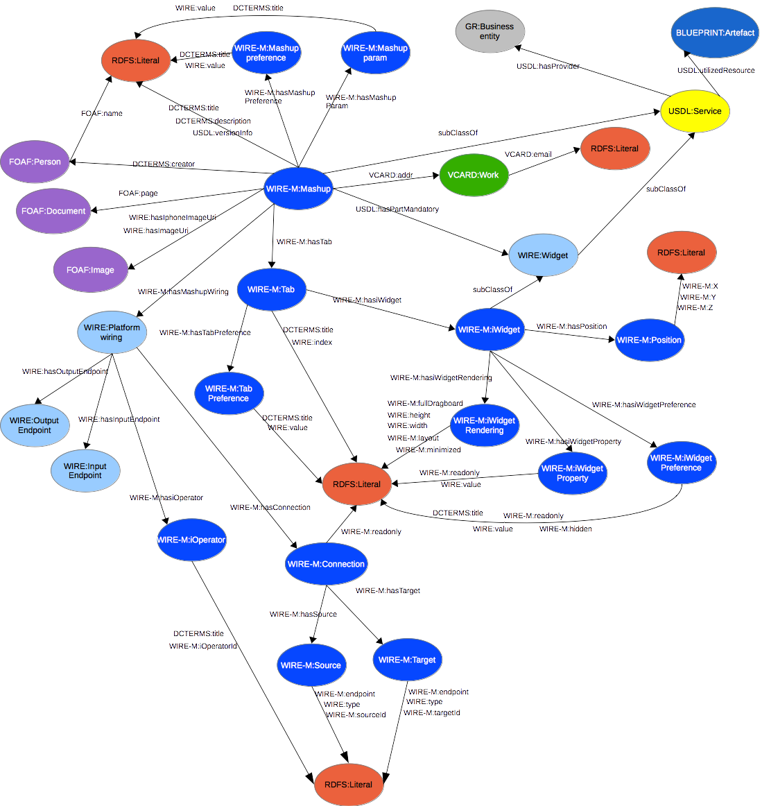

In order for Mashable Application Components to be offered in the [Store
GE], MACs should provide their metadata information using a format
supported by the FIWARE's Marketplace, Store and Repository Generic
Enablers. Those GE are based on the use of USDL documents (RDF), so the
Application Mashup GE supports a RDF flavour of the MACDL, built upon
Linked Data principles and making MAC description files linkable
directly from USDL documents.

The RDF flavour of the MACDL is based on two new RDF vocabularies. The
first vocabulary, WIRE
(https://github.com/Wirecloud/wirecloud/blob/develop/src/wirecloud/commons/utils/template/schemas/wire.rdf),
deals with the definition of the information that the Application Mashup
GE must use to instantiate widgets and operators, including its user
preferences, persistent variables, wiring information, and so on. The
second vocabulary, WIRE-M
(https://github.com/Wirecloud/wirecloud/blob/develop/src/wirecloud/commons/utils/template/schemas/wire-m.rdf),
defines the mashup-related information needed to create an instance of
the user workspace, including platform-specific information such as
widget instances, wiring and piping between widgets and operators, etc.

The following sections show both vocabularies, that can be used for
describing MACs using RDF.

[Store GE]: https://github.com/conwetlab/wstore

## WIRE vocabulary

The diagram below shows the WIRE vocabulary.

The `WIRE` vocabulary

The Application Mashup GE must support this vocabulary to provide a way to represent MAC information as RDF and allow those descriptions to be used from USDL documents.

### Classes

#### The `wire:Widget` class

This class represents a widget. This is, jointly with `wire:Operator`, one of
the root classes of this vocabulary.

- **URI**: `http://wirecloud.conwet.fi.upm.es/ns/widget#Widget`

- **Properties include**: `dcterms:title`, `dcterms:description`,
  `dcterms:creator`, `usdl:hasProvider`, `usdl:utilizedResource`, `foaf:page`,
  `wire:hasPlatformPreference`, `wire:hasPlatformWiring`,
  `wire:hasPlatformRendering`, `wire:hasPlatformStateProperty`,
  `usdl:versionInfo`, `wire:hasImageUri`, `wire.hasiPhoneImageUri`,
  `wire:displayName`, `vcard:addr`

- **Subclassof**: `usdl-core:Service`

#### The `wire:Operator` class

This class represents a operator. This is, jointly with `wire:Widget`, one of
the root classes of this vocabulary.

- **URI**: `http://wirecloud.conwet.fi.upm.es/ns/widget#Operator`

- **Properties include**: `dcterms:title`, `dcterms:description`,
  `dcterms:creator`, `usdl:hasProvider`, `usdl:utilizedResource`, `foaf: page`,
  `wire:hasPlatformPreference`, `wire:hasPlatformWiring`,
  `wire:hasPlatformRendering`, `wire:hasPlatformStateProperty`,
  `usdl:versionInfo`, `wire:hasImageUri`, `wire.hasiPhoneImageUri`,
  `wire:displayName`, `vcard:addr`

- **Subclassof**: `usdl-core:Service`

#### The `wire:PlatformPreference` class

This class represents a user preference in the Application Mashup GE,
that is, data users can see and configure. The Enabler must make this
value persistent and provide users with tools to edit and validate this
data.

- **URI**: `http://wirecloud.conwet.fi.upm.es/ns/widget#PlatformPreference`

- **Properties include**: `wire:hasOption`, `dcterms:title`,
  `dcterms:description`, `rdfs:label`, `wire:type`, `wire:default`,
  `wire:secure`

- **Used with**: `wire:hasPlatformPreference`

#### The `wire:PlatformWiring` class

This class represents the wiring status of a widget.

- **URI**: `http://wirecloud.conwet.fi.upm.es/ns/widget#PlatformWiring`

- **Properties include**: `wire:hasOutputEndpoint, wire:hasInputEnpoint`

- **Used with**: `wire:hasPlatformWiring`

#### The `wire:PlatformRendering` class

This class represents the widget size when it is instantiated.

- **URI**: `http://wirecloud.conwet.fi.upm.es/ns/widget#PlatformRendering`

- **Properties include**: `wire:renderingWidth`, `wire.renderingHeight`

- **Used with**: `wire:hasPlatformRendering`

#### The `wire:PlatformStateProperty` class

This class represents a widget state variable that the platform needs to
know in order to make it persistent.

- **URI**: `http://wirecloud.conwet.fi.upm.es/ns/widget#PlatformStateProperty`

- **Properties include**: `dcterms:title`, `dcterms:description`, `wire:type`,
  `rdfs:label`, `wire:default`, `wire:secure`

- **Used with**: `wire:hasPlatformStateProperty`

#### The `wire:Option` class

This class represents an option that a user preference could have.

- **URI**: `http://wirecloud.conwet.fi.upm.es/ns/widget#Option`

- **Properties include**: `dcterms:title`, `wire:value`

- **Used with**: `wire:hasOption`

#### The `wire:OutputEndpoint` class

This class represents an output endpoint.

- **URI**: `http://wirecloud.conwet.fi.upm.es/ns/widget#OutputEndpoint`

- **Properties include**: `dcterms:title`, `dcterms:description`, `rdfs:label`,
  `wire:type`, `wire:friendcode`

- **Used with**: `wire:hasOutputEndpoint`

#### The `wire:InputEndpoint` class

This class represents an input endpoint.

- **URI**: `http://wirecloud.conwet.fi.upm.es/ns/widget#InputEndpoint`

- **Properties include**: `dcterms:title`, `dcterms:description`, `rdfs:label`,
  `wire:type`, `wire:friendcode`, `wire:actionLabel`

- **Used with**: `wire:hasInputEndpoint`

### Properties

#### The `wire:hasPlatformPreference` property

This property states a user widget preference.

- **URI**: `http://wirecloud.conwet.fi.upm.es/ns/Widget#hasPlatformPreference`
- **Domain**: `wire:Widget`  
- **Range**: `wire:PlatformPreference`

#### The `wire:hasPlatformWiring` property

This property states the widget wiring status.

- **URI**: `http://wirecloud.conwet.fi.upm.es/ns/Widget#hasPlatformWiring`
- **Domain**: `wire:Widget`
- **Range**: `wire:PlatformWiring`

#### The `wire:hasPlatformRendering` property

This property states how the widget must be rendered.

- **URI**: `http://wirecloud.conwet.fi.upm.es/ns/Widget#hasPlatformRendering`
- **Domain**: `wire:Widget`
- **Range**: `wire:PlatformRendering`

#### The `wire:hasPlatformStateProperty` property

This property states a widget persistent variable.

- **URI**: `http://wirecloud.conwet.fi.upm.es/ns/Widget#hasPlatformStateProperty`
- **Domain**: `wire:Widget`
- **Range**: `wire:PlatformStateProperty`

#### The `wire:hasOption` property

This property states a user preference option.

- **URI**: `http://wirecloud.conwet.fi.upm.es/ns/Widget#hasOption`
- **Domain**: `wire:PlatformPreference`
- **Range**: `wire:Option`

#### The `wire:hasOutputEndpoint` property

This property states a widget wiring output endpoint.

- **URI**: `http://wirecloud.conwet.fi.upm.es/ns/Widget#hasOutputEndpoint`
- **Domain**: `wire:PlatformWiring`
- **Range**: `wire:OutputEndpoint`

#### The `wire:hasInputEndpoint` property

This property states a widget wiring input endpoint.

- **URI**: `http://wirecloud.conwet.fi.upm.es/ns/Widget#hasInputEndpoint`
- **Domain**: `wire:PlatformWiring`
- **Range**: `wire:InputEndpoint`

#### The `wire:friendcode` property

This property states a *friendcode*.

- **URI**: `http://wirecloud.conwet.fi.upm.es/ns/Widget#friendcode`
- **Domain**: `wire:InputEndpoint` and `wire:OutputEndpoint`
- **Range**: `rdfs:Literal`

#### The `wire:actionLabel` property

This property states an input's action label.

- **URI**: `http://wirecloud.conwet.fi.upm.es/ns/Widget#actionLabel`
- **Domain**: `wire:InputEndpoint`
- **Range**: `rdfs:Literal`

#### The `wire:hasImageUri` property

This property states the URI of the image associated with the widget.

- **URI**: `http://wirecloud.conwet.fi.upm.es/ns/Widget#hasImageUri`
- **Domain**: `wire:Widget`
- **Range**: `foaf:Image`

#### The `wire:hasiPhoneImageUri` property

This property states the URI of the image associated with the Widget if
the platform is running on an iPhone.

- **URI**: `http://wirecloud.conwet.fi.upm.es/ns/Widget#hasiPhoneImageUri`
- **Domain**: `wire:Widget`
- **Range**: `foaf:Image`

#### The `wire:displayName` property

This property states the widget name to be displayed.

- **URI**: `http://wirecloud.conwet.fi.upm.es/ns/Widget#displayName`
- **Domain**: `wire:Widget`
- **Range**: `rdfs:Literal`

#### The `wire:value` property

This property states the widget configuration element value.

- **URI**: `http://wirecloud.conwet.fi.upm.es/ns/Widget#value`
- **Range**: `rdfs:Literal`

#### The `wire:type` property

This property states the widget configuration element type.

- **URI**: `http://wirecloud.conwet.fi.upm.es/ns/Widget#type`
- **Range**: `rdfs:Literal`

#### The `wire:default` property

This property states the widget configuration element default value.

- **URI**: `http://wirecloud.conwet.fi.upm.es/ns/Widget#default`
- **Range**: `rdfs:Literal`

#### The `wire:secure` property

This property states whether or not a widget configuration element is
secure.

- **URI**: `http://wirecloud.conwet.fi.upm.es/ns/Widget#value`
- **Range**: `rdfs:Literal`

#### The `wire:index` property

This property states the logical order of elements of the same type.

- **URI**: `http://wirecloud.conwet.fi.upm.es/ns/Widget#value`
- **Range**: `rdfs:Literal`

#### The `wire:codeContentType` property

This property states the widget code MIME type. The widget code URI is
represented using `usdl-core:Resource`

- **URI**: `http://wirecloud.conwet.fi.upm.es/ns/Widget#codeContentType`
- **Domain**: `usdl-core:Resource`
- **Range**: `rdfs:Literal`

#### The `wire:codeCacheable` property

This property states whether or not the widget code is cacheable.

- **URI**: `http://wirecloud.conwet.fi.upm.es/ns/Widget#codeCacheable`
- **Domain**: `usdl-core:Resource`
- **Range**: `rdfs:Literal`

## WIRE-M vocabulary

The diagram below shows the WIRE-M vocabulary.

The `WIRE-M` vocabulary

Like the WIRE vocabulary, this vocabulary must be supported by the Application
Mashup GE implementations to provide a way to represent Mashup information using
RDF and allow those descriptions to be used from USDL documents.

### Classes

#### The `wire-m:Mashup` class

This class represents a mashup. It will be implemented as a workspace.

- **URI**: `http://wirecloud.conwet.fi.upm.es/ns/mashup#Mashup`

- **Properties include**: `wire-m:hasMashupPreference`, `wire-m:hasMashupParam`,
  `wire-m:hasTab`, `wire-m:hasMashupWiring`, `wire:hasImageUri`,
  `wire:hasiPhoneImageUri`, `wire:version`

- **subClassOf**: `usdl:CompositeService`

#### The `wire-m:Tab` class

This class represents a workspace tab.

- **URI**: `http://wirecloud.conwet.fi.upm.es/ns/mashup#Tab`

- **Properties include**: `wire-m:hasiWidget`, `wire-m:hasTabPreference`,
  `dcterms:title`

- **Used with**: `wire-m:hasTab`

#### The `wire-m:iWidget` class

This class represents a widget instance.

- **URI**: `http://wirecloud.conwet.fi.upm.es/ns/mashup#iWidget`

- **Properties include**: `wire-m:hasPosition`, `wire-m:hasiWidgetRendering`,
  `wire-m:hasiWidgetPreference`, `wire-m:hasiWidgetProperty `

- **Used with**: `wire-m:hasiWidget`

- **subClassOf**: `wire:Widget`

#### The `wire-m:MashupPreference` class

This class represents a mashup preference.

- **URI**: `http://wirecloud.conwet.fi.upm.es/ns/mashup#MashupPreference`

- **Properties include**: `dcterms:title`, `wire:value`

- **Used with**: `wire-m:hasMashupPreference`

#### The `wire-m:MashupParam` class

This class represents a mashup parameter.

- **URI**: `http://wirecloud.conwet.fi.upm.es/ns/mashup#MashupParam`

- **Properties include**: `dcterms:title`, `wire:value`

- **Used with**: `wire-m:hasMashupParam`

#### The `wire-m:Position` class

This class represents the position of a widget instance in the tab.

- **URI**: `http://wirecloud.conwet.fi.upm.es/ns/mashup#Position`

- **Properties include**: `wire-m:x, wire-m:y, wire-m:z`

- **Used with**: `wire-m:hasPosition`

#### The `wire-m:iWidgetPreference` class

This class represents a widget instance preference.

- **URI**: `http://wirecloud.conwet.fi.upm.es/ns/mashup#iWidgetPreference`

- **Properties include**: `dcterms:title`, `wire:value`, `wire-m:readonly`, `wire-m:hidden`

- **Used with**: `wire-m:hasiWidgetPreference`

#### The `wire-m:iWidgetRendering` class

This class represents a widget instance rendering.

- **URI**: `http://wirecloud.conwet.fi.upm.es/ns/mashup#iWidgetRendering`

- **Properties include**: `wire-m:fullDragboard`, `wire-m:layout`,
  `wire-m:minimized`, `wire:renderingHeight`, `wire:renderingWidth`

- **Used with**: `wire-m:hasiWidgetRendering`

#### The `wire-m:iWidgetProperty` class

This class represents a widget instance property.

- **URI**: `http://wirecloud.conwet.fi.upm.es/ns/mashup#iWidgetProperty`

- **Properties include**: `wire-m:readonly`, `wire:value`

- **Used with**: `wire-m:hasiWidgetProperty`

#### The `wire-m:TabPreference` class

This class represents a tab preference.

- **URI**: `http://wirecloud.conwet.fi.upm.es/ns/mashup#TabPreference`

- **Properties include**: `dcterms:title`, `wire:value`

- **Used with**: `wire-m:hasTabPreference`

#### The `wire-m:Connection` class

This class represents a wiring connection between two widget instances
or operator instances.

- **URI**: `http://wirecloud.conwet.fi.upm.es/ns/mashup#Connection`

- **Properties include**: `wire-m:hasSource`, `wire-m:hasTarget`,
  `dcterms:title`, `wire-m:readonly`

- **Used with**: `wire-m:hasConnection`

#### The `wire-m:Source` class

This class represents a widget instance or operator instance that is the
source of a connection.

- **URI**: `http://wirecloud.conwet.fi.upm.es/ns/mashup#Source`

- **Properties include**: `wire-m:sourceId`, `wire-m:endpoint`, `wire:type`

- **Used with**: `wire-m:hasSource`

#### The `wire-m:Target` class

This class represents a widget instance or operator instance that is the
target of a connection.

- **URI**: `http://wirecloud.conwet.fi.upm.es/ns/mashup#Target`

- **Properties include**: `wire-m:targetId`, `wire-m:endpoint`, `wire:type`

- **Used with**: `wire-m:hasTarget`

#### The `wire-m:iOperator` class

This class represents an operator instance inside a wiring configuration.

- **URI**: `http://wirecloud.conwet.fi.upm.es/ns/mashup#iOperator`

- **Properties include**: `wire-m:iOperatorId, dcterms:title`

- **Used with**: `wire-m:hasiOperator`

### Properties

#### The `wire-m:hasMashupPreference` property

This property states a mashup preference.

- **URI**:
`http://wirecloud.conwet.fi.upm.es/ns/mashup#hasMashupPreference`

- **Domain**: `wire-m:Mashup`

- **Range**: `wire-m:MashupPreference`

#### The `wire-m:hasMashupParam` property

This property states a mashup parameter.

- **URI**: `http://wirecloud.conwet.fi.upm.es/ns/mashup#hasMashupParam`

- **Domain**: `wire-m:Mashup`

- **Range**: `wire-m:MashupParam`

#### The `wire-m:hasTab` property

This property states that a given tab is part of a workspace.

- **URI**: `http://wirecloud.conwet.fi.upm.es/ns/mashup#hasTab`

- **Domain**: `wire-m:Mashup`

- **Range**: `wire-m:Tab`

#### The `wire-m:hasiWidget` property

This property states that a given widget instance is instantiated in a
tab.

- **URI**: `http://wirecloud.conwet.fi.upm.es/ns/mashup#hasiWidget`

- **Domain**: `wire-m:Tab`

- **Range**: `wire-m:iWidget`

#### The `wire-m:hasTabPreference` property

This property states a tab preference.

- **URI**:
`http://wirecloud.conwet.fi.upm.es/ns/mashup#hasTabPreference`

- **Domain**: `wire-m:Tab`

- **Range**: `wire-m:TabPreference`

#### The `wire-m:hasPosition` property

This property states the position of an widget instance in a tab.

- **URI**: `http://wirecloud.conwet.fi.upm.es/ns/mashup#hasPosition`

- **Domain**: `wire-m:iWidget`

- **Range**: `wire-m:Position`

#### The `wire-m:hasiWidgetPreference` property

This property states a widget instance preference.

- **URI**:
`http://wirecloud.conwet.fi.upm.es/ns/mashup#hasiWidgetPreference`

- **Domain**: `wire-m:iWidget`

- **Range**: `wire-m:iWidgetPreference`

#### The `wire-m:hasiWidgetProperty` property

This property states a widget instance property.

- **URI**:
`http://wirecloud.conwet.fi.upm.es/ns/mashup#hasiWidgetProperty`

- **Domain**: `wire-m:iWidget`

- **Range**: `wire-m:iWidgetProperty`

#### The `wire-m:hasiWidgetRendering` property

This property states the rendering of a widget instance.

- **URI**:
`http://wirecloud.conwet.fi.upm.es/ns/mashup#hasiWidgetRendering`

- **Domain**: `wire-m:iWidget`

- **Range**: `wire-m:iWidgetRendering`

#### The `wire-m:hasConnection` property

This property states a wiring connection.

- **URI**: `http://wirecloud.conwet.fi.upm.es/ns/mashup#hasConnection`

- **Domain**: `wire:PlatformWiring`

- **Range**: `wire-m:Connection`

#### The `wire-m:hasSource` property

This property states the source of a connection.

- **URI**: `http://wirecloud.conwet.fi.upm.es/ns/mashup#hasSource`

- **Domain**: `wire-m:Connection`

- **Range**: `wire-m:Source`

#### The `wire-m:hasTarget` property

This property states the target of a connection.

- **URI**: `http://wirecloud.conwet.fi.upm.es/ns/mashup#hasTarget`

- **Domain**: `wire-m:Connection`

- **Range**: `wire-m:Target`

#### The `wire-m:targetId` property

This property states the ID of a target.

- **URI**: `http://wirecloud.conwet.fi.upm.es/ns/mashup#targetId`

- **Domain**: `wire-m:Target`

- **Range**: `rdfs:Literal`

#### The `wire-m:sourceId` property

This property states the ID of a source.

- **URI**: `http://wirecloud.conwet.fi.upm.es/ns/mashup#sourceId`

- **Domain**: `wire-m:Source`

- **Range**: `rdfs:Literal`

#### The `wire-m:endpoint` property

This property states the ID of the widget instance or operator instance
that is the source or target of a connection.

- **URI**: `http://wirecloud.conwet.fi.upm.es/ns/mashup#endpoint`

- **Range**: `rdfs:Literal`

#### The `wire-m:hasiOperator` property

This property states the wiring of an operator's instance.

- **URI**: `http://wirecloud.conwet.fi.upm.es/ns/mashup#hasiOperator`

- **Domain**: `wire:PlatformWiring`

- **Range**: `wire-m:iOperator`

#### The `wire-m:x` property

This property states the x coordinate of a widget instance position.

- **URI**: `http://wirecloud.conwet.fi.upm.es/ns/mashup#x`

- **Domain**: `wire-m:Position`

- **Range**: `rdfs:Literal`

#### The `wire-m:y` property

This property states the y coordinate of a widget instance position.

- **URI**: `http://wirecloud.conwet.fi.upm.es/ns/mashup#y`

- **Domain**: `wire-m:Position`

- **Range**: `rdfs:Literal`

#### The `wire-m:z` property

This property states the z coordinate of a widget instance position.

- **URI**: `http://wirecloud.conwet.fi.upm.es/ns/mashup#z`

- **Domain**: `wire-m:Position`

- **Range**: `rdfs:Literal`

#### The `wire-m:fullDragboard` property

This property states whether a widget instance occupies the whole space
in the tab.

- **URI**: `http://wirecloud.conwet.fi.upm.es/ns/mashup#fullDragboard`

- **Domain**: `wire-m:iWidgetRendering`

- **Range**: `rdfs:Literal`

#### The `wire-m:layout` property

This property states the layout of a widget instance.

- **URI**: `http://wirecloud.conwet.fi.upm.es/ns/mashup#layout`

- **Domain**: `wire-m:iWidgetRendering`

- **Range**: `rdfs:Literal`

#### The `wire-m:minimized` property

This property states whether a widget instance is minimized in its tab.

- **URI**: `http://wirecloud.conwet.fi.upm.es/ns/mashup#minimized`

- **Domain**: `wire-m:iWidgetRendering`

- **Range**: `rdfs:Literal`

#### The `wire-m:hidden` property

This property states whether a widget instance is hidden in its tab.

- **URI**: `http://wirecloud.conwet.fi.upm.es/ns/mashup#hidden`

- **Domain**: `wire-m:iWidgetPreference`

- **Range**: `rdfs:Literal`

#### The `wire-m:readonly` property

This property states whether a mashup configuration element is read
only.

- **URI**: `http://wirecloud.conwet.fi.upm.es/ns/mashup#readonly`

- **Range**: `rdfs:Literal`
