## Introduction

The latest version of the XML Schema described in the following sections
is available at:

-   [Mashable application component description language XML Schema]

Mashable application components descriptions use the
`http://wirecloud.conwet.fi.upm.es/ns/macdescription/1` namespace for
the root element. The name of the root element varies depending on the
type of the component: `widget`, `operator` or `mashup`. Whereas it always
require the following attributes:

-   `vendor`: The id of the vendor/distributor of the mashable
    application component. It cannot contain the character "/".
-   `name`: Name of the mashable application component. It cannot
    contain the character "/".
-   `version`: Current version of the mashable application component.
    It must define starting sequences of numbers separated by dots.
    Moreover, zeros can only be used alone (e.g. 0.1 is valid but 03.2
    is not). Following a release number, you can have a pre-release tag.
    A pre-release tag is a serie of letters: a (alpha), b (beta) or rc
    (release candidate); followed by digits. Pre-release tags make a
    version be considered older than the version they are appended to.
    So, revision 2.4 is newer than revision 2.4rc1, which in turn is
    newer than 2.4b1 or 2.4a1.

These tree fields (`vendor`, `name` and `version`) uniquely identify the
mashable application component, therefore there can not be a repetition
of such identifier in any collection of WireCloud components (including
widgets, mashups, operators, ...).

  [Mashable application component description language XML Schema]: https://github.com/Wirecloud/wirecloud/blob/develop/src/wirecloud/commons/utils/template/schemas/xml_schema.xsd

## Common metadata

### details element

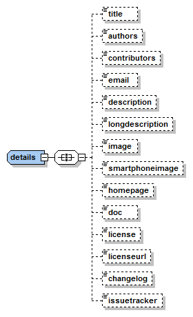

The `details` element

Mashable application components descriptions should provide generic
information about what you will obtain by using it, information about
who develops the component, etc... All this generic information is
provided through the `details` element. This element can contain any of
the following elements:

-   `title`: Name used in the user interface for the mashup
    application component. Used for example when listing mashable
    application components. This field can be translated, therefore this
    field is not used to uniquely identify the mashable
    application component. This field is also uses as the default title
    for widgets added to workspaces.
-   `authors`: Comma separated list of developers, e.g.:
      
        Álvaro Arranz, Aitor Magan

    You can also provide an email and/or an url:

        Barney Rubble <b@rubble.com> (http://barnyrubble.tumblr.com/)

-   `contributors`: Comma separated list of contributors. Same format
    than the authors field.
-   `email`: E-mail address for getting support. It is recommend to
    provide, at least, this field or the issuetracker as these fields
    are helpful for people who encounter issues with the component.
-   `license`: Name of the license associated to the mashable
    application component.
-   `licenseurl`: Absolute or description-file-relative URL pointing
    to the full license document.
-   `description`: A brief textual description of the mashable
    application component.
-   `longdescription`: Relative path to a markdown file describing the
    mashable application component.
-   `changelog`: Relative path to a markdown file detailing the
    changes made to the mashable application component in each version.
-   `image`: Absolute or description-file-relative URL of the mashable
    application component image for the catalogue. (170x80px)
-   `smartphone`: Image to be used in smartphones. (59x60px)
-   `doc`: Relative path to the markdown file containing the mashable
    application component documentation. For backwards compatibility,
    this field also supports an absolute URL to the documentation of the
    component (pointing to a web page).
-   `issuetracker`: Absolute URL to the component's issue tracker. It
    is recommend to provide, at least, this field or the `email` one as
    these fields are helpful for people who encounter issues with
    the component.

### The `requirements` element

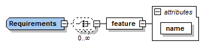

The `requirements` element

The `requirements` element is used for declaring on which features the
component depends on. Currently those features are associated with the
injection (by WireCloud) of the API required for accessing a given
feature (e.g. a widget can depend on the NGSI feature to notify
WireCloud it requires the injection of the NGSI API). In future releases
of the Application Mashup GE this element will provide support for
adding other kind of dependencies (e.g. with another mashable
application component), but for now this element only accepts `feature`
sub-elements.

#### The `feature` element

-   `name`: Name of the feature required by the application
    mashup component.

## Platform-component interaction elements

To guarantee the platform-component interaction, templates also define a
set of elements that components use to get connected to the environment
and set different platform options. Likewise, it also defines some other
interface elements, such as the initial widget size. They are all
managed by the platform, which will ensure their persistence.

Let us go through all these elements:

### The `preferences` element

The first platform-related element is the `preferences` one:

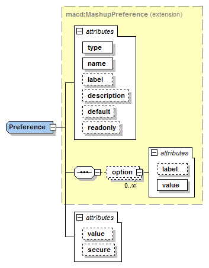

The `preferences` element

It defines user preferences, which may be changed through the platform
interface. This element is made up of one, many or none `preference`
sub-elements. This defines the actual user preference. It requires the
following attributes:

-   `type`: preference data type: `text` (string), `number`, `boolean`,
    `password` and `list`.
-   `name`: name of the preference to be referenced in the source code.
-   `label`: text that the preference will show in the user interface.
-   `description`: text that describes the preference.
-   `default`: preference default value.
-   `readonly`: indicates whether this preference can be modified.
-   `value`: initial value. If not specified, the default value will
    be used as the initial value.
-   `secure`: access to the value of this preference is disallowed if
    the value of this attribute is true (the value of this preference
    will be usable through the Application Mashup cross-domain proxy).
    default: `false`.

If the `type` attribute is set to `list`, the different choices are
defined by means of the `option` element. It has the following
attributes:

-   `name`: text to be displayed in the selection list.
-   `value`: value to be used when the option is selected.

### The persistentvariables element

The next XML element is the `persistentvariables` element. Its
main purpose is to define a set of variables to store the state of the
widget/operator while it is executing, in order to have it available for
future executions. Its structure is shown in the figure below:

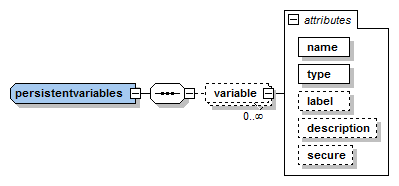

The `persistentvariables` element

This element is made up of a list of `variable` elements that require the
following attributes:

-   `name`: property name.
-   `type`: property data type: only `text` (string) datatype does
    make sense in here.
-   `label`: text to be displayed in the user interface.
-   `description`: Descriptive text.
-   `secure`: Access to the value of this persistent variable is
    disallowed if the value of this attribute is true (the value of this
    variable will be usable through the Application Mashup
    cross-domain proxy). default: `false`.

### The wiring element

This is probably one of the most important elements. It defines both the
inputs and outputs needed by widgets/operators to intercommunicate with
other widgets/operators. The Application Mashup GE implementation must
take this information into account to manage and control the wiring
mechanism and its internal data flow.

The figure below depicts the `wiring` element:

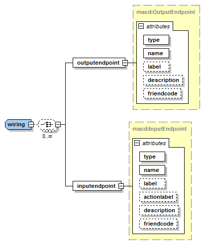

The `wiring` element

This element may contain any number of `inputendpoint` and
`outputendpoint` elements.

Widgets and operators may send data (events) through an output endpoint.
To do so, they must declare the endpoint using the `outputendpoint`
element. These elements have the following attributes:

-   `name`: output endpoint name.
-   `type`: output endpoint data type: only `text` (string) datatype
    does make sense in here.
-   `label`: text to be displayed in the user interface.
-   `description`: text that describes the output.
-   `friendcode`: keyword used as an output endpoint tag: it will help
    the platform to make suggestions in the wiring process.

On the other hand, widgets and operators can receive asynchronous data
through the input endpoints. These endpoints are meant to be used by
widgets and operators for receiving data (events) coming from other
widgets/operators. The `inputendpoint` element supports the
following attributes:

-   `name`: input endpoint name.
-   `type`: input endpoint data type: only `text` (string) datatype
    does make sense in here.
-   `label`: text to be displayed in the user interface.
-   `actionlabel`: short text that describes what is going to happen
    if an event is sent to this input endpoint. Widgets could use this
    text in buttons, selection boxes, etc... allowing end users to
    select what to do (and the widget will send an event to the
    associated target endpoint)
-   `description`: text that describes the input.
-   `friendcode`: keyword used as an input endpoint tag: it will help
    the platform to make suggestions in the wiring process.

## Specific Widget metadata

The figure below depicts the structure followed by `widget` elements (and
therefore, the structure followed by widget descriptions):

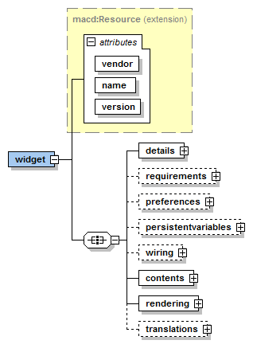

widget structure

### The `contents` element

Widget descriptions must link to the actual source code of the widget.
This is done through the `contents` element.

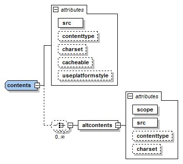

The `content` element binds the description with the actual widget source code

The `contents` element supports the following attributes:

-   `src`: absolute or description-file-relative URL of widget code.
-   `contenttype`: linked resource content type: suggested values are:
    `text/html` and `application/xml+xhtml`. This is an optional attribute,
    with `text/html` by default. All implementations of the Application
    Mashup GE must support HTML files (`text/html`), other options (like
    SVG or Flash are optional).
-   `charset`: Charset used by the source file. This is an optional
    attribute, with `utf-8` by default.
-   `cacheable`: sets if the linked code can be cached by the
    platform: possible values are `true` and `false`. This is an
    optional attribute, `true` by default.
-   `useplatformstyle`: Use platform style to display HTML elements.
    Optional attribute, `false` by default.

In addition to these attributes, the `contents` element allows to
provide a list of extra source files (through the `altcontents`
subelement) that will be use instead of the one provided in the main
`contents` element if the conditions are met (controlled by the `scope`
attribute).

### The `rendering` element

The `rendering` element specifies the default width and height of the
widget once it is deployed in the user workspace.

The `rendering` element

The `contents` element supports the following attributes:

-   `width`: initial width of the widget as layout columns. From Wirecloud
    v0.8.0 you can use also pixel units (e.g. `200px`) and percentage units
    (e.g. `30%`). It's recommended to use pixel or percentage units if you don't
    need to support previous versions of WireCloud.
-   `height`: initial height of the widget as layout rows. From Wirecloud
    v0.8.0 you can use also pixel units (e.g. `200px`) and percentage units
    (e.g. `30%`). It's recommended to use pixel or percentage units if you don't
    need to support previous versions of WireCloud.

## Specific Operator metadata

The figure below depicts the structure followed by `operator` elements (and
therefore, the structure followed by operator descriptions):

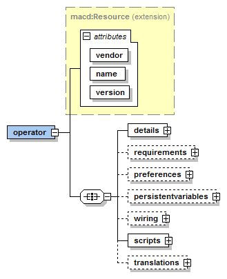

The `operator` element

### The `scripts` element

While in widgets define it code entry point, in general, through an HTML
file, operators, as they do not provide an user interface, need to
declare directly the list of javascript files to use. This script list
is declared using the `scripts` element that is composed of one or more
`script` sub-elements. `script` elements supports the following
attributes:

-   `src`: description-file-relative URL of the JavaScript file.

## Specific Mashup metadata

The figure below depicts the structure followed by `mashup` elements (and
therefore, the structure followed by mashup descriptions):

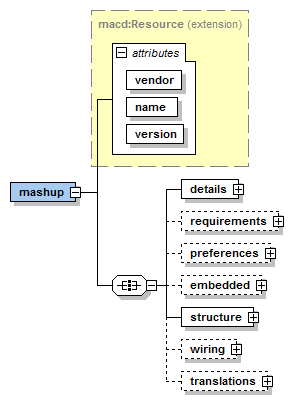

The `mashup` element

### The `structure` element

The `structure` element is in charge of describing the structure of the
mashup. The figure below depicts what it looks like:

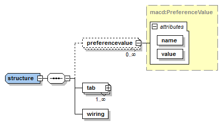

The `structure` element

The `preferencevalue` element allows the modification of the initial
values of the preferences of the final workspace.

The `tab` element is used for describing each of the tab that build up
the mashup. So this is the key element for describing the visual part of
a mashup.

The `wiring` element is used for describing the wiring/piping
configuration of the mashup. This element also is used for describing
the operators used in the mashup. Note that this element has the same
name to the `wiring` element used on the root of the description, but
this element is different in structure.

### The `tab` element

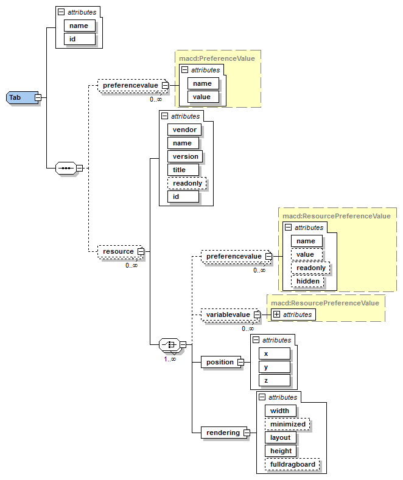

The `tab` element

The `structure` element should contain at least one `tab` element
that represents tabs in Application Mashup GE dashboard. It has the
following attributes

-   `name`: the name of the tab
-   `id`: the identification of the tab; this id is internal to
    the description.

The `tab` element may contain any number of `resource` elements which represent
widget instances used in the mashup. It has the following attributes:

-   `vendor`: the widget distributor
-   `name`: name of the widget
-   `version`: version of the widget
-   `title`: name to be displayed in the dashboard.
-   `readonly`: indicates if the widget can be remove from
    the dashboard.
-   `id`: the widget identification; this id is internal to the
    mashup description.

The `preferencevalues` and the `variablevalues` elements allows the modification
of the initial values and the behaviour of the preferences an persistent
variables respectively. The parametrisation of each preference/persistent
variable is controlled by one of those elements and their attributes:

-   `name`: name of the preference/persisten variable to parameterise.
-   `value`: initial value for the preference/persistent variable. If
    not provided, the initial value of the preference (obtained from the
    widget description) will be used.
-   `readonly`: indicates if the preference/persistent variable can
    be modified.
-   `hidden`: indicates if the user will be able to see the value for
    this preference/persistent variable on the user interface of the
    Application Mashup GE.

The `position` element describes the widget position into the
dashboard. It has the following attributes:

-   `x`: the widget's X coordinate.
-   `y`: the widget's Y coordinate.
-   `z`: the widget's Z coordinate.

The `rendering` element describes some characteristics of the
widget representation. It has the following attributes:

-   `width`: widget width in the dashboard.
-   `minimized`: Boolean attribute that defines whether the widget is
    minimized in the dashboard
-   `layout`: widget layout in the dashboard
-   `height`: widget height in the dashboard
-   `fulldragboard`: Boolean attribute that describes whether the
    widget is using all the dashboard.

##### The Mashup's `wiring` structure element

This element describes how widgets and operators in the mashup are
connected using their output and input endpoints.

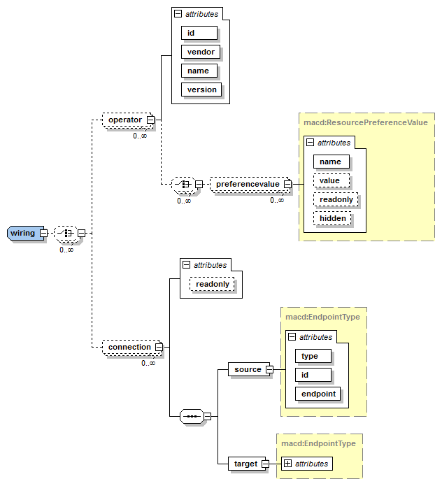

The mashup `wiring` element

The `wiring` element may contain any number of `operator` elements. An
`operator` element defines an operator that is used in the wiring. It has the
following attributes:

-   `id`: identification of the operator; this id is internal to the
    mashup description.
-   `vendor`: the distributor of the operator.
-   `name`: operator name.
-   `version`: version of the operator.

Fields `vendor`, `name` and `version` follows the same pattern defined in the
[introduction](#introduction).

The `wiring` element may contain any number of `connection`
elements. These elements describe which output endpoints are connected
with which input endpoints. The `connection` elements are composed
of a `source` element and a `target` element.

The `source` element defines the output endpoint of the
connection. It has the following attributes.

-   `type`: type of the element that has the output endpoint; this
    attribute could have the values `widget` or `operator`.
-   `id`: id of the element that has the output endpoint; this id is
    the same as the id defined in the `resource` element if the
    element is a widget, whereas this id is the same as the id defined
    in the `operator` element if the element is an operator.
-   `endpoint`: the name of the output endpoint. This name is the same
    as the defined in the `outputenpoint` element.

The `target` element defines the input endpoint of the connection.
It has the following attributes:

-   `type`: type of element that has the input endpoint; the possible
    values of this attribute are `widget` or `operator`.
-   `id`: id of the element that has the input endpoint; this id is
    the same as the id defined in the `resource` element if the
    element is a widget, whereas this id is the same as the id defined
    in the `operator` element if the element is an operator.
-   `endpoint`: the name of the input endpoint; this name is the same
    as the defined in the `inputenpoint` element.
