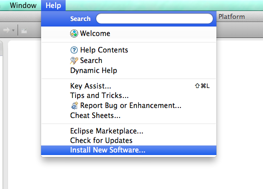
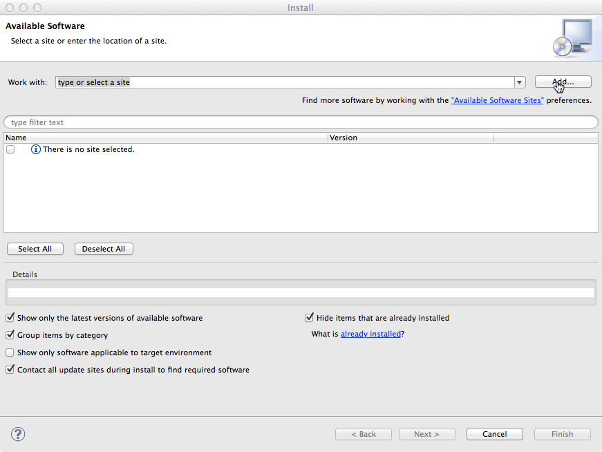
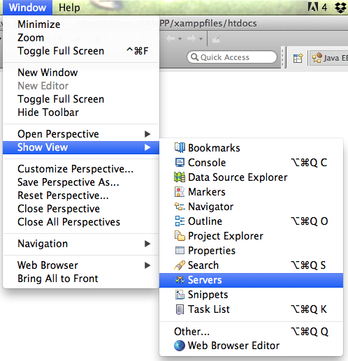
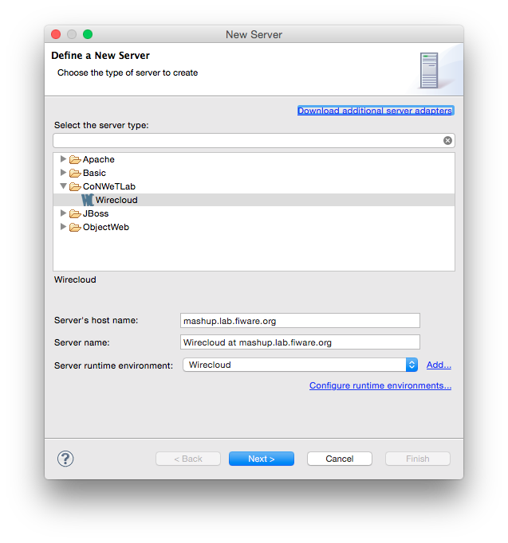
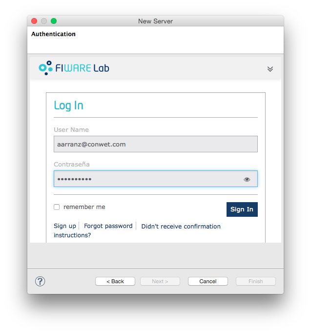
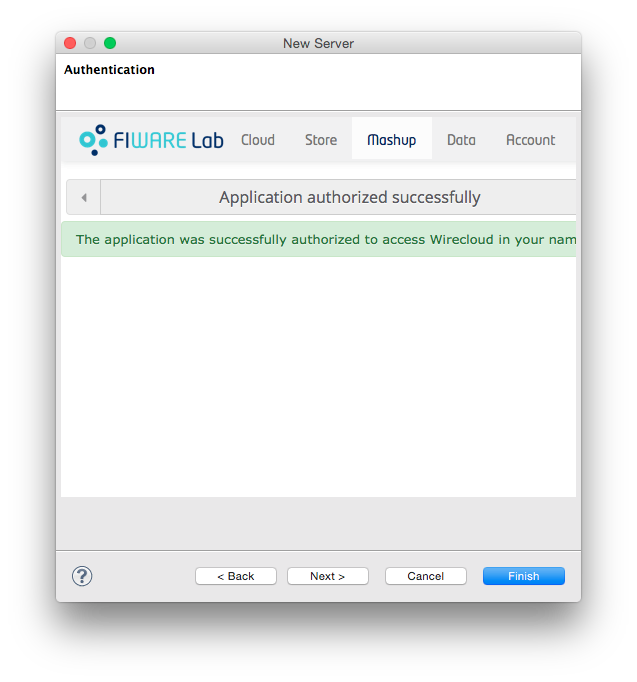
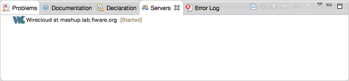
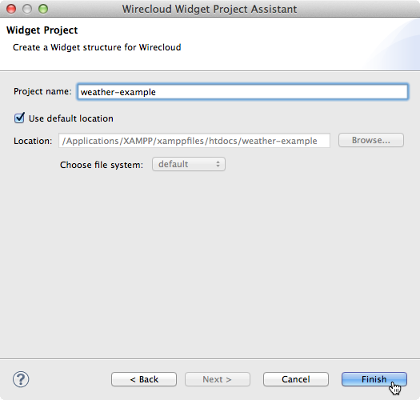
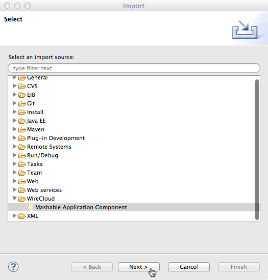

## Installation

-   Download the latest version of the "Eclipse IDE for Java EE
    Developers" package for your platform from the
    [Eclipse's downloads section][].
-   Download the WireCloud IDE plugin from the
    [FIWARE PPP Public Files area].
-   Install the WireCloud IDE plugin:

    -   *Help -> Install New Software...*

        

    -   Add a new repository using the *Add* button

        

    -   Click *Archive* and select the WireCloud IDE plugin file
        downloaded in previous steps

        

    -   Select the WireCloud IDE entry

        

    -   Click *Next* and complete the wizard.

[Eclipse's downloads section]: http://eclipse.org/downloads/
[FIWARE PPP Public Files area]: https://forge.fiware.org/frs/?group_id=7

## Adding WireCloud servers

WireCloud IDE support deploying Widget/Operator projects into WireCloud
servers. You can manage WireCloud servers from the "Server" view
(usually located in the lower half of Eclipse's development screen). If
you don't have such a view, you can add it via *Window -> Show View
-> Servers*:

-   Right click inside the "Server" tab to open the New Server dialogue:

    

-   In the next step, select WireCloud as the type of server to define
    (you will find it under the CoNWeTLab category), update the host
    name of the server where WireCloud is located and give it a name.
    After filling this info, click *Next*:

    

-   Review the protocol and port configuration. You will also need to
    provide a client id and a client secret obtained from the IdM (see
    how to create new OAuth2 applications on the
    [KeyRock's User and Programmers Guide]). You will need to use
    `[WIRECLOUD_SERVER_URL]/oauth2/default_redirect_uri` as the
    callback URL field. Once finished click *Next*:

    

-   The next step is authorising WireCloud IDE to install and uninstall
    resources on the server. This will require you to log in to the
    WireCloud server.

    

-   And to confirm the authorisation:

    

-   After which, a confirmation message should be displayed:

    

-   At this step you can choose between clicking *Next* and selecting a
    list of projects to upload initially to the server, or clicking
    *Finish* as all the required info has been provided. In any case,
    after finishing the wizard, a new WireCloud server should appear in
    the "Server" tab:

    

[KeyRock's User and Programmers Guide]: https://fi-ware-idm.readthedocs.org/en/latest/user_guide/#registering-an-application 

## How to create Widget/Operator projects from scratch

-   Open the new project wizard page:

    

-   And select the Widget/Operator project depending on the type of
    resource you want to create (you will find them on the WireCloud
    Project category):

    

-   Give a name to the project and click *Finish*:

    

Once created the project, you will obtain the following features in
addition to the ones provided directly by Eclipse:

-   JavaScript API autocompletion.
-   Assistance for editing Widget/Operator descriptions.
-   Support for installing and uninstalling them from the configure
    WireCloud servers.

## Tutorial

- First of all, download this initial code from this
  [link](slides/attachments/Example1Skel.zip). This code contains a widget
  example skeleton including basic html/style code.
- Import the downloaded file into a Widget project:

	
    
    

- Follow the *3.1.3. Making requests and wiring* tutorial available on the
  [WireCloud's course @ FIWARE
  Academy](http://edu.fiware.org/course/view.php?id=53#section-3).
- Add the widget to the WireCloud server using the Servers view (see the [Adding
  WireCloud servers](#adding-wirecloud-servers) sections for more info). The
  first step is opening the "Add and remove ..." view:

    

- Once opened the "Add and Remove" view, you will need to move the project from
  the available section to the configured one:

    

- Click *Finish* and the widget will be uploaded to the selected server where you
  will be able to test your widget following the steps documented on the
  tutorial.
