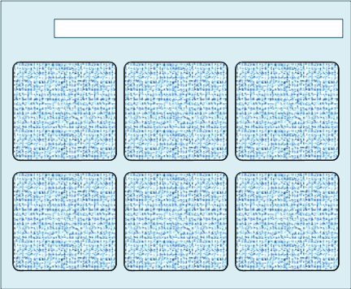
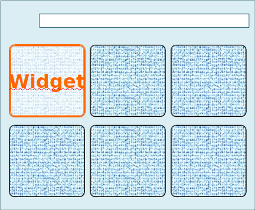
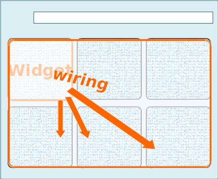
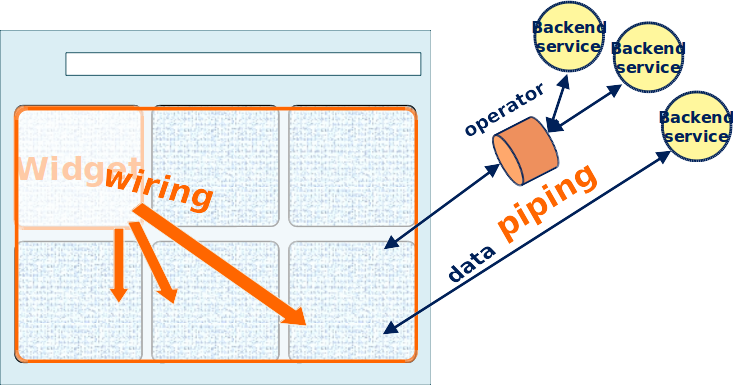
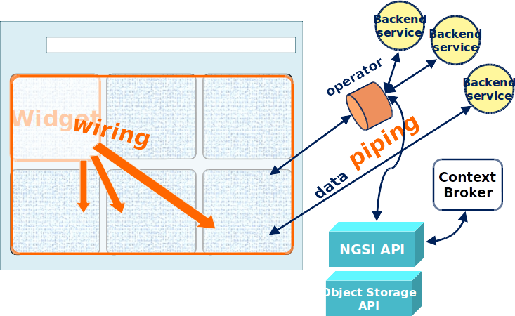
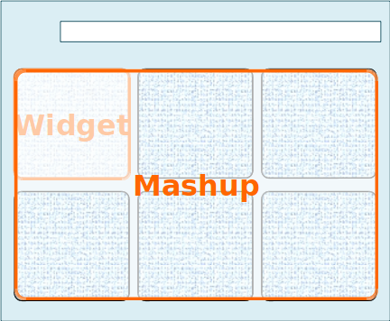
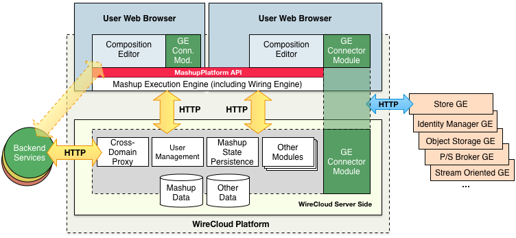

# Introduction to WireCloud

.fx: cover

@conwet

---

## Introduction

.fx: section-title

---
<!-- SLIDE 3 -->
## Introduction

- WireCloud is the Reference Implementation of the FIWARE’s Application Mashup
  Generic Enabler
    - It is a framework to create value-added application mashups by means of
      integrating heterogeneous data, application logic, and UI web components
      in a visual manner

- WireCloud is offered under a Affero GPL v3 license with a classpath-like
  exception, allowing **mashups**, **widgets**, and **operators** to be licensed
  under any license without any restriction

---

## Basic Concepts

.fx: section-title

---
<!-- SLIDE 5 -->
## Workspace / Dashboard

- A **workspace** represents the place where users can edit their dashboards.
- A **dashboard** contains the set of **widgets** that will conform the frontend
  of the application mashup
- Users can place/resize/name/tab... their widgets as they wish on the workspace

---
<!-- SLIDE 6 -->
## Widget

- A widget is a UI component developed using web technologies (HTML, CSS,
  JavaScript, ...)
- It provides the atomic functionality of the application mashup
- It can send data to other widgets and/or receive events from them.

---
<!-- SLIDE 7 -->
## Wiring

- WireCloud provides a data flow- or event-based mechanism that widgets can use
  to notify other widgets about changes in their state
- Widgets can consume these events to provide an unified behaviour of the
  application mashup
    - The final user is who decides this final behaviour
- It allows you to easily connect **widgets** with **operators** in a **mashup**
  to create a full-fledged dashboard with RIA functionality

---
<!-- SLIDE 8 -->
## Piping and Operators

Piping allows you to easily connect widgets to back-end services or data sources
through an extendable set of **operators**, including filters, aggregators,
adapters, etc...

---
<!-- SLIDE 9 -->
## Piping and Operators

---
<!-- SLIDE 10 -->
## Mashup

- A **mashup** represents your application.
- It is built from **widgets**, **operators**, and backend services, all of them
  connnected by **wiring** and **piping**.
- The are built in the context of **workspaces/dashboard**

---

## Architecture

.fx: section-title

---
<!-- SLIDE 12 -->
## Architecture

---
<!-- SLIDE 13 -->
## Architecture

- As shown in the previous diagram, WireCloud internally follows a client-server
  architecture.
- From the user's perspective, WireCloud mainly runs on client side (in her
  browser), where she can visually create her dashboards
    - It also runs the mashup and the wiring engine to interconnect
      widgets/operators.
- WireCloud's server side provides some key features through the `MashupPlatform
  API`, such as cross-domain proxy functionalities to get access to external
  services / web APIs. It also provides some modules to get connected to other
  FIWARE's GEs
	- It also stores dashboards.

---
## APIS

.fx: section-title

---
<!-- SLIDE 14 -->
## APIS

- [MashupPlatform](http://wirecloud.readthedocs.org/en/latest/widgetapi/widgetapi/):
  Core API provided by WireCloud to widgets and operators.
- [NGSI API](http://wirecloud.readthedocs.org/en/latest/development/ngsi_api/):
  API used for interacting with the Orion Context Broker.
- [Object Storage API](http://wirecloud.readthedocs.org/en/latest/development/object_storage_api/):
  API used for interacting with the Object Storage.

---

.fx: back-cover

Thanks!

FIWARE                                FIWARE Lab
OPEN APIs FOR OPEN MINDS              Spark your imagination

         www.fiware.org               FIWARE Ops
twitter: @Fiware                      Easing your operations

