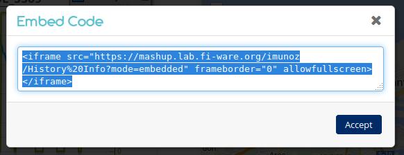

# End-user guide

.fx: cover

@conwet

---

## Introduction

.fx: section-title

---
<!-- SLIDE 3 -->
## Introduction

* Web mashups are targeted at leveraging the "long tail" of the Web of Services by exploiting rapid development, DIY, and shareability
* Web mashups integrate:
	- Heterogeneous data
	- Application logic
	- UI components (widgets/gadgets)
* WireCloud builds on cutting-edge end-user development, RIA and semantic technologies to offer a next-generation end-user centred mashup platform aimed at leveraging the "long tail" of the Internet of Services

---

## Features

.fx: section-title

---
<!-- SLIDE 5 -->
## Features

There are two main features -through integrated tools:

* **wiring editor:** Allows you to easily connect widgets in a mashup to create a full-fledged dashboard with RIA functionality
* **piping editor:** Allows you to easily connect widgets to back-end services or data sources through an extendable set of operators, including filters, aggregators, adapters, etc

---

## Video tutorials

.fx: section-title

---
<!-- SLIDE 7 -->
## Video tutorials
### Creating a new workspace

<video src="videos/Create.mp4" controls></video>

---
<!-- SLIDE 8 -->
## Video tutorials
### Building a new mashup

Widgets and operators that you need for this example:

* [NGSI source](attachments/CoNWeT_ngsi-source_3.0.2.wgt)
* [NGSI Entity To poI](attachments/CoNWeT_ngsientity2poi_3.0.3.wgt)
* [Map Viewer](attachments/CoNWeT_map-viewer_2.5.3.wgt)
* [History Module to Linear Graph](attachments/CoNWeT_simple-history-module2linear-graph_2.3.2.wgt)
* [Linear Graph](attachments/CoNWeT_linear-graph_3.0.0b3.wgt)

---

<!-- SLIDE 9 -->
## Video tutorials
### Building a new mashup

<video src="videos/Building.mp4" controls></video> <!-- Volver a hacer el vídeo -->

---
<!-- SLIDE 10 -->
## Video tutorials
### Sharing your dashboards

<video src="videos/Sharing.mp4" controls></video>

---
<!-- SLIDE 11 -->
## Video tutorials
### Sharing your dashboards

At the end of the last video appears a code like this:

For embed your mashup, Copy & Paste it into you HTML document.

---

.fx: back-cover

Thanks!

FIWARE                                FIWARE Lab
OPEN APIs FOR OPEN MINDS              Spark your imagination

         www.fiware.org               FIWARE Ops
twitter: @Fiware                      Easing your operations

