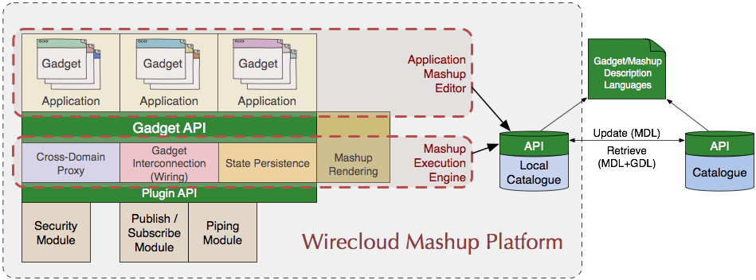

Wirecloud architecture overview
===============================

The Wirecloud Mashup Platform is made up of the following components:

* Application Mashup Editor
* Mashup Execution Engine
* Catalogue

The **Application Mashup Editor** conforms the web-based composition editor that
end-users utilize to create their mashup applications. It consists of a
workspace where end-users can place widgets in a spatial manner, a wiring tool
to set the interconnection between widgets, and a catalogue/marketplace where
end-users can access and look for the widgets they need.

The **Mashup Execution Engine** offers widget interconnection, mashup state
persistence, and cross-domain proxy facilities through an API to the editor. The
decentralized nature of mashups demands this execution engine to coordinate
widget execution and communication within the mashup. Thanks to the plugin API,
extra functionality can be added to the execution engine as external modules
(i.e. security, publish/subscribe, or piping modules).

End-users will find the widgets they need from the **catalogue**. The
availability of a standardized widget and mashup description languages allows
the catalogue to be decoupled from both the editor and the execution engine.

Wirecloud offer technologies to build the front end layer of a new generation
SOA architecture that supports the following criteria:

* End-users are fully empowered to self-serve from a wide range of available
  resources, providing access to content and application services, in order to
  set up their own personalized operating environment in a highly flexible and
  dynamic way ("Do it yourself", IKEA philosophy).
* Active participation of users is now enabled, they can now create resources as
  well as share and exchange both knowledge and resources with others and learn
  together through the catalogue, thus accelerating the way innovations and
  improvements in productivity are incorporated.
* Interaction will be adapted and relevant to context, giving the term "context"
  the widest possible meaning, in a way that comprises both user context
  (knowledge, profile, preferences, language, information about social networks
  the user belongs to, etc.) and delivery context (static and dynamic
  characteristics of the device used for access, geographical and time location,
  connection bandwidth, etc.). Dynamic context variability and user mobility
  will also be taken into consideration.

Wirecloud base functionality can be easily enhanced by means of modules:

* Widgets will be able to receive and publish data in a publish/subscribe
  fashion using the pub/sub module.
* Widgets can use the cross-domain proxy for accessing services without taking
  into account whether they are accessed using cross-domain requests.
* Resources (Widgets and Mashups) can be added to the catalogue using MDL/GDL
  languages.
