Supported browsers
------------------

WireCloud 0.9 supports the following desktop browsers:

- Firefox 38+
- Chrome 37+
- Safari 8+
- Opera 23+

WireCloud 0.9 also works on the mobile version of the previous browsers, except
the wiring editor that currently does not work with touch screens. On
smartphones, an experimental and not ready for production view is provided.

> **Note:** Although WireCloud supports those browsers, some widgets and operators
> may not support all of them. Read each widget and operators documentation for
> knowing if they have any restriction on the used browser.

Creating a new workspace
------------------------

Mashups in WireCloud are built in the context of **workspaces**. A
workspace consists of the set of widgets and operators that can be
mashed-up, even spanning multiple tabs. Widgets and operators in a
workspace can share data though data flow- or event-based mechanisms.

The workspace in use is shown in the upper area of the screen. It
resembles the well-known REST nomenclature. For example, the following
screenshot shows a workspace named "Workspace", pertaining the user
"admin" and running in the FIWARE Lab’s instance of WireCloud, i.e. it
is named admin/Workspace.

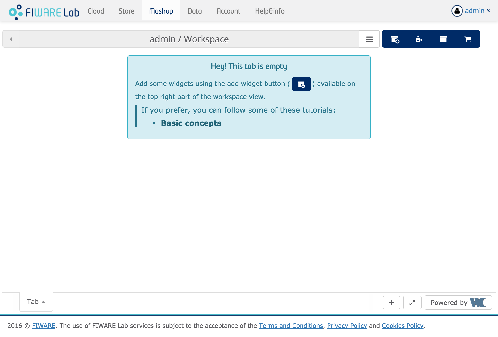

Near the workspace name there is a button that you can click on to
expand the workspace dropdown menu:

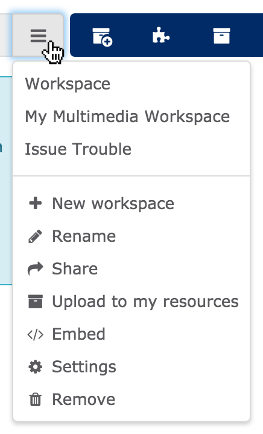

Once expanded, the menu shows a list of the already created workspaces
(see *Workspace*, *My Multimedia Workspace* and *IssueTrouble* in the
figure above) that allows you to quickly switch between them, followed
by a list of options:

-   **Rename** changes the name of the current workspace
-   **Settings** changes the settings of the current workspace
-   **Remove** deletes the current workspace
-   **New workspace** creates a new workspace
-   **Embed** shows info about how to embed current workspace in other
    web pages
-   **Share** shows the sharing configuration of the current workspace
-   **Upload to my resources** allows you to save the current
    workspace to the local catalogue for later usage

If you want to create a new workspace named "History Info", choose *New
workspace* in the dropdown menu:

A dialog will pop up requiring a name for the new workspace. Type the
desired name and click the accept button:

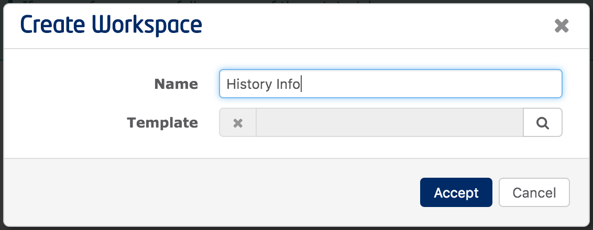

Once accepted, the name of the new workspace is shown in the upper area of
the window:

The following screenshot show the "Settings" menu, where you can set
workspace features:

Browsing the Marketplace
------------------------

### Marketplaces and Stores

A mashup tool like WireCloud must support access to a **marketplace**
made up of **stores**, where people can offer and deal with services
made accessible through widgets and operators, like goods, and finally
mashup them to create value added services and applications.

On the marketplace you can quickly find and compare widgets and
operators, which enable you to attend an industry-ecosystem better than
before. Widgets, operators, and even pre-built mashups become tradable
goods, which can be offered and acquired on Internet based marketplaces.
Partner companies and other users can combine existing services to new
services whereby new business models will be incurred and the value
added chain is extended.

We differentiate the marketplace from a store. While a store is owned by
a store owner who has full control over the specific (limited) widget,
operator and mashup portfolio and offerings, a marketplace is a platform
for many stores to make their offerings available to a broader audience
and enable consumers to search and compare widgets, operators and
pre-built mashups and find the store, where to buy. The final business
transaction (buying) is done at the store and the whole back office
process is handled by the store.

The following figure shows a screenshot of WireCloud where you can see
the FIWARE Lab marketplace and the different stores made available through
it.

### Managing marketplaces

When looking for an offer of widgets, operators and mashups, you first
need to choose a marketplace. Use the dropdown menu shown in the
workspace path for this purpose.

As shown in the previous screenshot, this menu allows you to choose
among the different marketplaces you have access to. To add a new
marketplace, you only need to provide its endpoint (URL). You can also
delete the current markeplace through the *Delete Marketplace* option in
the context menu.

If you have only Local marketplace available, you can add the FIWARE Lab
marketplace using the *Add new marketplace* option as shown in the following
screenshots:

WireCloud offers a built-in local catalogue called "My Resources", which
allows you to search among the widgets, operators and mashups currently
available for the user. The following figure shows a screenshot of the
*My Resources* for a user in a given instance of WireCloud.

If you are a widget developer with brand new widgets to share, or you
just have downloaded a WireCloud-compliant widget from anywhere, you can
easily upload your new widgets to the built-in local catalogue through
the *Upload* button available on the *My Resources* view.

### Choosing an available store

Stores in WireCloud are associated to a specific marketplace. Therefore,
to surf a store you first need to choose the FIWARE Lab marketplace that
publishes it. In the following figure, the user uses the dropdown menu
to choose FIWARE Lab’s marketplace:

Once in the FIWARE Lab marketplace, the store dropdown menu shows all its
available stores (*CoNWeT*, *WStore FIWARE Lab* and *Another Store*). The
following figure shows the options available in the stores dropdown menu:

Last, but not least, you can return to surf the entire marketplace and
see the global offer at a glance by selecting the *All stores* option.

### Publishing mashable application components into Stores

1.  Go to *My Resources* view:
    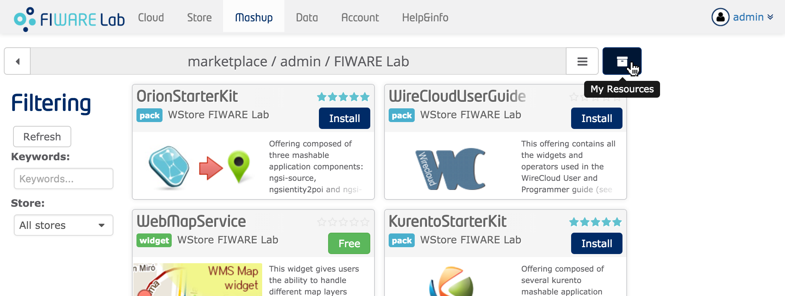

1.  Open the mashable application component details clicking on it:
    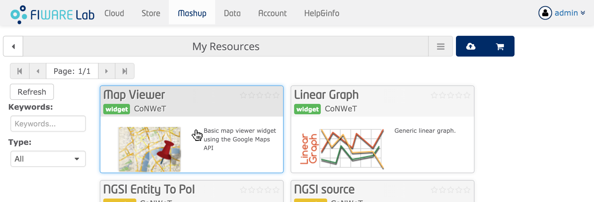

1.  Click *Publish*:
     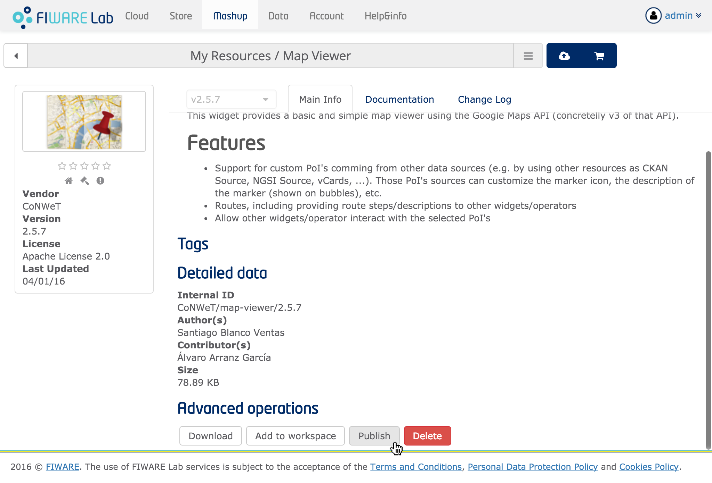

1.  Check the marketplace and the Store where the mashable application
    component is going to be uploaded
    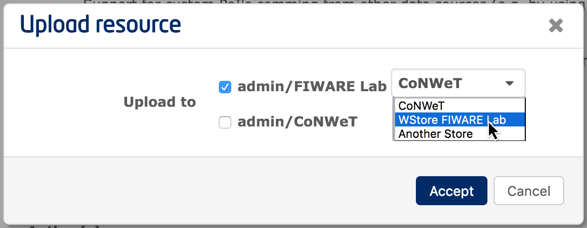

1.  That's all!. Now you will be able to create new offerings at the
    selected Store using the uploaded resource. See the [WStore
    documentation](http://wstore.readthedocs.org/en/latest/user-programmer-guide.html#creating-an-offering)
    for more information on how to create offering using the uploaded
    resources.

Building a new mashup
---------------------

If you followed the instructions documented in the "[Creating a new
workspace](#creating-a-new-workspace)" section, you should
have a "History Info" workspace. Let's assume that we start from this
point:

Go then to the Marketplace to choose among the components available in the
catalogue those you want to use in your mashup:

To ensure that you find the required widgets/operators for this example
mashup, go to the FIWARE Lab marketplace and install them using the
[*WireCloudUserGuide* offering](https://store.lab.fiware.org/offering/CoNWeT/WireCloudUserGuide/1.0).
You can also download them using the following URLs:

-   [CoNWeT_simple-history-module2linear-graph_2.3.2.wgt](attachments/CoNWeT_simple-history-module2linear-graph_2.3.2.wgt)
-   [CoNWeT_ngsi-source_3.0.7.wgt](attachments/CoNWeT_ngsi-source_3.0.7.wgt)
-   [CoNWeT_ngsientity2poi_3.0.3.wgt](attachments/CoNWeT_ngsientity2poi_3.0.3.wgt)
-   [CoNWeT_map-viewer_2.5.7.wgt](attachments/CoNWeT_map-viewer_2.5.7.wgt)
-   [CoNWeT_linear-graph_3.0.0b3.wgt](attachments/CoNWeT_linear-graph_3.0.0b3.wgt)

Once installed, you should be able to see all the widgets/operators used
in this example in the "My Resources" view:

Go to the editor view and click on the *Add widget* button:

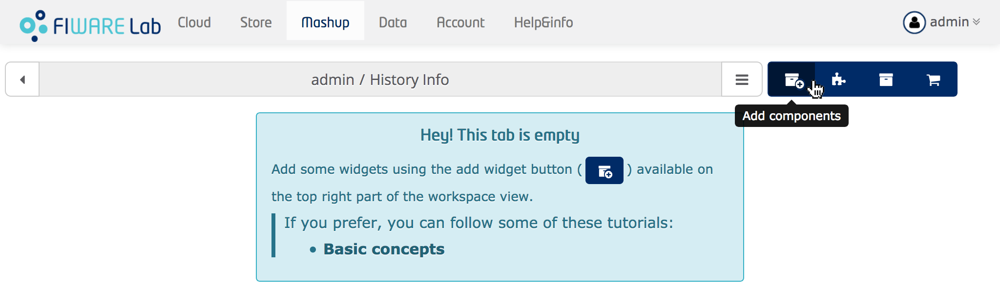

Look for the *Linear Graph* widget and click on the *Add to workspace*
button:

This will add the *Linear Graph* widget into the dashboard, you can move
and resize it until you obtain the desired layout:

Add the *Map Viewer* widget to the dashboard following the same steps
for adding the *Linear Graph* widget. After rearranging it you will be
presented with the following view, which shows you the two widgets in
the default tab. You can see the tabs used in your workspace at the
footer bar, and you can create new tabs to better organize the
distribution of the widgets in your mashup.

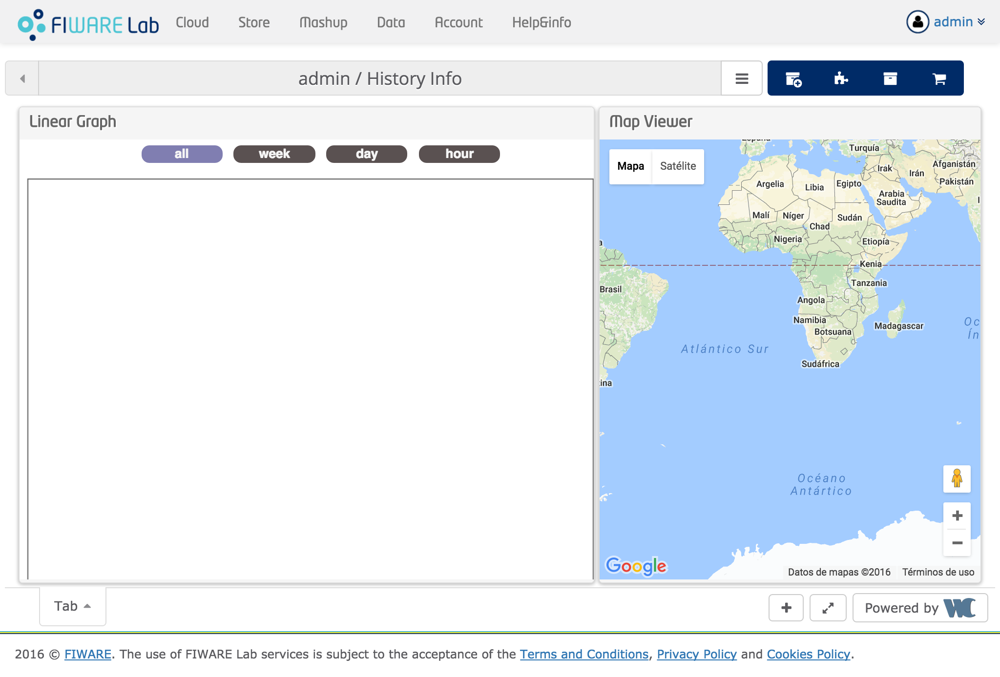

### Changing the settings of a widget

Once you have added the desired widgets to your mashup and you have
placed and resized them to configure the information dashboard of your
choice, you can change their settings. To do so, go to the upper-right
corner of the widget and click the properties icon as shown in the
following screenshot:

You will then be presented with a dropdown menu with several options.

-   **Rename** changes the widget name shown in workspace editor and
    wiring Editor views
-   **Settings** shows a form for changing the settings of the current
    widget
-   **Log** shows a dialog with the log history of the widget
-   **Upgrade/Downgrade** allows you to change the version of the widget
-   **Reload** reloads the widget
-   **User's Manual** will open the widget documentation
-   **Full Dragboard** maximises the selected widget, so it will take up
    the full canvas area. This option becomes **Exit Full Dragboard** if
    the widget is already on "Full Dragboard" mode. In that case, this
    option will restore the size of the widget to the one it had before
    maximising it
-   **Extract from grid** lifts up the widget from the canvas, allowing
    you to place it wherever you want on the canvas, even on top of
    other widgets. This option becomes **Snap to grid** if the widget is
    currently outside the grid, in this case, this option docks the
    widget into the grid.

Finally, click on the **Settings** and you will be prompted with a
customised dialog for the settings of the widget. In this example, the
*Map Viewer* should be provided with initial location, zoom level and
mark shadow radius to customise the visualisation.

As we have configure the initial position and the initial zoom, we need to
reload the widget. To do so, we click again on the properties icon and then on
the *Reload* option:

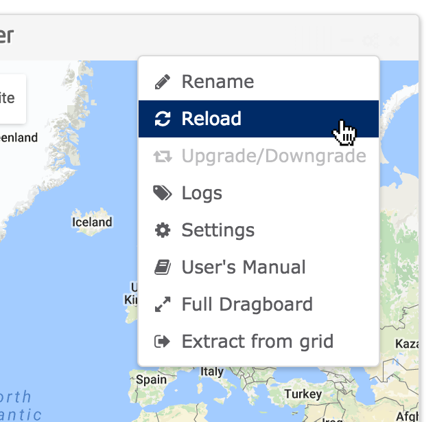

Now we have our widget centered in the new location, Santander, and using the
configured initial zoom level.

At this time, you have created a mashup with two individual widgets. The
*Linear Graph* widget is empty and need to be wired with something that
provides information to draw, and the *Map Viewer* is a good option to
show any kind of "Points of Interest" and allow the user to select them
easily.

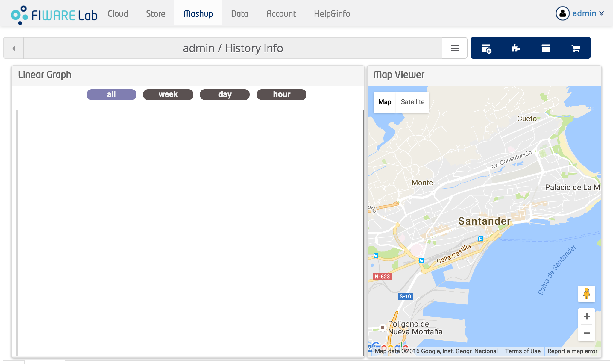

### Wiring widgets and operators

Once you have chosen the desired widgets, you can wire them to enable
their intercommunication and to achieve coordinated behaviour. Widgets
and operators in WireCloud, are capable of sending and/or receiving
events and data through well-identified ports called endpoints. When you
connect two compatible endpoints, the second one (i.e. the input or
target endpoint) prepares to receive data flows and/or events coming
from the first one (i.e. the output or source endpoint).

#### Basic wiring concepts

To wire the widgets and add operators to your mashup go to the Wiring
view of the tool:

You will then be presented with an empty wiring configuration (denoted by an
empty canvas displaying a welcome message):

One of the most important characteristics that should be intrinsic to
the design of widgets is that they must be as generic as possible. For
example, it makes much more sense to have a generic *Map Viewer* widget
that can be wired through an operator to any source of information of
your choice, than to have an specific one that has hard-coded the source
of data. Operators represents the means to achieve this generality,
because they represents the means to dynamically associate the widgets
with the concrete services or sources of information you want to use in
the context of a particular mashup.

In this case, we have an *NGSI source* operator that is going to
provide the data information to the *Map Viewer* widget. This kind of
operators are called piping operators. So we have to add it to the
wiring.

To do so, open the components side panel and search the *NGSI source* operator,
then click on the *Create* button:

This will create an instance of that operator and will appear in the bottom of
the box associated with the *NGSI Source* operator. You can see that it is
highlighted indicating that the new operator is not used in the wiring
configuration. All operators not used when leaving the wiring editor will be
removed from the wiring configuration.

Now drag the operator from the operator list to the wiring canvas:

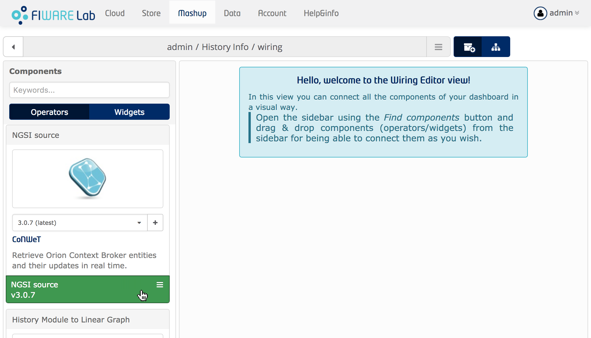

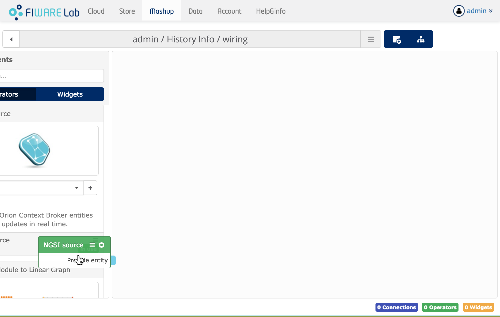

Once added, we need to configure it so it knows what info to retrieve from the
[Orion Context Broker] and from what instance. To do so, click on the
**Settings** menu entry:

And make sure the following configuration is used:

- **NGSI server URL**: `http://orion.lab.fiware.org:1026/`
- **NGSI proxy URL**: `https://ngsiproxy.lab.fiware.org`
- **Use the FIWARE credentials of the user**: Enabled
- **Use the FIWARE credentials of the workspace owner**: Disabled
- **NGSI tenant/service:** Emtpy
- **NGSI scope:** `/`
- **NGSI entity types**: `Node, AMMS, Regulator`
- **Id pattern**: Empty
- **Monitored NGSI attributes**: `Latitud, Longitud, presence, batteryCharge, illuminance, ActivePower, ReactivePower, electricPotential, electricalCurrent`

Now, we have ready the source of information that is going to be presented in
the *Map Viewer* widget. So, the next step is adding the *Map Viewer* widget to
the wiring canvas, this way we will be able to connect them. This is
accomplished in the same way we did with the *NGSI Source* operator, but using
the *Widget* tab in the sidebar:

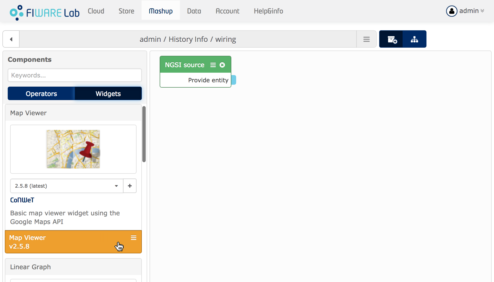

> **NOTE**: We have created the instance of the *Map Viewer* widget in the
> editor view, but you can also create widget instances from the wiring editor
> using the *Create* button:
>
> 
>
> Remember to resize and place the new widget after exiting the wiring editor.

After adding the *Map Viewer* widget into the wiring canvas, you should have
something similiar to this:

The wiring editor comes with a recommendation system for connections.
For example, move the pointer to the *Provide entity* endpoint. You will
see that the endpoint get highlighted, this means that te recommendation
system is searching for compatible endpoints. In this case there are no
compatible endpoints.

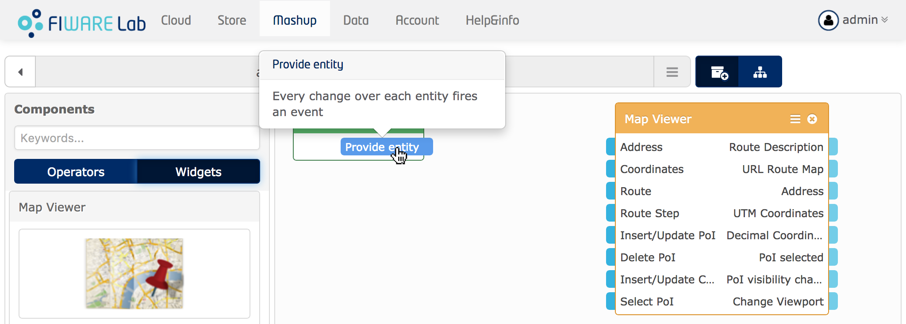

This is because the output of the *NGSI source* cannot be connected directly
with the *Map Viewer* widget. We can use a transform operator to convert the
event data provided by the *NGSI source* operator to the format used by the *Map
Viewer* widget. In this example, the operator that is going to perform this
transformation is called *NGSI Entity to PoI*:

After adding the operator, we can move the pointer to the *Provide
entity* endpoint to see that now we have a connection recommendation:

So, we can connect it. To do so, push down the mouse button on the
*Provide entity* endpoint and drag the arrow to the *Entity* endpoint:

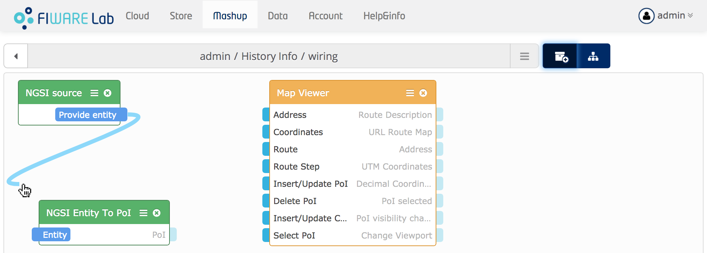
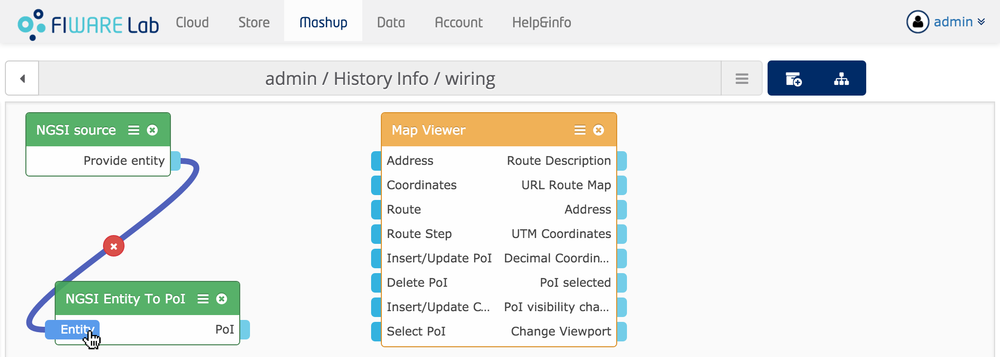

We have to connect also the *PoI* endpoint of the *NGSI Entity To PoI* operator
to the *Insert/Update PoI* endpoint on the *Map Viewer* widget:

Once again, we need to configure the *NGSI Entity To PoI* operator, this is done
in the same way as we have done with the *NGSI Source*. In this case the values
should be:

- **Coordinates attribute**: `Latitud, Longitud`
- **Marker Icon**: Empty

If you return to the *Editor* view, you will see that the map widget has
been updated and is showing the PoIs obtained from the *NGSI source*
operator.

You can use the *Map Viewer* moving the viewport, selecting PoI's, etc.
But in really, what we have is just the *Map Viewer* widget connected to
a source of data, but using piping and transformation operators that is
going to give us a great flexibility.

[Orion Context Broker]: http://catalogue.fiware.org/enablers/publishsubscribe-context-broker-orion-context-broker

#### Other wiring common tasks

One of the most common operations is the task of getting the connections
removed in the wiring. For example, when you make some mistake for some
reason, you can fix it by clicking the *Remove* button that appears in the middle
of the connection.

Another common task is to change the shape of connections. To do so, you have to
click on the *Customize* option of the connection:

Once enabled, you only have to move the handles that appear to modify the shape
of the connection.

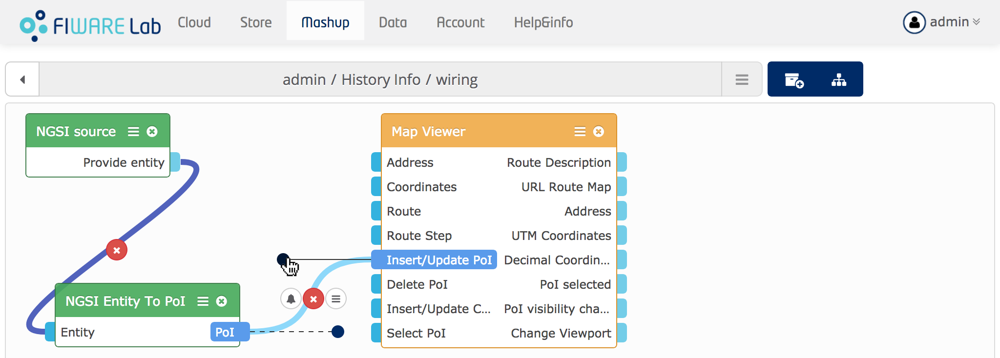

If you want to stop customising the connection, click outside the connection or
use the *Stop Customizing* option:

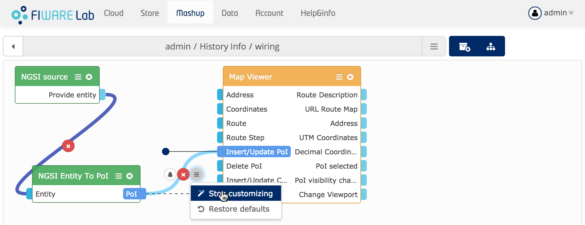

You can also minimize operators with the intention of improving space
usage. This can be accomplished using the *Collapse* option that appears
in the component menu:

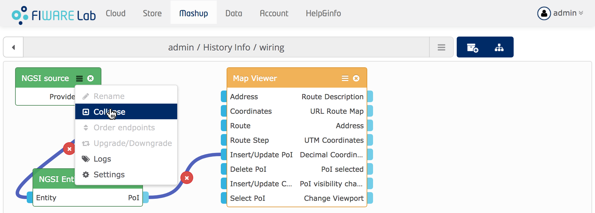

#### Cloncluding our example

Continue wiring the rest of the widgets in your mashup following your
intuition, the documentation and the contextual help offered by each
widget/operator. Anyway, just in case you have difficulties, you can see
the final result in the following screenshot:

Now you can play with your new workspace.

Behaviour Oriented Wiring
-------------------------

Starting at WireCloud 0.8.0, you can create wiring configurations by means of
compositing several *behaviours*.

A *behaviour* is a set of components jointly with the connections established
between them for adding a feature or behaviour to the application mashup. For
example, we can split the wiring configuration used by the dashboard created on
the previous section into two behaviours:

- The first one can be called: **Show lampposts on map**. This behaviour is
  composed of the `NGSI Source`, `NGSI Entity To PoI` and `Map Viewer` components
  as well as the connections between those components:

  

- The second one can be called: **Show lamppost details**. This behaviour is
  composed of the `Map Viewer`, `History Module to Linear Graph` and
  `Linear Graph` components as well as the connections between those components:

  

> Take into account that components and connections can be present in more than
> one behaviour. For example, in the previous example the *Map Viewer* widgets
> was used in both behaviours.

WireCloud will continue supporting the creation of application mashups without
having to use the behaviour methodology. However, by using this brand new
feature WireCloud provides several benefits:

- Splitting the wiring configuration into severals behaviours helps to provide a
  more organised and structured diagram as well as a way for documenting the
  reasons for using and connecting components in a particular way.
- Ignoring the fact that using the behaviour oriented wiring has a harder
  learning curve, using it eases the development of wiring configurations as it
  allows you to develop them using several phases.
- This documentation is also a good starting point for novice developers and
  experiences developers wanting to replicate the behaviour of a given
  application mashup. They only need to access the application mashups developed
  by other users and learn how the wiring configuration works by reading the
  behaviour descriptions.

### Enabling/disabling the behaviour engine

Before using the Behaviour Oriented methodology, it must be enabled. To do so,
go to the wiring editor view and click on the *List behaviours* button.

This will display a side panel, currently without any behaviour. Click on the
*Enable* button:

Once enabled, you will have a first behaviour with all the components and
connections previously added into the wiring configuration.

> *Note:* You can always go back to not use the behaviour engine by clicking on
> the *disable* button.
>
> 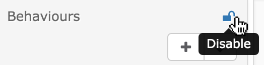
>
> If you disable the behaviour engine, all components and connections will be
> squashed into a single view.
>
> Take into account that this operation cannot be undone.

### Using the behaviour oriented wiring user interface

This is the look of the wiring editor interface when the behaviour engine is
enabled. Each of the panels in the *Behaviours* section represents a
behaviour and displays the name and the description of the represented
behaviour.

Noticed that one of the behaviours is highlighted, this is because
you can edit only a behaviour at a time, this is the active behaviour. The name
of the active behaviour is also displayed in the footer of the wiring editor, so
you can know which is the active behaviour all the time (i.e. including when the
behaviour list panel is hidden). Changing the active behaviour is just a matter
of clicking on the panel representing the behaviour.

The other important thing to notice is that there are some "faded" components
inside the wiring canvas (e.g. the *Search For* widget). Background components are
faded because they do not form part of the active behaviour, although they form
part of other behaviours.

#### Adding components and creating connections

You can add new components into a behaviour in the same way they are added when
the behaviour engine is disabled. That is, by draging them from the component
side panel. The only thing you have to take into account is that those
components are only added into the active behaviour.

If you want to use a component already involved in other behaviour, you can use
the *Add* button of the background component you want to include:

The same applies to the connections, if you create a new connection, that
connection is added only into the active behaviour. If you want to include a
connection already available on other behaviour, you can click on the *Add*
button of the background connection:

> **Note:** If a background connection implies background components, adding
> that connection will also add that background components into the active
> behaviour.

#### Creating a new behaviour

You can create new behaviours by clicking on the *Create behaviour* button
available on the list behaviour side panel:

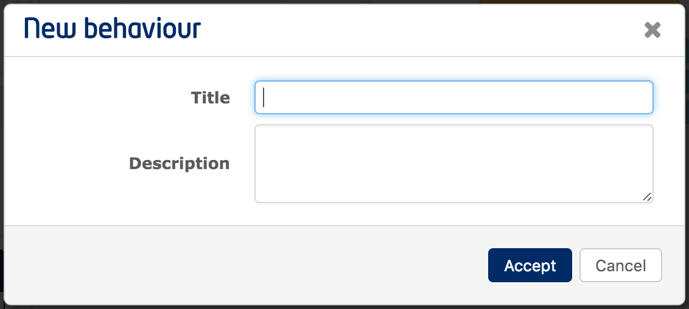

If you want to edit the title and the description of a behaviour, you can open
the preferences menu and click on the *Settings* option:

### Removing behaviours

You can always remove a behaviour at any time, except when there is only one
behaviour (at least one behaviour must be present in a wiring configuration when
the behaviour engine is enabled). To do so, click on the *Remove* button of the
behaviour you want to remove:

> **Note:** All the components not used on other behaviour will be removed from
> the wiring configuration. Also take into account that this operation cannot be
> undone.

### Removing components and connections

To remove a component from a behaviour, click on the *Delete* button:

Components are only totaly removed from the wiring configuration when they are
not used in any of the available behaviours.

The same applies to connections, you can remove them from the active behaviour
using the *Delete* button:

Again, connections are remove from the wiring configuration when the are removed
from all the behaviours.

Sharing your mashups
--------------------

Workspaces can be made public by means of modifying their settings as
Follows:

1.  Click on the workspace menu button and click *Share*:
    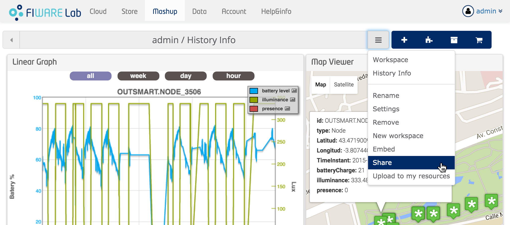

2.  You will be presented with a dialog for editing the sharing configuration of
    the workspace:
    

After making a workspace public, you will be able to share the workspace
URL with other users.

### Embedding mashups inside other web pages

All workspaces can be embedded, but take into account that access rules
are the same that applies when using the workspace directly from
WireCloud. If you don't make the workspace public, you will require
users to be logged in WireCloud and having enough access permission.
This make changing sharing settings of the workspace a first step before
embedding mashups into other web pages.

You can also obtain the code you have to copy & paste into other web
pages following those steps:

1.  Click on the workspace menu button and click *Embed*:
    

1.  A new window showing you the code for embedding the mashup. Copy &
    paste it into you HTML document.
    

Additional sources of information
---------------------------------

See the [Application Mashup GE fundamentals
course](http://edu.fiware.org/course/view.php?id=53) at the FIWARE
Academy for detailed documentation on how to use WireCloud from
different perspectives (end-user, developer and administrators). Another
source of information is [the WireCloud
website](https://conwet.fi.upm.es/wirecloud/) where you can find more
general information and other interesting resources such as demo videos.
